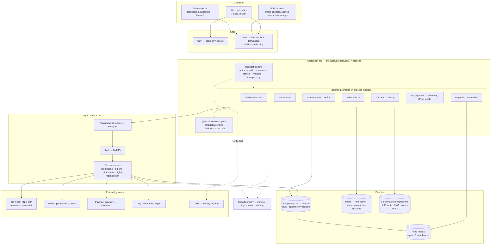
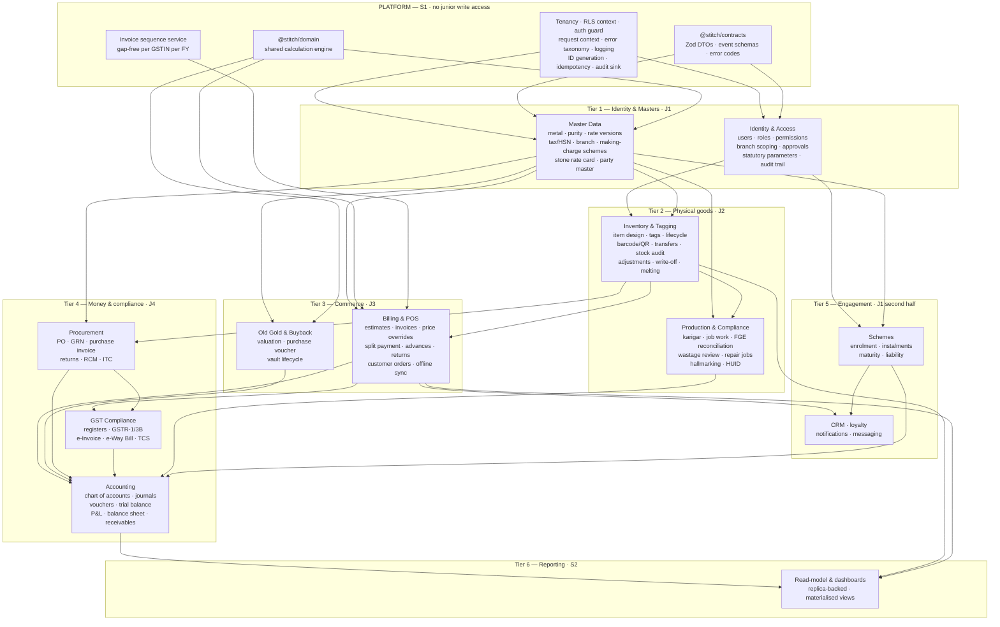
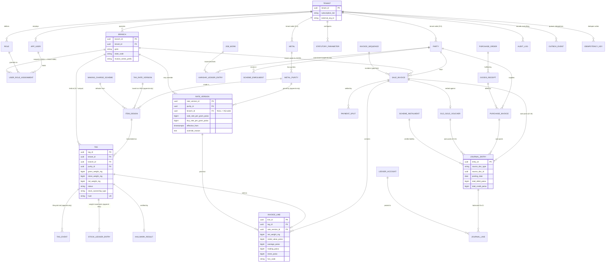
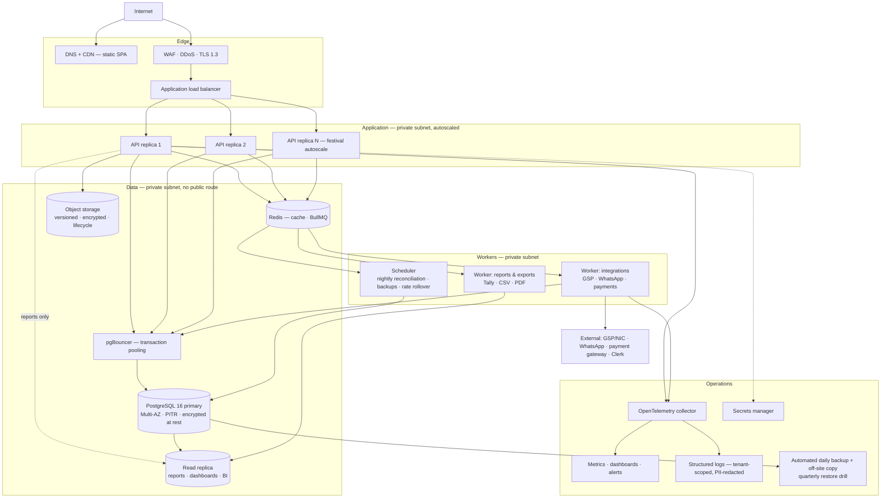
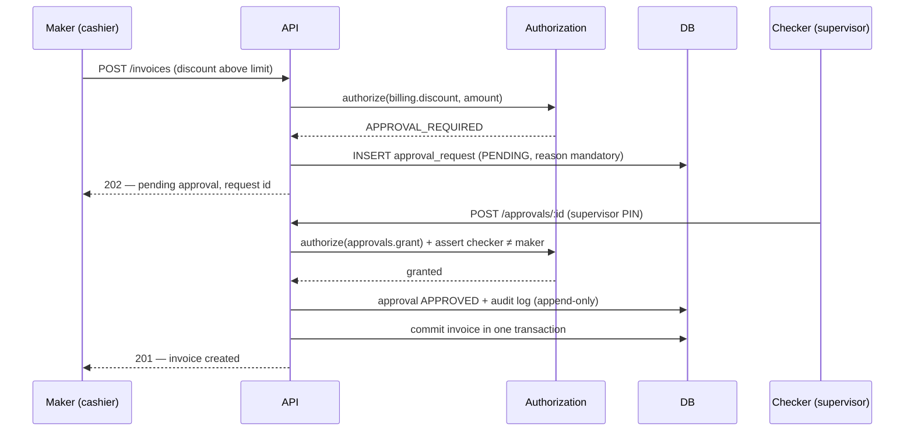
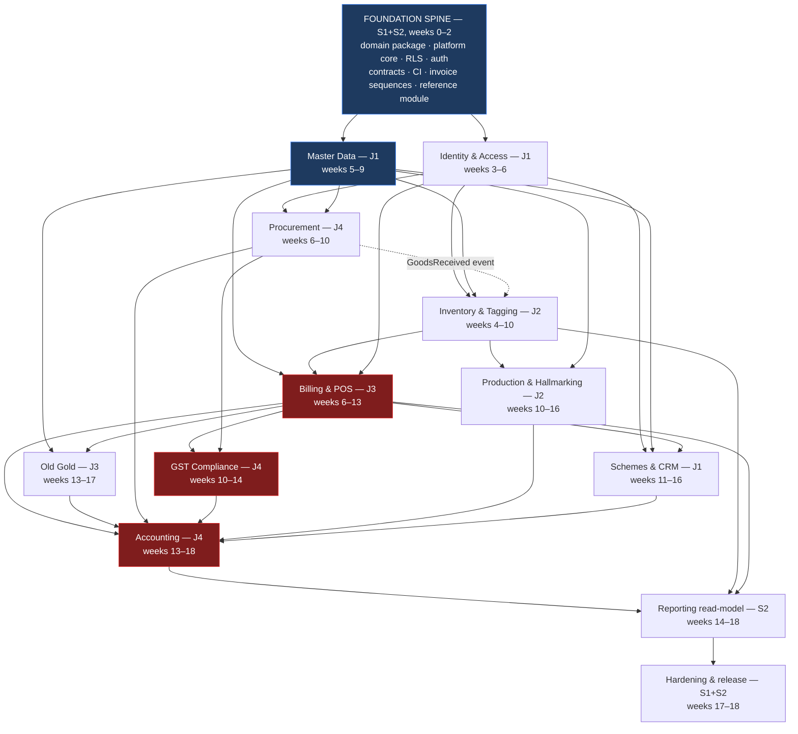
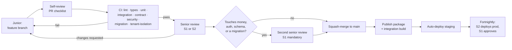
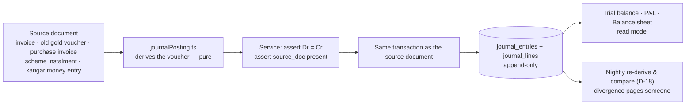

# Stitch Jewellery ERP — Backend Architecture & Team Execution Plan

**Version 1.0 · 10 August 2026**
**Audience:** S1, S2 (senior backend), J1–J4 (junior backend), engineering management
**Status:** Proposed — Section 37 lists what must be signed off before Day 1

**Source material inspected before writing this document**

| Source | What was examined |
|---|---|
| `stitch-jewellery-erp` working tree | 167 files, 45,228 lines of TypeScript/TSX; `package.json`, `vite.config.ts`, `tsconfig.json`, `.env.example`; full `src/lib` inventory; `src/types.ts`; `src/App.tsx` |
| Test suite | `npm test` executed — **51 files, 1,534 tests, all passing, 6.43s** |
| `docs/Jewellery_Retail_Software_PRD.md` | 759 lines, all 19 sections |
| `docs/Jewellery_ERP_Developer_Handbook (1).md` | 2,076 lines, Phases 1–14 |
| `.ai/` | `DECISIONS.md` (D-1…D-14), `BACKEND_ARCHITECTURE.md`, `MODULE_STATUS.md`, `HANDOFF.md`, `KNOWN_ISSUES.md` |

---

# 1. Executive Summary

**The single most important finding: there is no backend, and that is not the problem it sounds like.**

What exists is a client-only React 19 SPA persisting to `localStorage`. There is no server, no database, no authentication, no API. But the same repository contains **53 pure domain modules in `src/lib/` with 1,534 passing unit tests** — the wastage engine, the Fine Gold Equivalent maths, tunch valuation, the 12-state tag lifecycle, GST splitting with effective-date versioning, double-entry journal posting, HUID uniqueness, scheme liability accrual, integer-paisa money arithmetic. This is the expensive part of a jewellery ERP and it is already written, already reviewed against the PRD line by line, and already tested.

That inverts the normal risk profile of handing a domain this hard to four juniors. **They are not being asked to invent Indian jewellery accounting. They are being asked to put a schema, a tenant boundary and an HTTP surface around logic that already exists.** Migration + repository + service orchestration + DTO + controller + integration test is exactly the right shape of work for a capable junior, and it is reviewable by a senior in an afternoon.

**Recommended architecture: a modular monolith** — one NestJS deployable, one PostgreSQL database, one BullMQ worker — **assembled from separately-owned private repositories.** Not microservices: six people cannot operate twelve services, and every hard consistency requirement in this domain (a journal that balances, a gap-free invoice series per GSTIN, a tag that cannot be sold twice) is a single-database transaction problem that microservices would turn into a distributed-transaction problem for no gain.

**On the source-visibility requirement, the honest answer up front:** GitHub's access control operates on repositories, not directories. Branches, CODEOWNERS, protected paths and monorepo tooling provide **none** of the confidentiality being asked for — a developer with read access to a repository can read every file in every branch and the entire history. If interns must not see the whole backend, the codebase must be physically split into multiple private repositories. Section 12 designs that split, and states its real cost plainly: roughly **15–20% velocity tax** and about **one day per week of S2's time** spent on package publishing and version coordination. Section 12 also presents the cheaper alternative (a single private repo plus NDA/IP assignment, which is what most of the industry actually does) so the trade is a decision and not a default.

**Shape of the plan**

- **18 weeks** to a production-ready v1 backend. Weeks 0–2 are a foundation spine built by seniors with **no parallel junior work** — four people starting simultaneously on an empty repo produces four conventions and a fortnight of merge conflicts.
- **Four bounded contexts, one per junior**, each owned end-to-end from migration to endpoint to test. Never split by layer.
- **S1 owns the domain, the schema and security.** **S2 owns integration, CI/CD, performance and release.** Neither is a fifth and sixth pair of hands.
- **The domain package is ported verbatim, not rewritten.** Rewriting 1,534 passing tests to gain nothing is the single most expensive mistake available to this project.

**Five decisions that need a human before Day 1** (detail in §37): the repository-confidentiality trade-off in §12; the stock valuation method for the balance sheet (PRD §10.4 is silent, and it blocks the accounting slice); the diamond HSN split (blocks the shape of `invoice_lines`); the Clerk-versus-self-hosted identity call under real Indian data-residency constraints; and the hosting region.

---

# 2. Existing Codebase Assessment

## 2.1 What the stack actually is

| Dimension | Finding |
|---|---|
| **Application type** | Client-only Single Page Application. No server process exists. |
| **Language / runtime** | TypeScript 5.8 (`strict`), targeting the browser only |
| **Framework** | React 19.0.1, React Router 7.18, Vite 6.2, Tailwind 4.1 |
| **Backend framework** | **None.** `express` is in `dependencies` but imported nowhere; `npm run clean` deletes a `server.js` that does not exist in the tree. |
| **Database** | **None.** Persistence is `localStorage`, written from `App.tsx`. |
| **ORM / data access** | **None.** |
| **Authentication** | **None.** Cosmetic login only — `MODULE_STATUS.md` states plainly that any credentials are accepted. |
| **Authorization** | Real and well-designed, but **client-side only** — `src/lib/permissions.ts`, 21 permissions, 6 roles, route guards. Its own header states it "gates the interface, not the data". |
| **API layer** | **None.** Zero `fetch()` or `axios` calls in the entire `src/` tree. |
| **Tests** | 51 Vitest files, **1,534 tests, all passing in 6.43s** |
| **CI/CD** | **Absent.** No `.github/` directory. |
| **Containerisation** | **Absent.** No Dockerfile, no compose file. |
| **Deployment config** | **Absent.** `.env.example` still contains Google AI Studio scaffolding (`GEMINI_API_KEY`, `APP_URL`). |
| **External integrations** | All **simulated by design** — e-Invoice/IRN, e-Way Bill, GSP, WhatsApp/SMS, barcode scanner, weighing scale, thermal printer |

## 2.2 The domain layer is the asset

`src/lib/` holds 53 modules and 51 test files. It is framework-free: the only genuine browser coupling in the whole directory is a **single CSV-download helper** at `gstReturns.ts:369` (`document.createElement('a')`), which belongs in the UI and stays there. Two further modules (`branch.ts:86`, `systemHealth.ts:49`) reference `localStorage` only as an **injected default parameter**, so they port by changing a default.

Verified directly, not taken on trust from `.ai/BACKEND_ARCHITECTURE.md` — which was written when there were 45 modules and 1,264 tests, and is now understated.

Representative quality, from `src/lib/money.ts`:

- Money is integer **paisa**; weight is integer **milligrams** at 3 dp (`WEIGHT_DP = 3`).
- `allocate()` uses the **largest-remainder method** so apportioned parts sum exactly to the whole. The comment records the live defect it fixed: three partial returns against one ₹1,000 discount reversed only ₹999, leaving an invoice that could never close. That is precisely the class of bug that makes a double-entry system stop balancing.
- `moneyEquals()` exists because `0.1 + 0.2 === 0.3` is false and "does this split settle the invoice" is exactly that comparison.

This is production-grade work. **It must be ported verbatim.**

## 2.3 Classification

### Already implemented — preserve, port unchanged

| Area | Evidence |
|---|---|
| Money & weight arithmetic | `money.ts` — integer paisa/mg, exact allocation, 25 tests |
| Billing calculation engine | `billingCalculations.ts` — PRD §7.2/§7.3/§7.4 literal; discount reduces taxable value **before** GST |
| Tax master with effective dating | `taxMaster.ts` — real HSN rows with `notificationRef`; append-only; no hardcoded `0.03` |
| Rate master, append-only | `rateMaster.ts` + `MetalRateVersion[]`; `resolveRateAt()` gives an old invoice its billed rate; 5% fat-finger guard |
| Tag lifecycle | `tagStateMachine.ts` — enforced 12-state machine; illegal transitions rejected (D-6/D-7) |
| Double-entry posting | `journalPosting.ts` (526 lines) — vouchers **derived** from source documents, never stored, so books cannot drift |
| Karigar ledger | `fineGoldLedger.ts`, `jobWork.ts` — balances derived from an append-only ledger; wastage assessed in Fine Gold Equivalent |
| Old gold | `oldGoldValuation.ts`, `oldGoldVault.ts` — separate purchase voucher, settled at payment stage (D-10) |
| Scheme engine | `savingsScheme.ts` — balances derived from receipts; BUDS Act 2019 cash-refund hard-block |
| Hallmarking | `hallmarking.ts`, `hallmarkGuard.ts` — globally unique HUID; configurable block/warn/off checkout gate |
| Statutory parameters as data | `statutoryParameters.ts` — PAN/TCS/PMLA thresholds configurable, never constants |
| RBAC model | `permissions.ts` — 21 permissions, 6 roles, orphan-administration guard |
| Documentation | `.ai/` is unusually complete: D-1…D-14 with rationale, a per-module status matrix, an open-issues register |

### Partially implemented — completing these is the backend project

Every business module has a UI and domain logic but **no persistence beyond a browser tab**. `MODULE_STATUS.md` marks two modules "Done" (Tax Master, Gold Savings Scheme) and the rest "Partial". Missing across the board: server-side enforcement, multi-user concurrency, durable storage, real integrations.

### Missing entirely

Server process · database · migrations · authentication · session management · server-side authorization · API layer · request validation at a trust boundary · structured logging · error taxonomy · CI · containerisation · deployment topology · observability · backup/restore · rate limiting · idempotency · real GSP / WhatsApp / payment integrations · audit trail persistence (the current event store is browser-resident and is a feed, not a trail).

### Poorly implemented / technical debt

| Item | Assessment |
|---|---|
| `package.json` name is `"react-example"` | Scaffold leftover |
| `@google/genai` dependency | **Imported nowhere.** Remove. |
| `express` dependency | Imported nowhere; `clean` script targets a non-existent `server.js`. Remove until the real server exists. |
| `.env.example` | AI Studio scaffolding, unrelated to this product |
| `src/lib/manualVoucher.ts` (176 lines) | **The only domain module with no test file.** It writes journal vouchers by hand — the highest-risk thing to leave untested. Fix before it moves server-side. |
| `src/App.tsx` (1,111 lines) | All application state in one component. Acceptable for a localStorage prototype, and it happens to be a **clean cutover seam** (§2.4), but it must not survive the migration unchanged. |
| `src/types.ts` (842 lines) | One flat type file for the whole domain. Split along bounded-context lines during the port. |
| `MetalStandard` as a string union | `'Gold (22K)'` etc. is a display string used as an identity. D-5 and Handbook §2.2 require a normalised `purity_id` foreign key with a `purity_fraction`. **This is the one genuine data-model defect that must be fixed during the port, not after** — Top-10 mistake #1 in Handbook §14.4. |

### Should be replaced

`localStorage` persistence; the cosmetic login; the simulated GSP/messaging/hardware layers (replaced by real adapters behind the same interfaces, which is why they were built as interfaces).

## 2.4 The cutover seam

`App.tsx` holds all state in one place with a consistent `useState` + `useEffect(localStorage)` shape. Introduce a repository interface per module in the web app with two implementations — `localStorage` and `api` — switched by a flag, and cut modules over one at a time as endpoints land. The app stays shippable throughout the entire 18 weeks. This is worth protecting: it means the backend project never has a big-bang integration date.

## 2.5 Prior backend planning already on file

`.ai/DECISIONS.md` records **D-12** (Node 22 + TypeScript + NestJS + PostgreSQL 16 + Drizzle + Redis/BullMQ + Zod), **D-13** (tenant isolation by PostgreSQL Row-Level Security) and **D-14** (identity bought from Clerk, authorization built in-house). `.ai/BACKEND_ARCHITECTURE.md` sketches a monorepo and a four-developer split.

**This plan adopts D-12, D-13 and D-14 substantially unchanged** — they are well-reasoned and reversing them silently would break compliance rules, not just tables. It departs from the prior document in three places, each argued where it appears:

1. **Repository topology** — the prior plan assumed a monorepo. The source-confidentiality requirement in this brief is incompatible with a monorepo (§12).
2. **Team shape** — the prior plan assumed four equal developers. This plan is four juniors + two seniors, which changes who owns the dangerous parts (§14, §19, §20).
3. **Journals** — the prior plan keeps journals purely derived. This plan keeps derivation as the *definition* but adds a written append-only snapshot reconciled against it in CI (§32), because "derive the trial balance over three years of transactions on every page load" has a ceiling.

---

# 3. Business Domain Summary

## 3.1 The paradigm the architecture must preserve

Handbook §1.1 and PRD §1.3 both insist on it, and every schema decision follows from it:

> **A jewellery item is not an SKU with a price. It is a unique physical piece with a weight, whose price is computed at the moment of sale from a rate that changes daily.**

Two consequences the architecture is built around:

**The tag is the atomic unit (D-6).** Not `product_id + quantity`. Two 22KT rings of the same design weigh different amounts, carry different HUIDs, and are different rows. `tags` is the central table of the system.

**Two parallel ledgers, always reconciling (Handbook §1.4, D-2).** Weight in grams by purity, and money in rupees. They are independent and must both balance.

> 💡 **The rule that prevents 80% of reconciliation bugs:** never persist a money value without also persisting (a) the weight it was computed from and (b) the exact rate version ID used. Stock value in ₹ is a *derived, rate-dependent view*, never a standalone stored fact.

This is enforced structurally in §5: every monetary column on a stock or transaction row is accompanied by `*_mg` and `rate_version_id`.

## 3.2 Business-critical rules, mapped to owners

| Rule | Source | Where it lives | Owner |
|---|---|---|---|
| `Net Weight = Gross Weight − Stone Weight` | PRD §7.2 | `domain/billing` | S1 |
| `Metal Value = NW × rate(purity, date)` | PRD §7.2 | `domain/billing` | S1 |
| `Wastage Value = NW × wastage% × rate` | PRD §7.2 | `domain/billing` | S1 |
| Making charge: per-gram **or** flat, branching on type | PRD §7.2 | `domain/billing` | S1 |
| Stone value is certified per piece, not derived from weight | PRD §17 | `domain/billing` | S1 |
| **Discount reduces taxable value BEFORE GST** | PRD §7.4 | `domain/billing` | S1 |
| GST split: CGST+SGST intra-state, IGST inter-state, by comparing branch state to customer state | PRD §7.3 | `domain/tax` | S1 |
| Halves derived so `cgst + sgst == gstTax` exactly | PRD §7.3 | `taxMaster.splitGst` | S1 |
| Round-off posted to its own ledger | PRD §7.3 | `domain/tax` | S1 |
| **Old gold is a separate purchase voucher netted at payment stage — never a sale-side discount** | PRD §8.3, **D-10** | `domain/oldGold` | S1 |
| Old gold net weight = `gross × tested_purity × (1 − melting_loss%)` | PRD §8.2 | `oldGoldValuation` | J3 |
| Fine Gold Equivalent for karigar wastage across mixed purities | PRD §6.2 | `fineGoldLedger` | J2 |
| Karigar balances **derived** from an append-only ledger | Handbook Ph4 | `fineGoldLedger` | J2 |
| Rate master **append-only**, never `UPDATE`d | **D-4** | Postgres grants | S1 |
| Tax rates effective-dated; an old invoice resolves its billed rate | PRD §9.2, **D-4** | `taxMaster` | J1 |
| PAN or Form 60 mandatory at ≥ ₹2,00,000 cash — **block the invoice** | PRD §15.3 (Rule 114B) | `statutoryChecks` | J1 gate, J3 enforce |
| TCS auto-computed above notified threshold, separate ledger | PRD §15.3 | `statutoryParameters` | J4 |
| PMLA CTR flag at ≥ ₹10,00,000, cannot be silently bypassed | PRD §15.3 | `statutoryParameters` | J4 |
| **No statutory threshold hardcoded anywhere in application code** | PRD §15.3, Handbook Ph12 | `statutory_parameters` table | S1 enforces in review |
| HUID globally unique, never reusable | PRD §11.1 | `hallmarking` | J2 |
| Non-exempt un-hallmarked piece cannot be billed (configurable block/warn/off) | PRD §11.3 | `hallmarkGuard` | J2 rule, J3 gate |
| A melt output carries no HUID — the certified ornament no longer exists | Handbook Ph9 | `melting` | J2 |
| `stock_ownership_type ∈ {OWNED, GML_FINANCED, CONSIGNMENT}` from day one | Handbook §1.6, **D-3** | `tags` column | J2 |
| Consignment stock is sellable but **not on the shop's balance sheet** | Handbook §1.6 | `financialStatements` | J4 |
| A tag is sellable at exactly one branch — DB-enforced | PRD §16.2, **D-7** | partial unique index | S1 |
| Invoice numbers strictly sequential per FY per GSTIN, **no gaps** | GST Rule 46 | `invoice_sequences` | S1 |
| Every journal entry balances: `Σ Dr = Σ Cr` | PRD §10.3 | `journalPosting` | J4, S1 reviews |
| No source-less journal entries from routine transactions | Handbook §14.4 #10 | service layer | S1 enforces |
| Scheme instalments credit a **liability**, not income | PRD §12.3 | `journalPosting` | J4 |
| **Scheme cash refund hard-blocked** (BUDS Act 2019) | Handbook §1.6.1, **D-11** | `savingsScheme` | J1 |
| Maker-checker above a configurable value threshold | PRD §15.1 | `approvals` | J1 |
| Self-approval refused regardless of permission | M33 | `permissions` | J1 |
| Party master is tenant-wide, never branch-scoped | **D-5** | schema | S1 |
| Metal/Purity master tenant-wide, no `branch_id` | **D-5**, Handbook §2.2 | schema | S1 |
| Purity soft-deleted only; existing stock stays sellable | Handbook §2.2 | `metal_purities` | J1 |
| Fixed-point arithmetic only — **never float** | PRD §16.2, **D-12** | `BIGINT` columns | S1 |
| e-Invoice / GSP calls **asynchronous** — never block the counter | Handbook §14.4 #8 | outbox + BullMQ | J4/S2 |
| Append-only means append-only, enforced by Postgres grants | **D-4** | migrations | S1 |

## 3.3 Ambiguities identified — these need a decision, not a guess

| # | Ambiguity | Impact | Who decides |
|---|---|---|---|
| **A1** | **Stock valuation method for the balance sheet.** PRD §10.4 requires stock valuation; §5.4 lists methods but does not choose. FIFO, weighted-average and specific-identification give materially different P&L figures. | **Blocks the accounting slice.** J4 cannot build `financialStatements` persistence without it. | Client + CA |
| **A2** | **Diamond HSN split.** Composite jewellery at ~3%, or split lines (jewellery ~3% + diamond ~1.5%)? Already flagged in `HANDOFF.md` and `DECISIONS.md` as open. | Blocks the final shape of `invoice_lines.hsn_code`; the engine already supports both. | Client's CA |
| **A3** | **PRD §17's old-gold figures do not satisfy §8.2's own formula.** Already recorded in `HANDOFF.md` §1a. §17 is designated the canonical regression fixture (Handbook §14.3), so the fixture and the formula currently disagree. | The canonical test cannot be asserted literally until reconciled. | S1 + client |
| **A4** | **Offline POS scope.** PRD §16.2 demands offline billing; the Handbook demands cross-branch double-sell prevention on reconnect. These are in tension — an offline terminal cannot know another branch just sold the tag. | Determines whether v1 ships true offline or degraded-read-only. **Recommend: v1 = read-only offline + queued sales with server-side conflict resolution**, which `offlineQueue.ts` already models. | Product + S1 |
| **A5** | **Franchise / FOFO-FOCO.** Handbook §1.7-5 flags it; D-1 defers it. | If it is ever yes, the tenant model needs a partition dimension. Deferring is fine; deciding it silently later is a rewrite. | Product |
| **A6** | **Data residency.** GST records under Indian law plus a US identity vendor (Clerk, D-14) is a question, not an assumption. | Decides hosting region and possibly D-14 itself. | Legal + S1 |

---

# 4. Recommended Backend Architecture

## 4.1 The recommendation

> **A modular monolith: one NestJS deployable, one PostgreSQL 16 database, one BullMQ worker process — assembled from separately-owned private repositories, each publishing a versioned private npm package.**

Deployment topology and source topology are deliberately decoupled. **One thing runs. Twelve things are edited.**

## 4.2 Options evaluated

| Option | Verdict | Reasoning |
|---|---|---|
| **Microservices** | ❌ Rejected | Every hard consistency rule here is a single-transaction problem: a journal that balances, a gap-free invoice series per GSTIN, a tag that cannot be double-sold, a stock movement that must post to accounting atomically. Microservices convert all of these into distributed-transaction problems. Six people — four of them junior — cannot operate twelve services, twelve pipelines and twelve on-call surfaces. Choosing this would be over-engineering to look enterprise-grade, which the brief explicitly forbids. |
| **Service-Oriented Architecture** (3–4 coarse services) | ❌ Rejected for v1 | Splitting Billing from Accounting means the sale and its journal entry stop being one transaction. PRD §10.1 requires auto-posting; `journalPosting.ts` already guarantees it structurally by deriving vouchers from documents. A network hop between them destroys that guarantee. |
| **Modular monolith → future services** | ✅ **Recommended** | One deployable, one database, one transaction boundary. Bounded contexts are real, enforced by package boundaries rather than convention. If billing volume ever justifies extraction, the seam already exists: each context is already a separate package with an explicit contract. |
| **Monorepo modular monolith** | ⚠️ Technically superior, **blocked by the brief** | Best developer experience: atomic cross-cutting refactors, one CI run, no version skew. But it gives every intern read access to the entire backend, which this brief rules out. See §12 for the full trade. |

## 4.3 Why the monolith is safe here

The usual objection is that a monolith becomes a big ball of mud. Three things prevent it, and none is a convention:

1. **Package boundaries are compile-time.** `@stitch/billing` cannot import `@stitch/accounting`'s internals because it does not have the source. Cross-context communication goes through `@stitch/contracts` or a domain event. This is the strictest module boundary available short of a network — stricter, in practice, than most microservice codebases achieve.
2. **The domain layer is pure and already isolated.** `@stitch/domain` imports nothing with I/O. Business logic cannot leak into controllers because controllers have no way to reach it except through a service.
3. **One database with RLS.** Tenant isolation is enforced by PostgreSQL, not by four juniors remembering a `WHERE` clause (D-13).

## 4.4 Stack (adopting D-12)

| Concern | Choice | Note |
|---|---|---|
| Runtime | Node.js 22 LTS | Same language as the domain layer — no rewrite |
| Language | TypeScript 5.8, `strict` | Matches existing config |
| HTTP framework | NestJS 11 | Structure juniors can follow: modules, DI, guards, interceptors, pipes. The opinionation is the point with a junior-heavy team. |
| Database | PostgreSQL 16 | ACID, RLS, `NUMERIC`/`BIGINT`, partial unique indexes, advisory locks — every isolation and integrity requirement is a native feature |
| Query layer | Drizzle ORM + drizzle-kit | SQL-shaped, typed, migrations as reviewable SQL. **A senior must be able to read the generated SQL in a PR** — that rules out heavy abstraction. |
| Validation | Zod | Shared between web and api via `@stitch/contracts` — one schema, both sides |
| Cache / queue | Redis 7 + BullMQ | Rate cache, permission cache, async integrations |
| Identity | Clerk (D-14), pending A6 | Auth bought; **authorization built** |
| Object storage | S3-compatible | Certificates, HUID documents, KYC (encrypted) |
| Observability | OpenTelemetry → vendor TBD | Instrument from week 1; choose vendor late |

**Accepted risk, restated from D-12:** the team knows Express, not NestJS, and Nest+Drizzle has thinner tutorial coverage than Nest+Prisma. Mitigation: teach Drizzle and RLS first, Nest structure second. Swapping Nest for Fastify later costs about a day; changing the query layer after the schema exists does not.

---

# 5. Architecture Decision Record

New decisions this document adds, continuing the existing D-numbering.

### D-15 — Modular monolith, not microservices
**Status:** Proposed
**Context:** Six developers, four junior. Domain has hard transactional invariants: balanced journals, gap-free per-GSTIN invoice series, single-branch tag sellability, atomic sale→journal posting.
**Decision:** One deployable NestJS API + one BullMQ worker + one PostgreSQL database. Bounded contexts are packages, not services.
**Consequences:** Cross-context calls are in-process function calls inside one transaction. Scaling is horizontal replicas of the same image. Extraction to a service remains possible because the package seam already exists.
**Reversible:** Yes, per context, at moderate cost.

### D-16 — Source topology is multi-repo; deployment topology is a monolith
**Status:** Proposed — **requires management sign-off (§37)**
**Context:** The brief requires that no junior can see the complete backend source. GitHub ACLs operate at repository granularity only.
**Decision:** Each bounded context is its own private repository publishing a versioned npm package to a private registry. An assembly repository visible only to S1/S2 composes them into the deployable.
**Consequences:** Physical source isolation is achieved. Costs: cross-cutting refactors become multi-PR sequences; version skew is possible; CI is more complex; roughly 15–20% velocity tax; ~1 day/week of S2's time on release coordination. **A published package still ships readable JavaScript** — this protects authored source, history and the assembly, not the algorithms. It is a confidentiality control, not encryption.
**Reversible:** Yes — collapsing to a monorepo later is mechanical. The reverse is not.

### D-17 — Money is `BIGINT` paisa; weight is `BIGINT` milligrams
**Status:** Proposed (formalises D-12)
**Decision:** All monetary columns `BIGINT` in paisa; all weight columns `BIGINT` in milligrams. Ratios and percentages `NUMERIC`. **No `FLOAT`, `DOUBLE` or `REAL` anywhere in the schema, ever.**
**Rationale:** Exactly matches `money.ts` (`toPaisa`, `WEIGHT_DP = 3`), so the domain layer needs no conversion at the boundary. `BIGINT` max ≈ ₹9.2 × 10¹⁶ — five orders of magnitude beyond any plausible tenant.
**Enforcement:** A CI check greps migrations for float types and fails the build.

### D-18 — Journals are derived by definition and materialised for performance
**Status:** Proposed (amends the prior backend note)
**Context:** `journalPosting.ts` derives vouchers from source documents so books cannot drift — architecturally correct. Deriving a trial balance across three financial years on every request is not.
**Decision:** `journalPosting.ts` remains the single source of truth. Its output is **written to an append-only `journal_entries` table in the same transaction as the source document.** A nightly job and a CI test re-derive and assert equality.
**Consequences:** Fast reporting without giving up the drift-proof property. Any divergence is a loud failure rather than a silent one. Manual vouchers remain the only source-less entries and require `accounting.post` plus maker-checker.

### D-19 — Every write endpoint is idempotent
**Status:** Proposed
**Context:** `offlineQueue.ts` retries queued sales. A retried sale must never become two invoices — and an invoice consumes a number from a gap-free statutory series.
**Decision:** Every `POST`/`PATCH` accepts a required `Idempotency-Key` header. Keys are stored with the response hash and a 24-hour TTL. A repeat returns the original response.
**Consequences:** Retry-safe by construction, not by client discipline.

### D-20 — Async-first for every external system
**Status:** Proposed (formalises Handbook §14.4 #8)
**Decision:** GSP/e-Invoice, e-Way Bill, WhatsApp/SMS, payment reconciliation and Tally export are dispatched via a **transactional outbox** consumed by BullMQ. The billing hot path never awaits an external HTTP call.
**Consequences:** Invoices are issued with `einvoice_status = PENDING` and reconciled asynchronously. A GSP outage degrades compliance timing, never the counter.

---

# 6. High-Level Architecture Diagram



**Reading the diagram.** Three client types share one versioned REST API. Every request passes the same pipeline before reaching a context. Contexts call the pure domain package for every calculation and never duplicate a formula. Writes land in PostgreSQL under RLS; anything touching an external system is written to the outbox in the same transaction and drained by the worker, so the counter never waits on the GST portal. Reports read the replica, so a festival-day dashboard cannot slow a billing query.

---

# 7. Backend Module Architecture Diagram



**Dependency direction is strictly downward.** Accounting reads from every transactional context; **no transactional context ever imports Accounting.** Modules publish domain events; Accounting subscribes. This is what stops J4's work from blocking J2 and J3, and stops the classic "billing imports accounting imports billing" cycle.

---

# 8. Database Architecture Diagram



**Three structural points worth stating.** `PARTY` and `METAL` hang off `TENANT` with **no** `BRANCH` edge — that is D-5 as a schema fact, not a coding convention, and it is what keeps chain-wide loyalty and cumulative TCS aggregation correct. `INVOICE_LINE` carries both `net_weight_mg` and `rate_version_id` alongside every money column — that is Handbook §1.4's rule made physical. `JOURNAL_ENTRY` requires `source_doc_type` and `source_doc_id` to be non-null except for explicitly-permissioned manual vouchers, which is Top-10 mistake #10 prevented by a constraint.

---

# 9. Deployment Architecture Diagram



**Environments:** `dev` (per-developer Docker Compose) → `ci` (ephemeral Postgres+Redis per pipeline run) → `staging` (production-shaped, anonymised data, S1/S2 deploy) → `production` (S2 deploys, S1 approves, both required).

**Three deliberate properties.** Read traffic for reports is physically separated onto the replica so a festival-day dashboard cannot compete with the billing counter for connections — PRD §16.2's 5–10× spike NFR. pgBouncer in transaction mode is compatible with `SET LOCAL app.tenant_id` (D-13) but **not** with session-level state, which is why the tenant context must be transaction-scoped. The database has no public route; nothing reaches it except through the application subnet.

---

# 10. Multi-Tenant Architecture

## 10.1 The model (D-1, locked in Handbook §1.9)

```
Tenant  ── the business. One subscription. One identity organisation.
  │
  ├── Branch A (Pune)    own GSTIN · own invoice series · own stock
  ├── Branch B (Mumbai)  own GSTIN · own invoice series · own stock
  └── Branch C (Nashik)  own GSTIN · own invoice series · own stock
```

Architected for **multi-branch regional chain first**, with a path to enterprise/franchise that does not require a rewrite.

## 10.2 The `tenant_id` + nullable `branch_id` pattern

Every tenant-owned table carries `tenant_id NOT NULL`. Most also carry `branch_id`, where **`NULL` means "applies tenant-wide unless a branch-specific row overrides it"**. One pattern serves single-store and multi-branch without forking the schema.

| Data | `tenant_id` | `branch_id` | Why |
|---|---|---|---|
| Metals, purities | ✅ | ❌ **never** | Handbook §2.2 — "22KT" must mean exactly the same thing everywhere, or rates and reports stop reconciling |
| Parties (customers, suppliers, karigars) | ✅ | ❌ **never** (D-5) | Branch-scoping the customer table silently breaks chain-wide loyalty **and** cumulative TCS aggregation against the Rule 114B threshold. Top-10 mistake #6. |
| Tax rates / HSN | ✅ | ❌ | Statutory, national |
| Statutory parameters | ✅ | nullable | Some thresholds are state-specific (e-Way Bill) |
| Rate versions | ✅ | **nullable** | `NULL` = HQ rate for all branches; a row with `branch_id` = permissioned, reason-logged branch override |
| Making-charge schemes | ✅ | nullable | HQ default, branch override |
| Branches, users, roles | ✅ | n/a | |
| Tags, stock ledger | ✅ | ✅ **required** | A physical piece is in exactly one building (D-7) |
| Invoices, payments, old gold | ✅ | ✅ required | Issued under a specific GSTIN |
| Job work, hallmark batches | ✅ | ✅ required | |
| Journals, audit log | ✅ | ✅ required | Branch-wise books are a statutory requirement |

## 10.3 Enforcement: PostgreSQL Row-Level Security (D-13)

Isolation cannot depend on four juniors remembering a `WHERE` clause. It is enforced by the database.

```sql
ALTER TABLE tags ENABLE ROW LEVEL SECURITY;
ALTER TABLE tags FORCE ROW LEVEL SECURITY;

CREATE POLICY tenant_isolation ON tags
  USING      (tenant_id = current_setting('app.tenant_id')::uuid)
  WITH CHECK (tenant_id = current_setting('app.tenant_id')::uuid);
```

Every request opens a transaction and sets the context before any query runs:

```ts
await db.transaction(async (tx) => {
  await tx.execute(sql`SET LOCAL app.tenant_id = ${ctx.tenantId}`);
  await tx.execute(sql`SET LOCAL app.user_id   = ${ctx.userId}`);
  // every statement below is filtered by PostgreSQL itself
});
```

Three properties follow, and they are the entire justification for the choice:

1. **A repository method that forgets its tenant predicate returns zero rows** — never another shop's stock. The failure mode is a visible bug, not a silent breach.
2. `SET LOCAL` is transaction-scoped, so it is safe behind pgBouncer in transaction-pooling mode.
3. `FORCE ROW LEVEL SECURITY` means even the table owner is subject to the policy. Migrations run as a separate role.

**Rejected alternatives:** schema-per-tenant (migrations become O(tenants) and break down past a few hundred shops) and database-per-tenant (far too heavy for the single-shop customer that is most of this market). Both remain available as a premium isolation tier for one large enterprise customer later — a deployment-topology change, not an application rewrite, precisely because the scoping pattern was built in from the start.

## 10.4 Branch isolation is authorization, not RLS

Tenant isolation is absolute. Branch isolation is **not** — a Regional Manager legitimately sees three branches, an Owner sees all, a salesperson sees one plus read-only network stock (`catalog.view.network`, already in `permissions.ts`).

So branch scoping is enforced in the **authorization layer**, where it is a policy question, not in RLS, where it would be a wall:

```ts
// Resolved once per request, cached in Redis for 60s, invalidated on role change.
interface RequestContext {
  tenantId: string;
  userId: string;
  activeBranchId: string;          // the branch this request acts on
  accessibleBranchIds: string[];   // every branch this user may read
  permissions: Set<Permission>;
  isTenantWide: boolean;           // NULL branch_id on the role assignment
}
```

Every repository read for branch-scoped data takes `accessibleBranchIds`; every write asserts `activeBranchId` is within it **and** that the required permission is held. Both checks live in a shared guard in `@stitch/platform`, so a junior cannot forget them — the base repository will not compile without a scope argument.

## 10.5 Preventing the three leaks the brief names

### Tenant A reading Tenant B

| Layer | Control |
|---|---|
| Database | RLS policy on every tenant-owned table, `FORCE`d |
| Connection | Application role has no `BYPASSRLS`; migration role is separate and unused at runtime |
| Application | Tenant comes **only** from the verified JWT — never a header, query parameter or request body |
| Repository | Base class requires a `TenantContext`; there is no un-scoped query method to call |
| Test | **A tenant-isolation test runs in CI on every PR** — seed two tenants, authenticate as A, assert every list endpoint returns zero of B's rows. A failure blocks merge. |
| Runtime | Alert on any query executed without `app.tenant_id` set |

### Branch A reading Branch B without permission

| Layer | Control |
|---|---|
| Authorization | `accessibleBranchIds` derived from `user_role_assignments`; a `NULL` `branch_id` means tenant-wide |
| Repository | Branch-scoped reads take the list; there is no bare `findAll()` |
| Writes | `activeBranchId` must be in the list **and** the permission held |
| D-7 | Partial unique index — a tag is sellable at one branch only, enforced by the database |
| Audit | Every cross-branch read by a Regional Manager is logged |
| Test | Integration test per context: branch-scoped user cannot read, write or transfer another branch's rows |

### J1 reading J2's source code

Not solvable in the application. Solved in §12 by physical repository separation — and honestly bounded there.

## 10.6 Path to enterprise without a rewrite

Franchise partitioning (deferred by D-1) becomes a `partition_id` column plus one more RLS predicate — additive, not structural, because the scoping pattern already exists. A single enterprise customer demanding physical isolation gets a dedicated database with the same image and migrations. Neither is v1 scope; both stay cheap because of the choices above.

---

# 11. Security & RBAC Architecture

## 11.1 Authentication

Per **D-14**: identity is bought, authorization is built. Authentication is commodity and getting it wrong is a breach; authorization here is domain-specific and getting it wrong is a business-rule failure.

| Concern | Design |
|---|---|
| Provider | Clerk (D-14) — login, password reset, MFA, session lifecycle. **Contingent on A6, the data-residency question.** |
| Fallback if A6 forces self-hosting | Argon2id password hashing, TOTP MFA, our own session store. Cost: roughly two extra weeks of S1's time. Design the auth guard behind an interface so this stays a swap, not a rewrite. |
| Access token | JWT, **10-minute** expiry, carrying `sub`, `tenant_id`, `session_id` only — **never permissions**. Permissions are resolved server-side per request so a revoked role takes effect immediately, not in ten minutes. |
| Refresh token | 30 days, rotating, httpOnly + Secure + SameSite=Strict cookie, reuse detection revokes the family |
| POS offline lease | Signed, branch-scoped, **8-hour maximum**, permits queued sales only. Reconciled server-side on reconnect. Never a general-purpose credential. |
| Supervisor PIN | **Not an authentication factor.** It records that a second person authorised a discount (M33) — an accounting control. Stored Argon2id-hashed, rate-limited to 5 attempts, self-approval refused regardless of permission. |
| Service-to-service | Short-lived signed tokens for the worker; no shared static secrets |

## 11.2 Authorization

The existing 21-permission model in `permissions.ts` ports server-side unchanged. It gains one dimension it does not currently have — `MODULE_STATUS.md` names this gap explicitly: *"`can()` has no branch dimension — a Pune manager and a Mumbai manager are indistinguishable. That is backend work, not a frontend gap."*

```ts
// Server-side signature. Every sensitive action goes through this.
function authorize(
  ctx: RequestContext,
  permission: Permission,
  scope: { branchId?: string; amountPaisa?: bigint }
): AuthorizationResult;
```

Four checks, in order: does the user hold the permission → is the target branch within `accessibleBranchIds` → does the amount exceed a maker-checker threshold requiring a second approver → is this a self-approval attempt (always refused).

### Roles

Six roles ship today. The Handbook (§1.7-2, §1.7-3, Phase 12) requires three more, and both documents are explicit that not adding them now means a breaking RBAC change the day a chain customer signs up.

| Role | Status | Scope | Notes |
|---|---|---|---|
| Owner | exists | tenant-wide | All permissions including `admin.roles` |
| Store Manager | exists | branch | Everything except role administration |
| Counter Staff | exists | branch | Sell, view; no override, no rates, no books |
| Salesperson | exists | branch | Sells, sees network stock, **cannot discount** |
| Accountant | exists | tenant-wide | Books and purchases; no selling, no stock handling |
| Auditor | exists | tenant-wide read | Read-only + `stock.audit`; for the shop's CA |
| **Regional/Cluster Manager** | **new** | **branch subset** | Handbook §1.7-2. Approval authority across a group of branches without HQ rights. This is the role the nullable `branch_id` assignment pattern exists for. |
| **Purchase Manager** | **new** | tenant or branch | Handbook §1.7-3. Commits capital to buy metal/consignment — a different authority from tagging and transferring. |
| **Inventory/Stock Manager** | **new** | branch | The other half of the split: tags, transfers, audits; **cannot** commit purchase capital |

**Verdict on the brief's question:** yes, all three must be separated, and it is cheap now and expensive later. The Regional Manager is the one that would otherwise force a schema change, because it is the only role whose scope is "some branches" rather than "one branch" or "all branches".

### New permissions required

`purchase.approve` (commit capital, distinct from `purchase.manage`) · `branch.view.all` (Regional Manager cross-branch read) · `audit.view` (audit-trail viewer — currently no permission gates it) · `accounting.close` (period lock) · `tenant.admin` (branch/GSTIN administration, split from `masters.manage`).

## 11.3 Financial permission separation

Already correctly modelled in `permissions.ts` and preserved verbatim:

- `billing.discount` ≠ `billing.override` — a discount reduces the price; an override changes the *calculated rate itself* and requires a logged reason.
- `billing.override` ≠ `approvals.grant` — "may I do it" and "may I authorise it for someone else" are different questions.
- `accounting.view` ≠ `accounting.post` — a manual voucher has no source document behind it, so posting is effectively permission to write to the ledger by hand.
- `rates.edit` is separate from everything — the single most load-bearing number in the shop.

## 11.4 Maker-checker

PRD §15.1 requires dual control above a configurable threshold (example: ₹5,00,000). The threshold lives in `statutory_parameters`, never in code.



Applies to: discount above limit · price override · invoice cancellation after finalisation · stock write-off above threshold · rate change beyond the fat-finger guard · manual journal voucher · any transaction above the PMLA threshold.

## 11.5 Audit trail

Append-only, `UPDATE`/`DELETE` revoked at the Postgres role level. Written by a Nest interceptor so a junior cannot forget it, capturing entity, action, `old_value`/`new_value` JSONB, actor, tenant, branch, IP, request ID, and — mandatory for every override — a reason.

Covers PRD §14.9 in full: every master-data change, rate override, discount override, cancelled or edited invoice, permission change, login/logout/failure, and every cross-branch access.

**Tamper evidence:** each row stores a hash chained to the previous row's hash per tenant. A nightly job verifies the chain. This is what turns "we log things" into "we can prove the log was not edited", which is what an auditor actually asks for.

## 11.6 PII and data protection

PAN, Aadhaar and KYC documents are **encrypted at the application layer** (envelope encryption, keys in a secrets manager) — not merely encrypted at rest, so a database dump is not a PII breach. PRD §15.2 requires role-based PII visibility: counter staff see a masked PAN (`ABCDE****F`), only Accountant and Owner see it in full, and every full-PII read is audit-logged. Card data is never stored; the payment gateway is tokenised. Logs are PII-redacted by a serialiser in `@stitch/platform`, not by developer discipline.

---

# 12. GitHub Organization & Repository Strategy

**This section answers the brief's most important question, and it starts with what does not work.**

## 12.1 What cannot provide source confidentiality

| Proposal | Why it fails |
|---|---|
| "Give each intern a branch" | A branch is not an access-control boundary. Read access to a repository grants read access to **every branch, every file and the entire history**. `git clone` fetches all of it. |
| "Use CODEOWNERS" | CODEOWNERS routes *review requests*. It does not restrict reading anything. |
| "Use branch protection" | Controls who may *write* to a branch. Read is unaffected. |
| "Use a monorepo with sparse checkout" | Sparse checkout is a **client-side convenience**. The objects are on the server and any developer can fetch them with one flag. |
| "Use path-based permissions" | GitHub does not have them. Neither does GitLab in its non-enterprise tiers. Git's object model does not support partial-history read authorization. |
| "Squash history so old code is hidden" | The current tree is still fully readable, which is the code that matters. |

**The finding, stated plainly:** *a monorepo cannot provide directory-level source confidentiality on GitHub, at any price tier.* If the requirement is real, the code must be physically split into separate repositories, because the repository is the only unit GitHub's ACLs operate on.

## 12.2 Options evaluated

### Option A — Multiple private repositories ✅ Recommended, conditionally

Each bounded context is its own private repository publishing a versioned npm package to GitHub Packages. Interns are collaborators on only their own repositories plus the shared contracts. An assembly repository visible only to S1/S2 composes the deployable.

**Delivers:** genuine source isolation of authored code, history, commit messages and issues. Interns cannot enumerate the system.

**Costs, stated honestly:**
- **Velocity: 15–20% slower.** A change spanning contracts + two contexts is three PRs in three repos in dependency order, not one.
- **~1 day/week of S2's time** on version coordination and release management, permanently.
- **Version skew is possible.** Context X pinned to `@stitch/contracts@1.4.0` while Y is on `1.6.0` is a real class of bug that a monorepo makes structurally impossible.
- **Cross-cutting refactors get expensive.** Renaming a domain concept becomes a coordinated multi-repo release.
- **Onboarding is harder.** A junior cannot read a working example from a neighbouring context, because they cannot see one.
- **CI complexity multiplies** — 12 pipelines plus an integration pipeline.

### Option B — GitHub Organization + Teams ✅ **Use with A, not instead of A**

Teams are how permissions are *administered*; they do not create isolation on their own. On a single repository, a team with read access reads everything. Option B is the management layer for Option A.

### Option C — Single private repo + legal controls ⚠️ The honest alternative

One monorepo, all six developers, plus NDA, IP-assignment agreement, offboarding checklist and audit logging. This is what most of the industry does, including companies with far more valuable IP than this.

**Delivers:** maximum velocity, atomic refactors, one CI, no version skew, juniors learn from surrounding code.
**Does not deliver:** source-visibility restriction.

## 12.3 Recommendation

**Adopt Option A + B, structured as three confidentiality tiers rather than twelve equal repositories.**

Twelve peer repositories would be over-engineering. What actually needs protecting is not "each intern's CRUD module" — it is the **domain calculation engine, the tenancy/security core, and the full assembly**, because those are the parts that constitute the product. A module for hallmark batch dispatch is not the crown jewel.

| Tier | Contents | Visible to |
|---|---|---|
| **Tier 0 — Crown jewels** | `@stitch/domain` (the 53-module calculation engine), `@stitch/platform` (tenancy, RLS, auth, invoice sequencing), `erp-assembly` (the wiring, config, migration ordering, deployment), `erp-infrastructure` | **S1, S2 only** |
| **Tier 1 — Shared contracts** | `@stitch/contracts` — Zod DTOs, event schemas, error codes, OpenAPI | **Everyone reads. Only S1/S2 write.** |
| **Tier 2 — Context repositories** | Eight module repositories | **Owning junior + both seniors only** |

Interns consume Tier 0 as **published packages with compiled JS and `.d.ts` type definitions, no source maps.** They can call it and see its types; they do not get its repository, its history, its tests or its comments.

> ⚠️ **The limit of this control, stated so nobody over-claims it.** A published npm package ships readable JavaScript. A determined intern can open `node_modules/@stitch/domain/index.js` and read the compiled logic. This protects the authored source, the commit history, the design rationale in comments, the test suite and the assembly. **It is a confidentiality control, not encryption.** Anyone presenting it as absolute protection is misleading management. The legal layer — NDA and IP assignment, signed before repository access is granted — is not optional decoration; it is the part that actually holds.

## 12.4 Organisation structure

```
GitHub Organization: stitch-jewellery
│  SSO enforced · 2FA required · outside collaborators disabled
│  Default repository permission: NONE (critical — the default is "read", which
│  would give every member read access to every repository)
│
├── Teams
│   ├── backend-core          S1, S2         → admin on all repositories
│   ├── ctx-identity          J1             → write on erp-identity, erp-masters
│   ├── ctx-inventory         J2             → write on erp-inventory, erp-production
│   ├── ctx-sales             J3             → write on erp-billing, erp-oldgold
│   ├── ctx-money             J4             → write on erp-procurement, erp-gst, erp-accounting
│   └── all-backend           J1–J4, S1, S2  → read on erp-contracts ONLY
│
└── Repositories (all private)
    ├── erp-domain            Tier 0   S1/S2 only        → publishes @stitch/domain
    ├── erp-platform          Tier 0   S1/S2 only        → publishes @stitch/platform
    ├── erp-assembly          Tier 0   S1/S2 only        → the deployable
    ├── erp-infrastructure    Tier 0   S1/S2 only        → Terraform, Docker, CI templates
    ├── erp-contracts         Tier 1   all read/S1S2 write → publishes @stitch/contracts
    ├── erp-identity          Tier 2   J1                → publishes @stitch/identity
    ├── erp-masters           Tier 2   J1                → publishes @stitch/masters
    ├── erp-inventory         Tier 2   J2                → publishes @stitch/inventory
    ├── erp-production        Tier 2   J2                → publishes @stitch/production
    ├── erp-billing           Tier 2   J3                → publishes @stitch/billing
    ├── erp-oldgold           Tier 2   J3                → publishes @stitch/oldgold
    ├── erp-procurement       Tier 2   J4                → publishes @stitch/procurement
    ├── erp-gst               Tier 2   J4                → publishes @stitch/gst
    ├── erp-accounting        Tier 2   J4                → publishes @stitch/accounting
    └── erp-web               Tier 1   frontend team     → the existing React app
```

**The organisation-level setting that matters most:** set *Base permissions* to **None**. The GitHub default is `Read`, which would silently grant every organisation member read access to every repository and quietly defeat this entire section. Verify it on Day 1 and re-verify it monthly — this is the single control most likely to be undone by accident.

## 12.5 How a context repository builds without the rest of the system

Each Tier 2 repository is self-sufficient:

```
erp-inventory/
├── package.json          deps: @stitch/domain, @stitch/platform,
│                               @stitch/contracts  (all from GitHub Packages)
├── docker-compose.yml    Postgres 16 + Redis, seeded with the shared base migration
├── src/
│   ├── inventory.module.ts
│   ├── tags/  { controller · service · repository · dto }
│   └── migrations/       ONLY this context's tables
├── test/
│   ├── unit/             services, mocked repositories
│   ├── integration/      real Postgres via Testcontainers
│   └── contract/         asserts responses match @stitch/contracts
└── README.md             what this owns, what it must not touch, how to run it
```

A junior runs `docker compose up && npm test` and has a working, testable slice of the system with no visibility into any other context. Nest module registration is what the assembly repository does, and juniors never see it.

## 12.6 Fallback if velocity becomes the binding constraint

If, by week 6, the multi-repo tax is measurably hurting delivery, the escape hatch is **Option C-minus**: collapse the eight Tier 2 repositories into one `erp-modules` repository that all four juniors can read, while Tier 0 stays senior-only. Juniors then see each other's work but not the platform core, the domain engine or the assembly. Recovers most of the velocity, keeps the crown jewels protected. **Decide this at the week 6 checkpoint with data, not vibes** — Section 36 lists it as the primary bottleneck to watch.

---

# 13. Repository Access Matrix

| Repository | Tier | Owner | J1 | J2 | J3 | J4 | S1 | S2 | Purpose |
|---|---|---|---|---|---|---|---|---|---|
| `erp-domain` | 0 | S1 | pkg | pkg | pkg | pkg | **Admin** | Write | Ported `src/lib` — the calculation engine |
| `erp-platform` | 0 | S1 | pkg | pkg | pkg | pkg | **Admin** | Write | Tenancy, RLS, auth, context, errors, logging, idempotency, invoice sequences |
| `erp-assembly` | 0 | S2 | — | — | — | — | Write | **Admin** | Composes all packages into the deployable |
| `erp-infrastructure` | 0 | S2 | — | — | — | — | Write | **Admin** | Terraform, Docker, CI templates, secrets policy |
| `erp-contracts` | 1 | S1 | Read | Read | Read | Read | **Admin** | Write | Zod DTOs, event schemas, error codes, OpenAPI |
| `erp-identity` | 2 | **J1** | **Write** | — | — | — | Admin | Admin | Users, roles, permissions, approvals, statutory params, audit |
| `erp-masters` | 2 | **J1** | **Write** | — | — | — | Admin | Admin | Metal, purity, rates, tax/HSN, branch, schemes, stones, party |
| `erp-inventory` | 2 | **J2** | — | **Write** | — | — | Admin | Admin | Designs, tags, lifecycle, transfers, audit, adjustments, melting |
| `erp-production` | 2 | **J2** | — | **Write** | — | — | Admin | Admin | Karigar, job work, FGE, wastage, repairs, hallmarking, HUID |
| `erp-billing` | 2 | **J3** | — | — | **Write** | — | Admin | Admin | Estimates, invoices, payments, returns, orders, offline sync |
| `erp-oldgold` | 2 | **J3** | — | — | **Write** | — | Admin | Admin | Valuation, purchase voucher, vault lifecycle, buyback |
| `erp-procurement` | 2 | **J4** | — | — | — | **Write** | Admin | Admin | PO, GRN, purchase invoice, returns, RCM, ITC |
| `erp-gst` | 2 | **J4** | — | — | — | **Write** | Admin | Admin | Registers, GSTR-1/3B, e-Invoice, e-Way Bill, TCS |
| `erp-accounting` | 2 | **J4** | — | — | — | **Write** | Admin | Admin | Chart of accounts, journals, statements, receivables, Tally |
| `erp-web` | 1 | Frontend | Read | Read | Read | Read | Write | Write | Existing React SPA |

**Legend** — **Write**: push branches, open PRs; cannot merge to `main` (branch protection). **Read**: clone and read. **pkg**: consumes the published npm package; **no repository access**. **Admin**: full control including settings and merge. **—**: no access at all; the repository is invisible.

**Two access rules that are not negotiable:** no junior ever receives Admin on any repository, and no junior receives *any* access to a Tier 0 repository. Both are checked in the monthly access review (§35).

---

# 14. Backend Module Ownership

## 14.1 Allocation principle

The brief's example table splits Identity and Master Data across J1 and puts three contexts on J2. That is a reasonable starting sketch but not what the actual dependency graph and complexity distribution support. This allocation is derived from the code that exists.

Four rules drove it:

1. **Never split a tightly-coupled pair across two people.** Billing and Old Gold settle against each other in one transaction (D-10); they are one owner. GST and Accounting share the tax ledgers; one owner.
2. **The critical-path context goes to the strongest junior.** Everything depends on Master Data. J1 blocks all three others if late.
3. **Balance by risk, not line count.** Accounting has fewer endpoints than Inventory but a defect there is a wrong balance sheet. J4 gets fewer modules and more senior time.
4. **Reporting stays with the seniors.** It reads across every context, so a junior building it would need visibility into all of them — which defeats §12 — and it is the easiest place to accidentally put a heavy query on the billing path.

## 14.2 Ownership

| Context | Repository | Owner | Reviewer | Existing domain modules to wrap | Est. tables | Est. endpoints | Risk |
|---|---|---|---|---|---|---|---|
| **Identity & Access** | `erp-identity` | **J1** | S1 | `permissions`, `users`, `statutoryParameters`, `statutoryChecks` | 9 | ~28 | Med |
| **Master Data** | `erp-masters` | **J1** | S1 | `rateMaster`, `taxMaster`, `branch`, `supplier` | 12 | ~40 | **High** (blocks everyone) |
| **Inventory & Tagging** | `erp-inventory` | **J2** | S1 | `tagStateMachine`, `stockTransfer`, `stockAudit`, `stockAdjustment`, `melting`, `memoOut`, `inventoryDashboard` | 11 | ~38 | Med-High |
| **Production & Compliance** | `erp-production` | **J2** | S1 | `jobWork`, `fineGoldLedger`, `wastageReview`, `repairJob`, `hallmarking`, `hallmarkGuard` | 9 | ~30 | Med-High |
| **Billing & POS** | `erp-billing` | **J3** | S1 | `billingCalculations`, `priceOverrides`, `salesReturn`, `customerOrder`, `salesAttribution`, `offlineQueue` | 12 | ~35 | **Critical** |
| **Old Gold & Buyback** | `erp-oldgold` | **J3** | S1 | `oldGoldValuation`, `oldGoldVault`, `buybackDashboard` | 5 | ~15 | High |
| **Procurement** | `erp-procurement` | **J4** | S2 | `purchaseOrder`, `goodsReceipt`, `purchaseInvoice`, `purchaseReturn` | 9 | ~28 | Med |
| **GST Compliance** | `erp-gst` | **J4** | S1+S2 | `gstRegisters`, `gstReturns`, `eInvoice`, `eInvoiceGsp` | 7 | ~22 | **Critical** |
| **Accounting** | `erp-accounting` | **J4** | **S1** | `journalPosting`, `manualVoucher`, `financialStatements`, `receivables`, `tallyExport` | 8 | ~25 | **Critical** |
| **Schemes & CRM** | `erp-identity` (2nd phase) | **J1** | S2 | `savingsScheme`, `loyalty`, `notifications`, `messaging` | 8 | ~24 | Med |
| **Platform & Domain** | `erp-platform`, `erp-domain` | **S1** | S2 | `money`, all shared | 6 | ~8 | **Critical** |
| **Reporting & read-model** | `erp-assembly` | **S2** | S1 | `reports`, `dashboardAnalytics`, `systemHealth` | views only | ~20 | Med |

**Note on the seam between J2 and J4.** Procurement splits: purchase orders and goods receipts are *goods movement*, but purchase invoice and ITC are *money and tax*. Rather than splitting one repository across two people, the whole procurement context goes to **J4**, and the handoff to J2 is a **domain event**: `GoodsReceived` carries the pieces, and J2's inventory context creates the tags. Explicit contract, no shared write path, no merge conflicts.

**Note on GST and Billing.** GST rules live in `@stitch/domain` (`taxMaster.splitGst`), consumed by both. J3 computes tax on the invoice using the shared engine; J4 owns the *registers, returns and e-Invoice lifecycle* built from invoices already written. Neither reimplements the other's arithmetic — Top-10 mistake #3 prevented by package boundary rather than by review.

## 14.3 Shared components — built once, by seniors, never by an intern

Every one of these is something four juniors would otherwise implement four different ways. All live in `@stitch/platform` or `@stitch/domain`, both Tier 0.

| Component | Owner | Why it cannot be per-module |
|---|---|---|
| Money & weight arithmetic | **S1** (already exists) | Four implementations of rounding is four sets of drift |
| Calculation engine | **S1** (already exists) | D-9, PRD §16.1. Top-10 mistake #3 |
| Tenant context + RLS interceptor | **S1** | The entire isolation guarantee |
| Auth guard + `authorize()` | **S1** | One place to fix a privilege bug |
| Error taxonomy + exception filter | **S1** | Consistent error shape across every endpoint |
| API response envelope | **S1** | The frontend must not special-case per module |
| Validation pipe (Zod) | **S1** | One validation behaviour at the trust boundary |
| Structured logger + PII redaction | **S2** | Redaction cannot be optional |
| ID generation | **S1** | UUIDv7 for rows; per-document human series separately |
| **Invoice sequence service** | **S1** | GST Rule 46 gap-free numbering is a *locking* problem, not a sales feature. Belongs to the platform, consumed by billing. |
| Idempotency middleware | **S1** | D-19 |
| Audit interceptor | **S1** | Must be impossible to forget |
| Outbox + event publisher | **S2** | One delivery guarantee |
| Base repository (tenant-scoped) | **S1** | There must be no un-scoped query method to call |
| Pagination / filter / sort helper | **S2** | Consistent API surface |
| Testcontainers harness | **S2** | Every context tests against real Postgres the same way |
| Migration conventions + CI checks | **S1** | Naming, ordering, no-float check, RLS-required check |

> **Review rule, applied without exception:** if a junior's PR contains money arithmetic, a rounding rule, a tenant predicate written by hand, or a second implementation of something in this table — it is rejected with a pointer to the shared component. This is the single highest-value thing the seniors do in code review.

---

# 15. Junior Developer 1 Plan — Identity, Access & Master Data

**Repositories:** `erp-identity`, `erp-masters` · **Reviewer:** S1 · **Active:** weeks 3–16

> **Why J1 gets this:** Master Data blocks every other context. If it slips, everyone slips. Assign the strongest or most reliable junior here, and expect S1 to pair on it during weeks 3–4.

## Phase A — Identity & Access (weeks 3–6)

**Responsibilities:** operator accounts, roles, the permission matrix with its new branch dimension, role assignment, supervisor PIN verification, the approval/maker-checker workflow, statutory parameters, and the persisted audit trail.

**Ports from the existing domain layer:** `permissions.ts` (21 permissions, 6 roles, orphan-administration guard), `users.ts`, `statutoryParameters.ts`, `statutoryChecks.ts`.

### Tables owned

`users` · `roles` · `user_role_assignments` (nullable `branch_id` — the Regional Manager pattern) · `permissions_catalog` · `approval_requests` · `approval_decisions` (append-only) · `statutory_parameters` (effective-dated) · `audit_log` (append-only, hash-chained) · `user_sessions`

### API surface

```
POST   /v1/users                          create operator
PATCH  /v1/users/:id                      edit — never delete (documents keep the raiser's name)
POST   /v1/users/:id/deactivate           refuses the last active administrator
GET    /v1/users?branchId=&role=&active=
GET    /v1/roles
POST   /v1/roles                          rejects orphaning admin.roles
PATCH  /v1/roles/:id
DELETE /v1/roles/:id                      refuses system roles and roles in use
POST   /v1/users/:id/role-assignments     { roleId, branchId | null }
GET    /v1/permissions                    the catalogue with group + note
POST   /v1/approvals                      raise a maker-checker request
POST   /v1/approvals/:id/decide           refuses self-approval, verifies supervisor PIN
GET    /v1/approvals?status=&kind=
GET    /v1/statutory-parameters?asOf=
PUT    /v1/statutory-parameters/:key      append-only, effective-dated, reason mandatory
GET    /v1/audit-log?entity=&actor=&from=&to=   paginated, tenant-scoped
GET    /v1/audit-log/verify-chain         tamper check
```

### Dependencies

Consumes `@stitch/platform` (auth guard, tenant context, audit sink), `@stitch/contracts`. **Blocked by:** the foundation spine (weeks 0–2). **Blocks:** everything — every other context's authorization tests need real roles.

### Acceptance criteria

- [ ] `authorize()` correctly denies on missing permission, out-of-scope branch, and self-approval
- [ ] A Regional Manager reads 3 of 5 branches and writes to none outside their assignment
- [ ] The last administrator cannot be deactivated, and the last `admin.roles` role cannot be orphaned
- [ ] A statutory parameter change appends a row; `asOf` resolves the value in force on any past date
- [ ] Zero statutory numbers in application code — enforced by a CI grep for `200000`, `1000000`, `0.01`
- [ ] Audit chain verification detects a manually altered row
- [ ] Tenant-isolation test green

### Tests

Unit: ported `permissions.test.ts` (245 lines), `users.test.ts`, `statutoryParameters.test.ts` — all must stay green. New: branch-scope resolution, maker-checker state machine, PIN rate limiting, audit chaining. Integration: full role-assignment lifecycle, approval flow across two users, `UPDATE` on `audit_log` rejected by Postgres grants.

**Duration:** 4 weeks · **Skills:** SQL and indexing, NestJS guards and interceptors, JWT, Argon2, RBAC modelling, append-only design

## Phase B — Master Data (weeks 5–9, overlapping)

**Responsibilities:** metal and purity master, the append-only rate master with branch overrides, tax/HSN with effective dating, branch master with GSTIN, making-charge/wastage schemes, the stone rate card, and the unified party master.

**Ports:** `rateMaster.ts` (252 lines + 272 test lines), `taxMaster.ts`, `branch.ts`, `supplier.ts`.

### Tables owned

`metals` · `metal_purities` · `metal_rate_versions` (**append-only**) · `tax_rate_versions` (**append-only**) · `branches` · `making_charge_schemes` · `making_charge_scheme_lines` · `stone_rate_cards` · `parties` · `party_kyc` (encrypted) · `party_addresses` · `hsn_codes`

### Critical rules this owner is accountable for

- **The `MetalStandard` string union becomes a real `purity_id` FK with `purity_fraction NUMERIC(6,4)`.** This is the one genuine data-model defect in the existing code (§2.3) and Top-10 mistake #1. It must be fixed here, in the port, not later.
- Rate versions and tax rates are **append-only** — `UPDATE`/`DELETE` revoked at the Postgres role level, not merely avoided in code (D-4).
- `resolveRateAt(timestamp)` must return the rate in force at that instant, so a reprinted invoice shows what it was billed at.
- The 5% fat-finger guard with mandatory reason, and the 50% decimal-slip callout, carry over from `rateMaster.ts`.
- Purity is **never hard-deleted**, only deactivated; existing tagged stock stays sellable.
- Party master carries `tenant_id` and **no `branch_id`** (D-5). Getting this wrong breaks chain-wide loyalty and TCS aggregation.
- Metal/purity carries **no `branch_id`** at all (Handbook §2.2).

### API surface

```
GET    /v1/metals · POST /v1/metals · POST /v1/metals/:id/deactivate
GET    /v1/purities?metalId=&active=
POST   /v1/purities · POST /v1/purities/:id/deactivate
GET    /v1/rates/current?purityId=&branchId=     ← Redis-cached, billing hot path
GET    /v1/rates/at?purityId=&at=                ← point-in-time resolution
GET    /v1/rates/history?purityId=&from=&to=
POST   /v1/rates                                 ← append-only; guard + reason
POST   /v1/rates/branch-override                 ← permissioned, reason-logged
GET    /v1/tax-rates?hsn=&asOf=  ·  POST /v1/tax-rates   ← append-only
GET    /v1/branches · POST /v1/branches · PATCH /v1/branches/:id
GET    /v1/making-charge-schemes  ·  POST /v1/making-charge-schemes
GET    /v1/parties?type=&search=  ·  POST /v1/parties  ·  PATCH /v1/parties/:id
GET    /v1/parties/:id/kyc                        ← PII-gated, audit-logged
GET    /v1/stone-rate-cards
```

### Performance requirement

`GET /v1/rates/current` sits on the billing hot path and must never touch Postgres in steady state. Redis-cached per `(tenant, purity, branch)` with explicit invalidation on write, not TTL-only. **Target: p99 under 5 ms.** S2 verifies this with a load test before billing integrates.

### Acceptance criteria

- [ ] A rate `UPDATE` attempt fails at the database, not in application code
- [ ] `resolveRateAt()` returns the correct historical rate for a date six months back
- [ ] Branch override resolves correctly and falls back to the HQ rate when absent
- [ ] Purity deactivation hides it from new tagging but leaves existing stock sellable
- [ ] Party has no `branch_id` column — asserted by a schema test
- [ ] Rate cache invalidates within 1 second of a write, verified across two API replicas
- [ ] All ported unit tests green

**Duration:** 5 weeks (overlaps Phase A by 2) · **Skills:** effective-dated/temporal data, cache invalidation, PostgreSQL constraints, decimal precision

## Phase C — Schemes, Loyalty & Notifications (weeks 11–16)

Once Master Data stabilises, J1 picks up the engagement contexts. **Ports:** `savingsScheme.ts` (390 lines), `loyalty.ts`, `notifications.ts`, `messaging.ts`.

**Tables:** `savings_schemes` · `scheme_enrolments` · `scheme_instalments` (append-only) · `loyalty_ledger` (append-only) · `notification_templates` · `notification_log` · `message_outbox`

**Non-negotiable rules:** balances are **derived from append-only receipts, never stored**; the maturity bonus accrues only when matured *and* fully paid; **cash refund of a scheme balance is hard-blocked** (BUDS Act 2019, D-11) — there is deliberately no cash-out endpoint; a scheme instalment credits a **liability**, not income, and the total liability is exposed as a balance-sheet figure for J4.

**Duration:** 6 weeks · **Total J1 span: 14 weeks**

---

# 16. Junior Developer 2 Plan — Inventory, Tagging & Production

**Repositories:** `erp-inventory`, `erp-production` · **Reviewer:** S1 · **Active:** weeks 4–16

> This is the largest context by volume but not the highest risk: the hard logic — a 12-state machine, HUID uniqueness, FGE reconciliation — is already written and tested. The work is persistence, concurrency and lifecycle enforcement.

## Phase A — Inventory & Tagging (weeks 4–10)

**Responsibilities:** item design master, the tag as the atomic physical unit, the enforced 12-state lifecycle, barcode/QR issuance, inter-branch transfers with in-transit tracking, physical stock audit, adjustments and write-offs, and melting.

**Ports:** `tagStateMachine.ts`, `stockTransfer.ts`, `stockAudit.ts`, `stockAdjustment.ts`, `melting.ts`, `memoOut.ts`, `inventoryDashboard.ts`.

### Tables owned

`item_designs` · `tags` · `tag_events` (append-only lifecycle trail) · `stock_ledger_entries` (append-only weight ledger) · `stock_transfers` · `stock_transfer_lines` · `stock_audits` · `stock_audit_lines` · `stock_adjustments` · `melt_batches` · `melt_batch_inputs` · `memo_out`

### Critical rules this owner is accountable for

- **D-6:** the tag is the atomic sellable unit — never `product_id + quantity`.
- **D-7:** a tag is sellable at exactly one branch, enforced as a **partial unique index**, not a convention:
  ```sql
  CREATE UNIQUE INDEX tag_single_sellable_location
    ON tags (tenant_id, tag_id)
    WHERE status IN ('InStock','InShowcase');
  ```
- The **12-state machine** governs every status change; illegal transitions are rejected at the service layer with a specific error, never silently corrected.
- **`stock_ownership_type ∈ {OWNED, GML_FINANCED, CONSIGNMENT}` from day one** (D-3) — Top-10 mistake #7. `In Stock` is two independent facts: *sellable or not*, and *whose balance sheet is this on*.
- Every stock movement writes a **weight ledger row**; money columns always carry the `rate_version_id` they were computed from.
- A write-off keeps the record — **deleting the tag would delete the loss** — and flags GST s.17(5)(h) ITC reversal for J4.
- A melt output carries **no HUID**: the hallmark certified an ornament that no longer exists.
- Melt recovery may never exceed the input weight; loss is derived so the batch reconciles by construction.

### API surface

```
GET/POST/PATCH /v1/item-designs
POST   /v1/tags                       create a physical piece (needs catalog.manage)
GET    /v1/tags?status=&branchId=&ownership=&purityId=&ageDays=
GET    /v1/tags/:id  ·  GET /v1/tags/by-barcode/:code
POST   /v1/tags/:id/transition        { toStatus, reason } — state machine enforced
GET    /v1/tags/:id/events            append-only lifecycle trail
POST   /v1/tags/:id/label             barcode/QR payload
POST   /v1/stock-transfers            dispatch → in-transit
POST   /v1/stock-transfers/:id/receive  per-piece accept/reject at destination
POST   /v1/stock-audits · POST /v1/stock-audits/:id/lines · POST /v1/stock-audits/:id/close
POST   /v1/stock-adjustments          write-off with mandatory reason
POST   /v1/melt-batches · POST /v1/melt-batches/:id/close
GET    /v1/inventory/dashboard        sellable / held / financed / owned-outright split
```

### Concurrency requirement

Two terminals must not sell the same tag, and a transfer must not race a sale. Every status transition uses `SELECT … FOR UPDATE` on the tag row inside the transaction that writes the event. **S1 reviews the locking strategy before J2 writes it** — this is the concurrency-critical part of J2's work and the place a junior is most likely to produce a rare, expensive bug.

### Acceptance criteria

- [ ] All 38 `tagStateMachine` tests green; every illegal transition rejected with a typed error
- [ ] Concurrency test: 50 parallel sale attempts on one tag → exactly 1 success, 49 typed conflicts
- [ ] A tag in `TransferInTransit` is not sellable at either branch
- [ ] Ownership type is set on creation and reflected in the inventory dashboard split
- [ ] Write-off preserves the tag and emits an ITC-reversal event
- [ ] Melt batch refuses recovery above input; output has no HUID
- [ ] Tenant + branch isolation tests green

**Duration:** 7 weeks

## Phase B — Production & Compliance (weeks 10–16)

**Responsibilities:** karigar master, job work issue/receipt, the Fine Gold Equivalent ledger, wastage review and write-off decisions, repair/alteration jobs, AHC hallmark batch dispatch, and HUID assignment.

**Ports:** `jobWork.ts`, `fineGoldLedger.ts`, `wastageReview.ts`, `repairJob.ts`, `hallmarking.ts`, `hallmarkGuard.ts`.

**Tables:** `karigars` (references `parties`) · `job_works` · `job_work_stages` · `karigar_ledger_entries` (**append-only, weight + money separated**) · `wastage_reviews` · `repair_jobs` · `hallmark_batches` · `hallmark_results` · `huid_registry` (globally unique)

**Critical rules:** karigar balances are **derived** from the append-only ledger (never a stored `current_balance`); wastage is assessed in **Fine Gold Equivalent**, not raw grams, because raw grams understates loss across mixed purities (PRD §6.2); weight and money are structurally separate ledgers (D-2) and a weight-only entry posts **nothing** to accounting; **HUID is globally unique across every tag and can never be reused** (PRD §11.1); a failed assay returns the piece to `ReceivedFromKarigar` for rework rather than melting it; `hallmarkGuard` blocks billing a non-exempt un-hallmarked piece, configurable block/warn/off, honouring the §11.3 exemptions for metal, category, weight and shop turnover.

**Duration:** 6 weeks · **Total J2 span: 13 weeks**

---

# 17. Junior Developer 3 Plan — Sales, POS & Old Gold

**Repositories:** `erp-billing`, `erp-oldgold` · **Reviewer:** S1 · **Active:** weeks 6–17

> **The highest-consequence junior slice.** Every rupee the business takes passes through it. It starts later than the others deliberately — J3 needs stable master-data and inventory contracts, and needs S1 available for the first two weeks.

## Phase A — Billing & POS (weeks 6–13)

**Responsibilities:** estimate/quotation, tax invoice, per-line calculation via the shared engine, price overrides with approval, bill-level discount, multi-tender split payment, advance/booking, sales return and credit note, customer orders, salesperson attribution, and the offline sync endpoint.

**Ports:** `billingCalculations.ts`, `priceOverrides.ts`, `salesReturn.ts`, `customerOrder.ts`, `salesAttribution.ts`, `offlineQueue.ts`.

### Tables owned

`sale_invoices` · `invoice_lines` · `payment_splits` · `price_overrides` · `advances` · `sales_returns` · `credit_notes` · `customer_orders` · `customer_order_lines` · `sales_attribution` · `offline_sync_batches`

### Critical rules this owner is accountable for

- **All arithmetic comes from `@stitch/domain`.** J3 writes zero formulas. A PR containing a multiplication on a money field is rejected. (D-9, Top-10 mistake #3.)
- **Discount reduces the taxable value BEFORE GST** (PRD §7.4). The pre-fix behaviour overstated tax on every discounted sale.
- **Old gold NEVER touches the GST base** (PRD §8.3, D-10). It is netted after `grandTotal`, at the payment stage. Top-10 mistake #4.
- The invoice number comes from **S1's sequence service**, claimed inside the same transaction that writes the invoice. J3 does not implement numbering.
- Split payment must sum **exactly** to the amount due, compared with `moneyEquals`, never `===`.
- PAN or Form 60 is mandatory at ≥ ₹2,00,000 cash and **blocks the invoice**; the threshold is read from statutory parameters, never a constant.
- `hallmarkGuard` runs as a checkout gate, including on manually-typed custom lines, so it cannot be bypassed by typing a piece in.
- Every write is idempotent (D-19) — the offline queue retries, and a retried sale must not become two invoices consuming two statutory numbers.
- A finalised invoice is **never edited**. Correction is a credit note. Cancellation requires approval, a reason, and is audit-logged.

### API surface

```
POST   /v1/estimates  ·  POST /v1/estimates/:id/convert   EST- series, non-fiscal
POST   /v1/invoices                       Idempotency-Key required
GET    /v1/invoices?branchId=&from=&to=&type=&customerId=
GET    /v1/invoices/:id  ·  GET /v1/invoices/:id/print-payload
POST   /v1/invoices/:id/cancel            approval + reason + audit
POST   /v1/invoices/calculate             preview; pure, no persistence, <200ms/line
POST   /v1/invoices/:id/payments          split tender, exact-sum validated
POST   /v1/price-overrides                mandatory reason; may return 202 pending approval
POST   /v1/advances  ·  POST /v1/advances/:id/apply
POST   /v1/sales-returns                  CRN- series, partial returns, pro-rata reversal
POST   /v1/customer-orders  ·  PATCH /v1/customer-orders/:id
POST   /v1/offline/sync                   batch upload; server resolves number collisions
```

### Performance requirement

`POST /v1/invoices/calculate` must complete **under 200 ms per line** (PRD §16.2). It is pure computation against cached rates — no writes, no report queries. S2 load-tests it at 10× normal volume before go-live.

### Acceptance criteria

- [ ] **PRD §17's worked example passes as a literal automated assertion**, every figure, subject to A3's reconciliation
- [ ] Edge-case suite from Handbook §14.3: zero stone weight · wastage merged into MC · inter-state IGST · split across 4+ modes · old-gold-only with no sale · GML stock sold · consignment stock sold · scheme redemption combined with old-gold exchange in one bill
- [ ] Two terminals billing simultaneously produce two consecutive numbers with no gap and no duplicate
- [ ] The same `Idempotency-Key` posted twice yields one invoice and two identical responses
- [ ] Old gold never appears in `taxable_value`
- [ ] PAN gate blocks at threshold; threshold change takes effect without a deploy
- [ ] p99 of `/calculate` under 200 ms per line at 10× load

**Duration:** 8 weeks

## Phase B — Old Gold & Buyback (weeks 13–17)

**Ports:** `oldGoldValuation.ts`, `oldGoldVault.ts`, `buybackDashboard.ts`.

**Tables:** `old_gold_vouchers` (OGV- series) · `old_gold_lots` · `old_gold_vault_events` (append-only) · `buyback_rates`

**Critical rules:** net payable weight is `gross × tested_purity × (1 − melting_loss%)` (PRD §8.2); the voucher captures everything PRD §8.4 requires including seller KYC; the vault lifecycle `InSafe → SentForMelting → Melted → FineGoldStock | ResaleAsIs` is enforced; refining variance is reported; the headline buyback metric is **claimed versus tested purity**; it is a **purchase**, posting its own voucher, never contra-ing Sales (D-10).

**Duration:** 5 weeks · **Total J3 span: 12 weeks**

---

# 18. Junior Developer 4 Plan — Procurement, GST & Accounting

**Repositories:** `erp-procurement`, `erp-gst`, `erp-accounting` · **Reviewers:** S1 (accounting, GST), S2 (procurement) · **Active:** weeks 6–18

> **The highest-risk slice, and the one where a junior most needs a senior beside them.** Three contexts but the smallest endpoint count — deliberately, because correctness here matters more than surface area. **S1 pairs with J4 for the first week of the accounting phase and reviews every journal-posting PR personally.**

## Phase A — Procurement (weeks 6–10)

**Ports:** `purchaseOrder.ts`, `goodsReceipt.ts`, `purchaseInvoice.ts`, `purchaseReturn.ts`.

**Tables:** `purchase_orders` · `purchase_order_lines` · `goods_receipts` · `goods_receipt_lines` · `purchase_invoices` · `purchase_invoice_lines` · `purchase_returns` · `itc_register` · `rcm_entries`

**The J2 seam:** a closed goods receipt emits `GoodsReceived`; J2's inventory context consumes it and creates tags. J4 never writes to `tags`; J2 never writes to `purchase_invoices`. One event, one contract, zero shared write paths.

**Critical rules:** ITC is claimed only on a valid tax invoice with a supplier GSTIN; RCM is flagged on unregistered-supplier purchases and outside job work; a purchase return reverses the corresponding ITC; ITC **claimed** and ITC **retained** are separate figures, carrying s.17(5)(h) reversals from J2's write-offs — leaving them off is how a shop claims credit it has forfeited.

## Phase B — GST Compliance (weeks 10–14)

**Ports:** `gstRegisters.ts`, `gstReturns.ts`, `eInvoice.ts`, `eInvoiceGsp.ts`.

**Tables:** `gst_registers` (views) · `einvoice_records` · `eway_bills` · `gstr1_snapshots` · `gstr3b_snapshots` · `tcs_ledger`

**Critical rules:** **the GSP call is asynchronous** — outbox + BullMQ, never awaited on the billing path (D-20, Top-10 mistake #8). An invoice is issued with `einvoice_status = PENDING` and reconciled later. The 24-hour IRN cancellation window is enforced. A GSP outage produces a retry queue, never a blocked counter. TCS is computed from statutory parameters and posted to its own ledger. Every rate is read from the tax master, never hardcoded (Top-10 mistake #5).

## Phase C — Accounting (weeks 13–18)

**Ports:** `journalPosting.ts` (526 lines — the largest domain module), `manualVoucher.ts` (**write its missing tests first**), `financialStatements.ts`, `receivables.ts`, `tallyExport.ts`.

**Tables:** `ledger_accounts` (chart of accounts) · `journal_entries` (append-only) · `journal_lines` · `manual_vouchers` · `accounting_periods` · `receivables_ageing` (materialised) · `tally_export_batches`

### Critical rules this owner is accountable for

- **Every journal entry balances: `Σ debit = Σ credit`** — enforced by a deferred `CHECK` constraint at the database level, so an unbalanced entry cannot be committed even by a bug.
- **No source-less journal entries** from routine transactions (Top-10 mistake #10). `source_doc_type` and `source_doc_id` are `NOT NULL` except for manual vouchers, which require `accounting.post` plus maker-checker.
- **D-18:** posting is *derived* by `journalPosting.ts` and *written* in the same transaction as the source document. A nightly job re-derives and asserts equality; divergence pages someone.
- Old gold posts its own purchase voucher and **never contras Sales** (D-10).
- Scheme instalments credit a **liability**, not income (PRD §12.3).
- A weight-only karigar entry posts **nothing** (D-2).
- **Consignment stock is excluded from the balance sheet** but remains in inventory (Handbook §1.6, Top-10 mistake #7). GML-financed stock appears as an asset with a corresponding metal liability **in grams**, not only rupees.
- Cancellation is a **reversal entry**, never a deletion or an edit.
- A closed accounting period is locked; reopening requires `accounting.close` and is audit-logged.

### Blocked by A1

**Stock valuation method for the balance sheet is undecided** (PRD §10.4). J4 can build the chart of accounts, journals, trial balance, ledger statements and receivables without it, but **the balance sheet's stock figure cannot be finalised until the client's CA answers.** Escalate in week 1, not week 13.

**Duration:** 12 weeks total · **Skills:** double-entry accounting, Indian GST, deferred constraints, materialised views, async integration

---

# 19. Senior Developer 1 Responsibilities — Chief Architect, Domain & Security

**Owns:** `erp-domain`, `erp-platform`, `erp-contracts` · **Approves:** every schema, every migration, every security-relevant PR

S1 is not a fifth developer. S1 is the person who makes sure the four juniors' work composes into one correct system.

## Weeks 0–2 — the foundation spine (S1 writes this personally)

1. Port `src/lib` to `@stitch/domain` **verbatim**; all 1,534 tests green in the new location. Fix the `manualVoucher.ts` test gap. Split `types.ts` along context lines.
2. Core schema, migration tooling, naming conventions, and the **RLS policy template**.
3. The tenant-context interceptor and the `SET LOCAL` transaction wrapper.
4. Auth guard, `RequestContext`, and `authorize()` with its branch dimension.
5. The **invoice sequence service** — gap-free per GSTIN per FY, `SELECT … FOR UPDATE`, tested under concurrency.
6. Error taxonomy, response envelope, Zod validation pipe, idempotency middleware, audit interceptor, tenant-scoped base repository.
7. **One reference module end to end — Branches.** Small, tenant-scoped, real. It becomes the pattern every junior copies, and it is the single highest-leverage artefact of the whole project.

## Weeks 3–18 — ongoing

| Responsibility | Cadence | Detail |
|---|---|---|
| **Schema authority** | Every migration | No migration reaches `main` without S1's approval. Reviews indexes, constraints, RLS policies, precision types, and append-only grants. |
| **Domain guardianship** | Every PR touching money | Rejects any duplicated formula, any hand-rolled rounding, any float. Keeps `@stitch/domain` free of framework imports. |
| **Security review** | Every PR touching auth, PII, permissions | Threat model owner (§33) |
| **Accounting oversight** | Weeks 13–18 | Pairs with J4 for the first week; personally reviews every journal-posting PR |
| **Billing oversight** | Weeks 6–8 | Pairs with J3 through the first invoice endpoint |
| **Architecture governance** | Weekly | ADR authorship; resolves cross-context conflicts; the deciding vote |
| **PR review** | Daily | Primary reviewer for J1, J2, J3; second for J4 |
| **Production approval** | Every release | Deployment requires both S1 approval and S2 execution |

## Decisions requiring S1 approval — no exceptions

Any schema change · any migration · any new npm dependency · any change to `@stitch/domain` or `@stitch/platform` · any authentication or authorization change · any change to money/weight precision · any new external integration · any deviation from D-1…D-20 · anything touching invoice numbering, the audit log, or an append-only table.

---

# 20. Senior Developer 2 Responsibilities — Integration, Platform Engineering & Release

**Owns:** `erp-assembly`, `erp-infrastructure`, CI/CD, environments, observability, performance, release

## Weeks 0–2

1. GitHub organisation, teams, **base permissions set to None**, branch protection, PR templates, CODEOWNERS.
2. Private npm registry (GitHub Packages), versioning policy, publishing workflow.
3. The reusable CI pipeline template every context repository consumes.
4. Docker Compose development environment — Postgres 16 + Redis, one command.
5. The Testcontainers harness so every context tests against real Postgres identically.
6. The assembly repository skeleton: module registration, config, migration ordering, health checks.
7. Staging environment, provisioned as code.

## Weeks 3–18

| Responsibility | Cadence | Detail |
|---|---|---|
| **Integration owner** | Continuous | Runs the integration build daily; catches version skew before it reaches a junior |
| **Contract governance** | Every contract PR | Enforces contract-first: the Zod DTO merges **before** the implementation |
| **CI/CD** | Continuous | Pipeline health, flaky-test triage, build times under 10 minutes |
| **Performance** | Weeks 8, 12, 16 | Load tests the billing path at 10× (PRD §16.2 festival NFR); query plan review; index tuning |
| **Observability** | From week 2 | Traces, metrics, structured logs, alerting, dashboards |
| **Release management** | Weekly to staging, fortnightly to production from week 10 | Version bumps, changelogs, tags, rollback rehearsal |
| **E2E and contract tests** | Continuous | Owns the cross-context suites no single junior can write (§28) |
| **External integrations** | Weeks 12–16 | Real GSP, WhatsApp, payment gateway adapters behind the existing simulated interfaces |
| **Backup and DR** | Monthly | Automated backup, **quarterly restore drill** — an untested backup is not a backup |
| **Access review** | Monthly | Verifies §13's matrix is still what is actually configured |
| **PR review** | Daily | Primary reviewer for J4's procurement; second reviewer for all others |

## Decisions requiring S2 approval

Any CI change · any infrastructure change · any package version bump in the assembly · any deployment to staging or production · any new environment variable or secret · any change to the observability stack.

**Production deploys require both:** S2 executes, S1 approves. **No junior has production access at any point.**

---

# 21. Module Dependency Graph



## Start conditions

| Context | Can start when | Truly blocked by |
|---|---|---|
| Foundation spine | Day 1 | Nothing |
| Identity & Access | Spine complete | Platform core, auth guard |
| Master Data | Identity **contracts** merged | Contract only, not implementation |
| Inventory | Master Data **contracts** merged | Purity contract — cannot model a tag without a purity FK |
| Procurement | Master Data + Identity contracts | Party contract |
| Billing | Master Data + Inventory **implementations** live | Real rates and real tags — this one needs working code, not just contracts |
| Production | Inventory implementation live | Tag lifecycle must exist |
| GST | Billing + Procurement implementations | Real invoices to build registers from |
| Old Gold | Billing implementation | Settles against an invoice |
| Schemes | Identity + Master Data | |
| Accounting | All transactional contexts emitting events | Needs real documents to post from |
| Reporting | Accounting live | |

## Parallelism

**Fully parallel from week 6** (four juniors, four contexts, no shared write paths): J1 Master Data · J2 Inventory · J3 Billing · J4 Procurement.

**Contract-blocked, not implementation-blocked** — a junior may start against a merged Zod contract while the other side is still being written. This is the mechanism that keeps four people busy in a multi-repo setup and it is why §24 makes contract-first mandatory rather than encouraged.

**Serialised by necessity:** Accounting after its sources · Reporting after Accounting · Production after Inventory.

**Contention points requiring senior scheduling:** `@stitch/contracts` (S1 merges, batched daily to avoid churn) · the migration sequence in assembly (S2 orders it) · shared enums such as `stock_ownership_type` (S1 defines once in contracts).

---

# 22. Development Phases

| Phase | Weeks | Focus | Who | Exit criteria |
|---|---|---|---|---|
| **P0 — Setup & alignment** | 0 | Org, repos, permissions, conventions, environments, Day 1 plan (§37) | S1, S2 (+ all for onboarding) | Every developer can clone their repo, run Postgres locally, and run a green test; access matrix verified |
| **P1 — Foundation spine** | 1–2 | Domain port, platform core, RLS, auth, contracts, CI, invoice sequences, reference module | **S1, S2 only** | 1,534 tests green in `@stitch/domain`; tenant-isolation test green in CI; Branches module deployed to staging |
| **P2 — Identity & Access** | 3–6 | Users, roles, branch-scoped permissions, approvals, statutory params, audit | J1 | Real login end-to-end with server-enforced permissions |
| **P3 — Master Data** | 5–9 | Metal, purity, rates, tax, branch, schemes, stones, party | J1 | Append-only rates enforced by grants; rate cache p99 < 5 ms |
| **P4 — Inventory & Tagging** | 4–10 | Designs, tags, lifecycle, transfers, audit, adjustments, melting | J2 | Concurrency test passes; D-7 enforced by index |
| **P5 — Procurement** | 6–10 | PO, GRN, purchase invoice, returns, ITC, RCM | J4 | `GoodsReceived` → tags created by J2's context |
| **P6 — Billing engine** | 6–13 | Estimates, invoices, payments, overrides, returns, offline sync | J3 | **PRD §17 passes as an automated assertion**; gap-free numbering under concurrency |
| **P7 — Production & Hallmarking** | 10–16 | Karigar, job work, FGE, wastage, repairs, AHC, HUID | J2 | HUID globally unique; hallmark guard blocks at checkout |
| **P8 — GST compliance** | 10–14 | Registers, GSTR-1/3B, e-Invoice, e-Way Bill, TCS | J4 | GSP fully async; counter unaffected by a simulated outage |
| **P9 — Old Gold** | 13–17 | Valuation, voucher, vault, buyback | J3 | Old gold never in the GST base; vault reconciles |
| **P10 — Accounting** | 13–18 | Chart of accounts, journals, statements, receivables, Tally | J4 + **S1** | Trial balance balances; derived == stored; **blocked on A1** for the balance sheet |
| **P11 — Schemes & CRM** | 11–16 | Schemes, loyalty, notifications, messaging | J1 | Cash refund structurally impossible; liability on the balance sheet |
| **P12 — Reporting** | 14–18 | Read-model, materialised views, dashboards | S2 | All reports on the replica; zero report queries on the primary |
| **P13 — Integration & hardening** | 16–18 | E2E flows, load, security review, pen test, DR drill | S1, S2, all | §35 checklist fully green |
| **P14 — Production release** | 18 | Migration rehearsal, cutover, monitoring, hypercare | S1, S2 | Live with rollback tested |

---

# 23. Week-by-Week Development Plan

| Wk | J1 | J2 | J3 | J4 | S1 | S2 |
|---|---|---|---|---|---|---|
| **0** | Onboarding · domain reading · env setup | Onboarding · env setup | Onboarding · env setup | Onboarding · env setup | **Day 1 plan (§37)** · conventions · ADRs | **Org, repos, permissions** · CI skeleton |
| **1** | NestJS + Drizzle + RLS training | Training · read `tagStateMachine` | Training · read `billingCalculations` | Training · read `journalPosting` | **Domain port** — 1,534 tests green | Registry · CI template · Compose env |
| **2** | Study reference module | Study reference module | Study reference module | Study reference module | **Platform core** · RLS · auth · **invoice sequences** · **reference module** | Testcontainers · assembly skeleton · staging |
| **3** | **Identity: users, roles** | Inventory contracts (with S1) | Billing contracts (with S1) | Procurement contracts (with S1) | Review all contracts · pair with J1 | Contract CI · publishing pipeline |
| **4** | Permissions + **branch dimension** | **Inventory: designs, tags** | Contracts · learn the engine | Contracts · learn journals | Review · schema approvals | Integration build daily |
| **5** | Approvals · **Masters: metal/purity** | Tag lifecycle + concurrency | Study §17 worked example | Procurement schema | **Review J2 locking strategy** | Perf baseline |
| **6** | Statutory params · audit trail | Transfers · in-transit | **Billing: invoice skeleton** | **Procurement: PO** | **Pair with J3** on the first invoice | Contract tests |
| **7** | **Masters: rate master (append-only)** | Stock audit · adjustments | Line calculation via engine | GRN · `GoodsReceived` event | Review · rate-cache design | Load test rates |
| **8** | Rate cache · branch override | Write-off · ITC reversal event | Payments · split tender | Purchase invoice · ITC | Security review #1 | **Perf checkpoint #1** |
| **9** | **Masters: tax/HSN · party** | Melting · memo out | Discounts · overrides · approvals | Returns · RCM | Review · **A1 escalation** | Staging deploy #1 |
| **10** | Masters complete · **P3 exit** | **Production: karigar, job work** | PAN gate · hallmark gate | **GST: registers** | Review · integration audit | Replica setup |
| **11** | **Schemes: master, enrolment** | FGE ledger · wastage review | Estimates · returns · credit notes | GSTR-1 / 3B | Review · accounting prep with J4 | Materialised views |
| **12** | Instalments · **cash-refund block** | Repair jobs | Customer orders · attribution | **e-Invoice async (outbox)** | Security review #2 | **Perf checkpoint #2** · real GSP adapter |
| **13** | Maturity · liability figure | Hallmark batches · AHC | **Old Gold: valuation, voucher** | **Accounting: CoA, journals** — **S1 pairs** | **Pair with J4 all week** | WhatsApp adapter |
| **14** | Loyalty ledger | HUID registry · guard | Vault lifecycle | Trial balance · **derived==stored** | Review every journal PR | **Reporting read-model** |
| **15** | Notifications · messaging | Production complete · **P7 exit** | Buyback dashboard | Ledger statements · receivables | Review · threat-model pass | Dashboards · E2E suite |
| **16** | **P11 exit** · bug-fix | E2E support · bug-fix | Offline sync endpoint | P&L · balance sheet *(needs A1)* | Full security review | **Perf checkpoint #3** at 10× |
| **17** | Hardening · docs | Hardening · docs | **P9 exit** · hardening | Tally export · period lock | Pen-test coordination · sign-off | DR drill · rollback rehearsal |
| **18** | Release support | Release support | Release support | **P10 exit** · release support | **Production approval** | **Production deploy** · hypercare |

**Reading the plan.** Weeks 0–2 have no junior feature work by design — juniors train and read while the spine is built. Every junior's first real week is preceded by a week of contract work with S1, which is where architectural mistakes get caught before they are written. S1 is deliberately unassigned to feature work in weeks 6 and 13 so they can pair with J3 and J4 through the two most dangerous starts in the project.

---

# 24. API Contract Strategy

Because developers work in repositories that cannot see each other, the contract is the only integration surface. **Contract-first is mandatory, not encouraged.**

## 24.1 The rule

> **The Zod DTO in `@stitch/contracts` is written, reviewed and merged BEFORE the implementation begins.**

J3 builds against J2's contract while J2 is still writing the implementation. The frontend wires against the same types in parallel. Nobody waits.

## 24.2 What lives in `@stitch/contracts`

```
erp-contracts/src/
├── common/          pagination · sorting · filtering · envelope · error codes
├── identity/        User · Role · Permission · Approval · StatutoryParameter
├── masters/         Metal · Purity · RateVersion · TaxRate · Branch · Party
├── inventory/       ItemDesign · Tag · TagEvent · StockTransfer · StockAudit
├── production/      Karigar · JobWork · KarigarLedgerEntry · HallmarkBatch
├── sales/           Invoice · InvoiceLine · PaymentSplit · SalesReturn
├── oldgold/         OldGoldVoucher · OldGoldLot
├── procurement/     PurchaseOrder · GoodsReceipt · PurchaseInvoice
├── gst/             GstRegister · Gstr1 · EInvoiceRecord · EWayBill
├── accounting/      LedgerAccount · JournalEntry · TrialBalance
├── events/          every domain event payload (§31)
└── enums/           shared enums — ONE definition, e.g. stock_ownership_type
```

Zod is the single source of truth: types are inferred (`z.infer`), OpenAPI is generated, and a typed client is generated for the frontend. One schema, three artefacts, no drift.

## 24.3 Versioning

SemVer, strictly. **Additive is a minor; anything removed or narrowed is a major.** URL versioning (`/v1/...`) for the HTTP surface; package versioning for the types. Two majors are supported simultaneously for at least one sprint so a consumer is never forced to upgrade the same day.

**Breaking-change protocol:** S1 approves → announced in the daily standup → a migration note in the contracts changelog → consuming repositories get a tracking issue → the old version stays published.

## 24.4 The standard envelope

```jsonc
// success
{ "data": { }, "meta": { "requestId": "...", "page": 1, "pageSize": 50, "total": 213 } }

// error — the shape is identical for every endpoint in the system
{ "error": {
    "code": "TAG_NOT_SELLABLE",           // stable, machine-readable, in contracts
    "message": "This piece is in transit to Mumbai and cannot be sold here.",
    "details": { "tagId": "...", "status": "TransferInTransit" },
    "requestId": "..."
} }
```

Error codes are enumerated in `@stitch/contracts`. A junior inventing an ad-hoc error string fails the contract test.

## 24.5 Contract tests

Each context repository runs a contract test asserting that every response validates against the published Zod schema. `@stitch/contracts` is a **peer dependency**, so a context cannot silently pin an old version. The daily integration build in the assembly repo fails loudly on version skew — this is S2's early-warning system for the main risk that multi-repo introduces (§36).

---

# 25. Database Migration Strategy

## 25.1 Tooling and ownership

drizzle-kit generates migrations; **every migration is reviewed as SQL**, never merged as an opaque generated artefact. Each context repository owns migrations only for its own tables. The assembly repository owns the **ordering manifest**, which is S2's, and the shared base migration (tenants, branches, users, RLS helper functions), which is S1's.

Naming: `NNNN_<context>_<description>.sql`, with NNNN allocated from a registry in the assembly repo to prevent two juniors claiming the same number.

## 25.2 Rules

1. **Forward-only in production.** No `down` migrations against live data. A mistake is fixed by a new migration.
2. **Every migration is reversible in intent** — an expand/contract plan is documented in the PR even when the contract step ships weeks later.
3. **Additive first.** Add a column nullable → backfill in a job → make it `NOT NULL` in a later migration. Never all three in one deploy.
4. **No table lock beyond 1 second** on a table with production rows. `CREATE INDEX CONCURRENTLY`, `ADD COLUMN` without a volatile default, `SET NOT NULL` only after a validated `CHECK`.
5. **Append-only tables get their grants revoked in the same migration that creates them:**
   ```sql
   REVOKE UPDATE, DELETE ON metal_rate_versions FROM app_runtime;
   ```
6. **Every tenant-owned table gets its RLS policy in the same migration.** A CI check fails the build if a new table has `tenant_id` and no policy.
7. **No `FLOAT`, `DOUBLE PRECISION` or `REAL`, ever.** A CI grep enforces D-17.
8. **Data migrations are separate from schema migrations** and are idempotent and resumable.

## 25.3 The data migration that matters most

The `MetalStandard` string-to-`purity_id` conversion (§2.3). It runs once, converting `'Gold (22K)'` to a foreign key against `metal_purities`. It must handle every historical value present in real data, and it must fail loudly on an unrecognised string rather than defaulting to a purity — a wrong purity is a wrong price on every subsequent valuation. **S1 writes this one.**

## 25.4 Localstorage → Postgres import

Existing pilot users hold data in a browser. `systemHealth.ts` already exports a JSON backup. S2 builds a one-shot importer that reads that export, validates it against the contracts schema, and writes it under a tenant. Anything that fails validation is reported, never silently dropped.

## 25.5 Release procedure

Migrations run as a **separate job before** the application deploy, under a dedicated `app_migrator` role. Application code must tolerate both the old and new schema for one release (expand/contract). Every migration is rehearsed against a production-sized anonymised copy in staging before it is approved.

---

# 26. Git Branching Strategy

## 26.1 Model

**Trunk-based with short-lived feature branches.** Not GitFlow — with twelve repositories, long-lived develop/release branches multiply into an unmanageable matrix.

```
main ─────●─────●─────●─────●─────●──────► always deployable, protected
           \         /       \     /
            feat/A──●         fix/B
            (≤ 3 days)
```

**A feature branch older than three days is a review problem, not a coding problem.** Escalate at standup.

## 26.2 Naming

| Type | Pattern | Example |
|---|---|---|
| Feature | `feat/<context>-<short>` | `feat/inventory-tag-transitions` |
| Fix | `fix/<context>-<short>` | `fix/billing-split-rounding` |
| Migration | `db/<context>-<short>` | `db/masters-purity-fk` |
| Contract | `contract/<context>-<short>` | `contract/sales-invoice-v2` |
| Hotfix | `hotfix/<short>` | `hotfix/invoice-sequence-gap` |
| Chore | `chore/<short>` | `chore/bump-drizzle` |

## 26.3 Commits

Conventional Commits, enforced by commitlint in CI:

```
feat(tags): reject transition to Sold from TransferInTransit

The state machine allowed it because the guard checked branch
ownership but not in-transit status, so a piece dispatched to
Mumbai could still be billed at Pune. Adds the guard and a
regression test.

Refs: D-7, #142
```

## 26.4 Branch protection on `main` — every repository

- No direct pushes, no force-pushes, no deletion
- 1 approving review minimum; **2 for `erp-accounting`, `erp-billing`, `erp-gst`, `erp-platform`, `erp-domain`, and any PR containing a migration**
- CODEOWNERS review required (routing, not confidentiality — §12.1)
- All status checks green; branch up to date before merge
- Stale approvals dismissed on new commits
- Signed commits required
- **Administrators included** — a rule seniors can bypass is a rule that gets bypassed at 6pm on a Friday

## 26.5 Merge strategy

**Squash-merge to `main`.** One feature, one commit, linear history — juniors are still learning to curate a commit series, and a linear history makes `git bisect` usable when the trial balance stops balancing.

## 26.6 Releases

Each package: `npm version` → tag `@stitch/inventory@1.4.0` → publish to GitHub Packages → assembly bumps and runs the integration build.
The deployable: `v1.4.0` tagged in `erp-assembly` with a changelog assembled from the constituent packages.

**Hotfix:** branch from the production tag → fix → both seniors review → deploy → **forward-merge to `main` the same day**. A hotfix that lives only on a release branch is next month's regression.

**Rollback:** redeploy the previous image tag (under 5 minutes). Because migrations are expand/contract and forward-only, the previous image runs against the new schema. **If a rollback would require a schema reversal, the migration was designed wrong** — that is the design constraint the expand/contract rule exists to satisfy.

---

# 27. Pull Request & Code Review Strategy

## 27.1 The flow



## 27.2 PR template

```markdown
## What
One sentence.

## Why
Business rule / PRD § / Handbook Phase / decision reference.

## Self-review checklist
- [ ] I ran `npm run lint` and `npm test` locally — both green
- [ ] Every new query is tenant-scoped (or explains why it is not)
- [ ] No money or weight arithmetic outside `@stitch/domain`
- [ ] No hardcoded statutory value (threshold, rate, percentage)
- [ ] No `FLOAT`; money is BIGINT paisa, weight is BIGINT milligrams
- [ ] Migration reviewed as SQL; RLS policy added; index justified
- [ ] Errors use codes from `@stitch/contracts`
- [ ] Unhappy paths handled — not-found, forbidden, conflict, validation
- [ ] Audit logging on every state-changing action
- [ ] Tests: unit + integration; edge cases listed below
- [ ] OpenAPI regenerated; README updated

## Edge cases covered
-

## Reviewer, please look hardest at
-
```

That last field is worth more than it looks: it teaches juniors to identify their own weakest reasoning, and it makes review faster.

## 27.3 What reviewers check, in priority order

1. **Correctness against the domain rule.** Cite the PRD § or Handbook phase. This is the most valuable thing a senior does here.
2. **Tenant and branch scoping.** Every query, no exceptions.
3. **Money and weight.** No float, no ad-hoc rounding, no duplicated formula.
4. **Transaction boundaries.** Is everything that must be atomic actually in one transaction?
5. **Concurrency.** What happens if two terminals do this simultaneously?
6. **Authorization.** Is the permission checked server-side? Is branch scope asserted?
7. **Audit.** Is the state change logged with an actor and a reason?
8. **Unhappy paths.** No silent `catch {}`. No unhandled rejection.
9. **Migration safety.** Lock duration, index, RLS, append-only grants.
10. **Tests.** Do they test the rule, or only that the code runs?

## 27.4 Review SLA and mentoring

**First response within 4 working hours.** A junior blocked on review is a junior not learning. Seniors reserve 10:00–12:00 daily for review before their own work.

Reviews explain *why*, with a reference. "Use `sumMoney` here" is a fix; "use `sumMoney` here — summing floats in a loop is how a thousand-line bill drifts off its total, see the comment at `money.ts:50`" is teaching. With four juniors on a domain this unforgiving, review **is** the training programme.

**Rejection is normal and must be said out loud in week 0.** A PR bounced for a tenant-scoping miss is the system working. Nobody should feel it as a personal failure.

---

# 28. Testing Strategy

## 28.1 The pyramid, weighted for this domain

Handbook §14.1 is explicit: test effort weights toward the calculation engine and every append-only ledger, because a silent bug there compounds daily rather than failing loudly once.

| Layer | Count | Owner | Runs |
|---|---|---|---|
| **Unit — domain** | **1,534 existing + new** | S1 guards; all contribute | Every save. No DB, no HTTP, ~6s. |
| **Unit — service** | ~400 | Each junior | Every PR, mocked repositories |
| **Integration — API + real Postgres** | ~300 | Each junior | Every PR, Testcontainers |
| **Contract** | 1 per endpoint | Each junior | Every PR |
| **Cross-context integration** | ~40 | **S2** | Nightly + pre-release |
| **E2E business flows** | ~15 | **S2** | Nightly + pre-release |
| **Concurrency** | ~12 | **S1** | Every PR on affected contexts |
| **Compliance** | ~25 | S1 + J4 | Every PR |
| **Load** | 5 scenarios | **S2** | Weeks 8, 12, 16 + pre-release |
| **Security** | scanners + pen test | S1 | Every PR + week 17 |

## 28.2 Division

**Juniors own** everything inside their own context: unit, integration, contract. They cannot write cross-context tests — they cannot see the other contexts.

**Seniors own** everything spanning contexts. This is not a delegation choice; it is forced by §12 and it is the correct place for it anyway.

## 28.3 The three mandatory E2E flows

**Flow 1 — Purchase to books**
`Purchase Order → GRN → Tag created → Hallmarked → Sold → GST computed → Journal posted → Trial balance balances`
Asserts: tag created from receipt with correct weight and ownership type · HUID assigned and unique · invoice number consecutive with no gap · GST split matches supply type · journal Dr = Cr · trial balance unchanged in net.

**Flow 2 — Old gold exchange**
`Old gold received → tested → valued → buyback voucher → applied to invoice → billing → accounting`
Asserts: **old gold never enters the taxable base** (D-10) · net weight uses `gross × purity × (1 − loss%)` · a separate purchase voucher is posted, Sales is never contra-ed · vault lifecycle advances · the customer pays exactly `grandTotal − buybackValue`.

**Flow 3 — Raw metal to finished stock**
`Raw metal → issued to karigar → received → wastage reconciled in FGE → hallmarked → tagged → in stock`
Asserts: karigar weight ledger balances in Fine Gold Equivalent · excess wastage is flagged for review · a weight-only entry posts **nothing** to accounting (D-2) · the produced tag carries the correct purity and weight.

## 28.4 Edge cases that must exist as tests (Handbook §14.3)

Zero stone weight · wastage merged into making charges · inter-state IGST · split payment across 4+ modes · old-gold-only with no linked sale · **GML-financed stock sold** (ownership correct in reporting) · **consignment stock sold** (excluded from the balance sheet) · **scheme redemption combined with old-gold exchange in one bill** — the combination the PRD's single worked example does not model and where a calculation bug is most likely to hide · karigar excess wastage flagged · **e-Invoice GSP downtime then retry** · invoice cancellation inside and outside the 24-hour IRN window · concurrent rate revision during an open bill · offline sale synced after another branch sold the same tag.

## 28.5 Non-negotiable CI gates

Every PR, every repository: **the tenant-isolation test** (tenant A cannot read tenant B, on every list endpoint) · **the branch-isolation test** · **the no-float schema check** · **the no-hardcoded-statutory-value check** · **the PRD §17 regression fixture** (in `erp-billing`).

**Coverage:** 90% minimum on `@stitch/domain` and any service touching money; 80% elsewhere. Coverage is a floor, not a goal — a reviewer still asks whether the test asserts the *rule* or merely the code path.

---

# 29. CI/CD Strategy

## 29.1 Per-PR pipeline (every repository, from S2's shared template)

| Stage | Check | Fails the build |
|---|---|---|
| 1 | Lint (ESLint) + format (Prettier) | ✅ |
| 2 | Typecheck (`tsc --noEmit`, strict) | ✅ |
| 3 | Unit tests + coverage threshold | ✅ |
| 4 | Integration tests (Testcontainers Postgres + Redis) | ✅ |
| 5 | **Tenant-isolation test** | ✅ |
| 6 | Contract validation against `@stitch/contracts` | ✅ |
| 7 | **Migration validation** — applies to a clean DB, then to a seeded DB; asserts RLS present, no float, lock-duration estimate | ✅ |
| 8 | Dependency audit (`npm audit`, Dependabot) | ✅ on high/critical |
| 9 | SAST (CodeQL) | ✅ on high |
| 10 | Secret scanning (gitleaks) | ✅ always |
| 11 | Build + package | ✅ |
| 12 | Commit message lint | ✅ |

**Target: under 10 minutes.** Beyond that, juniors stop running it locally and start pushing to see what happens.

## 29.2 Post-merge

Publish the package → trigger the assembly integration build → assembly runs cross-context integration + E2E → auto-deploy to `dev` → **manual gate: S2 promotes to staging** → **manual gate: S2 deploys production, S1 approves.**

## 29.3 Deployment permissions

| Environment | Who deploys | Approval | Juniors |
|---|---|---|---|
| `dev` | Automatic on merge | none | can read logs |
| `staging` | S1 or S2 | none | **no access** |
| `production` | **S2 only** | **S1 required** | **no access, no exceptions** |

Production secrets are held in a secrets manager that no junior account can read. Production database credentials exist only in the deployment environment. This is enforced by GitHub Environments with required reviewers, not by convention.

## 29.4 Deployment mechanics

Rolling deploy with health checks; migrations as a separate pre-deploy job; automatic rollback on health-check failure; feature flags for anything risky; **fortnightly production releases from week 10**, with hotfixes on demand.

---

# 30. Performance Strategy

PRD §16.2 sets two hard numbers: **billing calculation under 200 ms per line**, and **5–10× normal load on Akshaya Tritiya, Dhanteras and Diwali.** The architecture is shaped around one principle: **the billing counter is sacred.**

## 30.1 Protecting the hot path

| Technique | Applied to | Target |
|---|---|---|
| **Redis rate cache** | `GET /rates/current` — read on every billing line | p99 < 5 ms, never hits Postgres in steady state |
| **Redis permission cache** | `authorize()` — every request | 60 s TTL, invalidated on role change |
| **Master data cache** | metals, purities, tax rates, HSN | Invalidate on write, not TTL-only |
| **Read replica** | **every report and dashboard** | Zero report queries on the primary |
| **pgBouncer** | all connections | Transaction pooling; compatible with `SET LOCAL` |
| **Async offload** | GSP, WhatsApp, exports, PDFs | Never on the request path (D-20) |
| **Materialised views** | trial balance, ageing, stock valuation, HSN summary | Refreshed on schedule; the derivation stays the source of truth (D-18) |

## 30.2 Indexing

Every one of these is justified by a query that exists:

```sql
-- Billing: sellable stock at a branch, the single most frequent inventory query
CREATE INDEX tags_sellable ON tags (tenant_id, branch_id, status)
  WHERE status IN ('InStock','InShowcase');

-- D-7: a tag is sellable in one place only
CREATE UNIQUE INDEX tag_single_sellable ON tags (tenant_id, tag_id)
  WHERE status IN ('InStock','InShowcase');

-- Rate resolution at a point in time (append-only history)
CREATE INDEX rates_lookup ON metal_rate_versions
  (tenant_id, purity_id, branch_id, effective_from DESC);

-- Invoice listing and GST register generation
CREATE INDEX invoices_period ON sale_invoices
  (tenant_id, branch_id, invoice_date DESC, invoice_type);

-- Ledger statements and trial balance
CREATE INDEX journal_account_period ON journal_lines
  (tenant_id, ledger_account_id, posting_date);

-- HUID global uniqueness (PRD §11.1)
CREATE UNIQUE INDEX huid_global ON tags (huid) WHERE huid IS NOT NULL;
```

**Every index must be justified in its PR by the query it serves.** Unjustified indexes slow writes and are rejected — a billing counter is write-heavy.

## 30.3 Festival capacity

Autoscale API replicas on CPU and request latency; pre-warm the rate and master-data caches before the trading day; **queue depth alerting** so a GSP backlog is visible before it is a compliance problem; a load test at 10× run in weeks 8, 12 and 16 rather than once at the end.

## 30.4 What is explicitly forbidden

No report query on the primary database. No synchronous external HTTP call on a write path. No `SELECT *` on `tags` without a branch predicate. No unbounded list endpoint — pagination is mandatory, default 50, maximum 200. No N+1 in a loop over invoice lines. **No stored `current_balance` column added because a derived query took 300 ms** — the answer is a materialised view, so the cache is visibly a cache.

---

# 31. Event-Driven Architecture

## 31.1 Where events are and are not appropriate

Events are used **only** where the consumer's failure must not fail the producer, or where the work can wait. Everything else is a direct in-process call inside the same transaction. Introducing events everywhere would be exactly the over-engineering the brief warns against — and worse, it would break the auto-posting guarantee that PRD §10.1 requires.

| Operation | Sync or async | Why |
|---|---|---|
| `InvoiceCreated` → **journal posting** | **SYNC**, same transaction | PRD §10.1 requires auto-posting. If the journal fails, the sale must fail. Books that lag the till are books that drift. |
| `InvoiceCreated` → tag status to `Sold` | **SYNC**, same transaction | The tag must not remain sellable for even a moment |
| `InvoiceCreated` → invoice number claimed | **SYNC**, same transaction | Gap-free statutory series |
| `InvoiceCreated` → **e-Invoice IRN** | **ASYNC** (outbox) | Top-10 mistake #8. The counter must never wait on the GST portal. |
| `InvoiceCreated` → SMS/WhatsApp | **ASYNC** | Nobody's checkout waits on a message |
| `InvoiceCreated` → loyalty points | **ASYNC** | Eventually consistent is fine |
| `InvoiceCancelled` → reversal entry | **SYNC** | Same reason as posting |
| `InvoiceCancelled` → IRN cancellation | **ASYNC**, 24-hour window enforced | External |
| `TagCreated` / `TagSold` / `TagTransferred` | **SYNC** ledger write, **ASYNC** reporting refresh | Weight ledger is transactional; dashboards are not |
| `StockWrittenOff` → **ITC reversal** | **SYNC** | s.17(5)(h) — a tax consequence, not a notification |
| `KarigarMetalIssued` / `Received` | **SYNC** ledger write | Weight ledger must balance immediately |
| `GoodsReceived` → **tag creation (J4 → J2)** | **SYNC** where possible, else outbox with retry | The cross-context seam; must be exactly-once |
| `RateUpdated` → cache invalidation | **SYNC** invalidate, **ASYNC** POS push | A stale rate is a wrong price |
| `RateUpdated` → subscriber alerts | **ASYNC** | |
| `PaymentReceived` → receivables | **SYNC** | Money |
| `SchemePaymentReceived` → **liability journal** | **SYNC** | Credits a liability (PRD §12.3) |
| `SchemeRedeemed` → bonus + journal | **SYNC** | |
| `JournalEntryPosted` → report refresh | **ASYNC** | |
| Tally export, PDF generation, backups | **ASYNC** | Batch by nature |

## 31.2 Delivery mechanism

**Transactional outbox.** An async event is written to `outbox_events` **in the same transaction as the business data** — so it cannot be lost if the process dies, and cannot be published if the transaction rolls back. A relay drains it to BullMQ.

Consumers are **idempotent** and keyed on `event_id`, because at-least-once delivery means duplicates. Failures retry with exponential backoff; after 5 attempts an event lands in a dead-letter queue that alerts and is inspectable. A DLQ that nobody watches is a silently broken integration.

## 31.3 Event schemas

Live in `@stitch/contracts/events`, versioned like every other contract. Every payload carries `eventId`, `eventType`, `eventVersion`, `tenantId`, `branchId`, `occurredAt`, `actorUserId`, `sourceDocType`, `sourceDocId`.

---

# 32. Accounting Architecture

Accounting is the downstream domain where every other context's correctness becomes visible. It gets more senior attention than any other junior slice.

## 32.1 The invariant

> **Every journal entry balances: `Σ debits = Σ credits`. No exception, no rounding tolerance, no "we'll fix it in the report."**

Enforced in three independent places, deliberately:

1. **Domain** — `journalPosting.ts` constructs balanced entries by derivation, and is tested to 336 lines of assertions.
2. **Service** — asserts balance before persisting; an unbalanced entry throws.
3. **Database** — a deferred `CHECK` constraint on `journal_entries` comparing `total_debit_paisa` to `total_credit_paisa`, plus a trigger asserting the lines sum to the header. **A bug cannot commit an unbalanced entry.**

Belt, braces and a third belt is justified here because an unbalanced ledger discovered three months later cannot be reconstructed.

## 32.2 Journal entry creation



**Every routine entry has a source document.** `source_doc_type` and `source_doc_id` are `NOT NULL` except for manual vouchers, which require the `accounting.post` permission plus maker-checker plus a mandatory narration. This is Top-10 mistake #10 prevented by a constraint rather than by a code-review habit.

## 32.3 Reversal and cancellation

A posted entry is **never edited or deleted**. A cancellation posts a **reversal entry** referencing the original, dated on the cancellation date — not backdated into a closed period. The original stays visible. This is what makes the books auditable and what an ITR/GST audit will actually ask to see.

## 32.4 The ledgers that matter in this domain

| Ledger | Rule |
|---|---|
| Sales (Jewellery) | Credited with the **taxable value**, never the grand total |
| Output CGST / SGST / IGST | Separate ledgers per PRD §10.2 |
| Round Off | Its own ledger — PRD §7.3 |
| **Old Gold Purchase** | Debited by its own voucher. **Never contra-ed against Sales** (D-10) |
| Input CGST / SGST / IGST (ITC) | Claimed vs **retained** separately; s.17(5)(h) reversals carried onto the register |
| TCS Payable | Separate ledger (PRD §15.3) |
| **Scheme Liability** | Instalments credit a **liability**, never income (PRD §12.3). Exposed as a balance-sheet figure. |
| **Customer Advances** | A liability until applied to an invoice |
| **Karigar Metal Liability (grams)** | A **weight** ledger, not money. A weight-only entry posts nothing to the money books (D-2). |
| **GML Liability** | Owed in **grams** with interest accruing in grams. Tracked in weight and valued at the reporting date. |
| **Consignment stock** | Sellable inventory, **excluded from the shop's own balance sheet** — it is not owned until sold |

## 32.5 Branch accounting

Every entry carries `branch_id`. Branch-wise trial balance, P&L and balance sheet are statutory expectations for multi-GSTIN chains; the consolidated view is an aggregation. Inter-branch stock transfers post to an inter-branch account that must net to zero across branches — a nightly check asserts it does.

## 32.6 Period close

Monthly soft close and annual hard close. A closed period rejects new postings; reopening requires `accounting.close` and is audit-logged. Financial year rollover carries balances forward via an opening-balance entry, never by editing history.

---

# 33. Security Threat Model

| # | Threat | Likelihood | Impact | Mitigations |
|---|---|---|---|---|
| **T1** | **Cross-tenant data leak** | Med | **Critical** | RLS `FORCE`d on every table (D-13) · tenant from verified JWT only, never from a header or body · base repository requires context · **CI test on every PR** · alert on any query without `app.tenant_id` set |
| **T2** | **Cross-branch data leak** | High | High | `accessibleBranchIds` on every scoped read · write asserts `activeBranchId` in scope · D-7 partial unique index · every cross-branch read audit-logged · per-context integration tests |
| **T3** | **Privilege escalation** | Med | **Critical** | Permissions resolved server-side per request, **never carried in the JWT** · role changes take effect immediately · unknown role gets **nothing**, never everything (already the rule in `permissions.ts`) · role changes are themselves audit-logged · orphan-administration guard |
| **T4** | **Access-token theft** | Med | High | 10-minute access tokens · rotating refresh tokens with reuse detection · httpOnly + Secure + SameSite=Strict · device binding on POS · immediate revocation on deactivation · TLS 1.3 only |
| **T5** | **Unauthorised rate override** | **High** | **Critical** — the rate prices every sale, buyback and valuation | `rates.edit` is a separate permission · append-only, so history cannot be rewritten (D-4) · 5% fat-finger guard with mandatory reason · 50% decimal-slip callout · branch override permissioned and reason-logged · every change audit-logged and alertable |
| **T6** | **Unauthorised discount** | **High** | High | `billing.discount` separate from `billing.override` · above-limit requires a **second** supervisor (M33) · **self-approval refused** · reason mandatory and persisted on the invoice · discount report by user |
| **T7** | **Unauthorised invoice cancellation** | Med | **Critical** (GST exposure) | Maker-checker required · reason mandatory · reversal entry, never deletion · 24-hour IRN window enforced · audit-logged · daily cancellation report |
| **T8** | **Financial manipulation** (edit a posted entry) | Low | **Critical** | `UPDATE`/`DELETE` revoked at the Postgres role level on append-only tables · reversal-only correction · hash-chained audit log · nightly derived-vs-stored reconciliation (D-18) |
| **T9** | **Duplicate payment or invoice** | **High** (offline queue retries) | High | **Idempotency keys mandatory on every write** (D-19) · unique constraint on `(tenant, branch, invoice_number)` · sequence claimed inside the invoice transaction · offline queue renumbers and keeps the original on the record |
| **T10** | **Replay attack** | Med | Med | Idempotency keys with TTL · short token lifetime · timestamp + nonce on POS sync · rate limiting |
| **T11** | **SQL injection** | Low | **Critical** | Drizzle parameterises everything · **no raw SQL string concatenation, enforced by lint rule** · Zod validation at the boundary · CodeQL in CI |
| **T12** | **IDOR** | **High** (the classic junior mistake) | High | RLS makes another tenant's ID return nothing · branch scope checked on every fetch-by-id · UUIDv7 not sequential integers · **integration test per endpoint: fetch another tenant's ID → 404, never 403** (403 confirms existence) |
| **T13** | **API abuse / scraping** | Med | Med | Per-tenant and per-user rate limiting · pagination caps · WAF · anomaly alerting on bulk reads |
| **T14** | **PII exposure** (PAN, Aadhaar, KYC) | Med | **Critical** (DPDP Act) | Application-layer envelope encryption, not just at-rest · masked by default, full view permissioned and audit-logged · PII-redacting log serialiser · signed short-lived URLs for documents · no PII in URLs or analytics |
| **T15** | **Audit-log tampering** | Low | **Critical** | Append-only with grants revoked · **hash chained per tenant** · nightly chain verification · off-site copy · no application path to delete |
| **T16** | **Insider — a developer exfiltrates source** | Med | Business | Repository segregation (§12) · **NDA + IP assignment before access** · audit logging of clones where available · offboarding checklist within 24 hours · no production data in any development environment |
| **T17** | **Supply chain** | Med | High | Lockfiles committed · Dependabot · `npm audit` in CI · new dependencies require S1 approval · private registry scoped to the org |
| **T18** | **Secrets in source** | Med | **Critical** | gitleaks pre-commit and in CI · secrets manager only · **no `.env` file ever committed** · quarterly rotation |
| **T19** | **Backup failure or ransomware** | Low | **Critical** | Automated daily backup + off-site immutable copy · PITR · **quarterly restore drill** · backups encrypted with separately-held keys |
| **T20** | **Statutory bypass** (billing past a PAN/HUID gate) | Med | High (regulatory) | Gates enforced **server-side**, not only in the UI · thresholds from `statutory_parameters` · a configurable soft-block still logs the override with a reason · compliance exception report |

**The single most likely real incident on this project is T12 (IDOR) or T2 (branch leak) written by a junior in an unreviewed endpoint.** That is precisely why the base repository has no un-scoped query method and why the isolation tests run on every PR rather than nightly.

---

# 34. Definition of Done

A module is **not** done because the endpoint returns 200.

## 34.1 Per pull request

- [ ] Code follows the layer contract — controller has no business logic; service has no arithmetic; domain has no I/O
- [ ] Unit tests for every service method, including failure paths
- [ ] Integration tests against real Postgres for every endpoint
- [ ] Contract test asserting the response matches `@stitch/contracts`
- [ ] Every query tenant-scoped; branch-scoped where applicable
- [ ] Zod validation on every input at the trust boundary
- [ ] Errors use codes from contracts; messages are user-facing and actionable
- [ ] Unhappy paths handled — 400, 401, 403, 404, 409, 422; **no silent `catch {}`**
- [ ] Structured logging with request ID and tenant; no PII in logs
- [ ] Audit logging on every state change, with actor and reason
- [ ] Permission checked server-side; branch scope asserted
- [ ] Migration reviewed as SQL; RLS policy present; indexes justified; append-only grants revoked where applicable
- [ ] No float; money BIGINT paisa; weight BIGINT milligrams
- [ ] No hardcoded statutory value
- [ ] No duplicated business logic — the domain package is the only home for a formula
- [ ] OpenAPI regenerated; README updated
- [ ] Senior review approved (two seniors for money, auth, schema)

## 34.2 Per module

- [ ] Every endpoint in the agreed contract implemented and documented
- [ ] All ported unit tests still green
- [ ] Every business rule from the PRD/Handbook section has a named test
- [ ] Every edge case from the Handbook list has a test
- [ ] Concurrency behaviour tested where two users can collide
- [ ] Tenant **and** branch isolation tests green
- [ ] Performance sanity check — no endpoint over 500 ms at expected volume; hot-path endpoints meet their stated target
- [ ] Query plans reviewed for every list endpoint; no sequential scan on a large table
- [ ] Postman/Insomnia collection or generated OpenAPI, exercisable end to end
- [ ] README: what this owns, what it must not touch, how to run it, how to test it
- [ ] Migration rehearsed against a production-sized dataset
- [ ] Domain events published and documented
- [ ] Handover walkthrough to the reviewing senior — **the junior explains the module out loud.** If they cannot explain a rule, they did not understand it, and that is far cheaper to find here than in production.

## 34.3 Per release

Section 35.

---

# 35. Production Readiness Checklist

### Correctness
- [ ] **PRD §17 worked example passes as an automated assertion**, every figure (subject to A3)
- [ ] All Handbook §14.3 edge cases covered
- [ ] Trial balance balances across the full E2E dataset
- [ ] Derived journals equal stored journals (D-18 nightly job green)
- [ ] Weight ledger reconciles: opening + receipts − issues − sales = closing, per purity per branch
- [ ] Invoice series gap-free per GSTIN per FY, verified under concurrent load
- [ ] **All 20 Handbook Top-10 + PRD compliance rules verified individually**

### Security
- [ ] Tenant and branch isolation tests green
- [ ] External penetration test complete; all high/critical findings closed
- [ ] All 20 threats in §33 mitigated and evidenced
- [ ] PII encryption verified; a database dump contains no readable PAN or Aadhaar
- [ ] Audit chain verification green; tampering detected in a deliberate test
- [ ] No secret in any repository (gitleaks full-history scan)
- [ ] **Access matrix (§13) re-verified against actual GitHub configuration**
- [ ] Production credentials inaccessible to every junior account

### Compliance
- [ ] Zero hardcoded statutory values (CI check green)
- [ ] PAN/Form 60 gate blocks at threshold
- [ ] TCS computed and posted correctly
- [ ] PMLA CTR flag cannot be silently bypassed
- [ ] HUID globally unique; hallmark guard enforced at checkout
- [ ] e-Invoice IRN generated async; 24-hour cancellation window enforced
- [ ] GSTR-1 and 3B reconcile against the invoice register
- [ ] **Scheme cash refund structurally impossible** (BUDS Act 2019)
- [ ] Consignment stock excluded from the balance sheet; GML liability reported in grams

### Performance
- [ ] Billing calculation p99 under 200 ms per line
- [ ] Load test at 10× normal volume passed
- [ ] Rate cache p99 under 5 ms
- [ ] Zero report queries on the primary database
- [ ] Connection pool sized and verified under load
- [ ] Query plans reviewed; no sequential scan on `tags`, `sale_invoices` or `journal_lines`

### Operations
- [ ] Automated daily backup running; **restore drill completed successfully**
- [ ] PITR verified to an arbitrary point
- [ ] Monitoring, dashboards and alerting live for latency, errors, queue depth, DLQ, replication lag
- [ ] Runbooks written: GSP outage · queue backlog · replica lag · rate-cache stampede · invoice-sequence contention
- [ ] Rollback rehearsed end to end
- [ ] On-call rota agreed; escalation path documented
- [ ] Log retention and PII redaction verified
- [ ] Migration rehearsed on a production-sized anonymised copy

### Documentation
- [ ] OpenAPI complete and published
- [ ] Every repository README current
- [ ] ADRs D-1…D-20 current
- [ ] Architecture diagrams match reality
- [ ] Onboarding guide validated by someone new following it

### Open decisions
- [ ] **A1 stock valuation method — resolved and implemented**
- [ ] **A2 diamond HSN — resolved with the CA**
- [ ] **A3 PRD §17 old-gold arithmetic — reconciled**
- [ ] **A6 data residency — resolved; identity provider confirmed**

---

# 36. Risks & Bottlenecks

| # | Risk | Likelihood | Impact | Early warning | Mitigation |
|---|---|---|---|---|---|
| **R1** | **The multi-repo tax exceeds its budget** | **High** | High | Juniors blocked > 1 day on a cross-repo change; > 3 version-skew incidents/week | S2 owns the daily integration build · batch contract merges · **week 6 checkpoint with the §12.6 fallback: collapse Tier 2 into one repo, keep Tier 0 separate** |
| **R2** | **Master Data slips and blocks everyone** | Med | **Critical** | J1 behind by end of week 7 | Contract-first unblocks others without implementation · S1 pairs weeks 3–4 · S1 takes over rate master personally if week 7 slips |
| **R3** | **Juniors are new to NestJS + Drizzle + RLS** (accepted in D-12) | **High** | Med | PRs bouncing repeatedly on the same issue | Week 0–1 is training, not delivery · the reference module is the pattern to copy · teach Drizzle and RLS before Nest structure · pair programming in each junior's first week |
| **R4** | **Accounting correctness beyond junior experience** | **High** | **Critical** | J4 unable to explain a posting rule at handover | **S1 pairs with J4 for the whole of week 13** · S1 reviews every journal PR personally · three-layer balance enforcement (§32.1) so a bug cannot commit |
| **R5** | **A1 unresolved blocks the balance sheet** | **High** | High | No CA answer by week 6 | **Escalate on Day 1, not week 13** · build everything except the stock figure · make the method pluggable so it is a strategy swap |
| **R6** | **Domain port introduces a regression** | Low | **Critical** | Any of the 1,534 tests failing after the move | Port **verbatim** · no refactoring during the move · tests are the acceptance criterion · S1 does it personally |
| **R7** | **Concurrency bugs in tag sale / invoice numbering** | Med | **Critical** | Any duplicate number or double-sell in staging | S1 designs the locking · concurrency tests in CI · load test specifically for collisions |
| **R8** | **Scope creep from the frontend's 62 milestones** | **High** | Med | Backlog growing faster than it burns down | The backend scope is this document · frontend parity is v1.1 · S1 is the gatekeeper |
| **R9** | **Junior attrition mid-project** | Med | High | — | Every context is documented and contract-defined · seniors have read access to everything · no bus factor of one on a Tier 0 repository |
| **R10** | **Review becomes the bottleneck** | **High** | Med | PRs waiting > 1 day | 4-hour SLA · seniors reserve mornings for review · small PRs enforced (branch ≤ 3 days) · batch reviews at fixed times |
| **R11** | **Clerk fails the data-residency test (A6)** | Med | High | Legal review not started by week 2 | Auth guard behind an interface from day one · self-hosted fallback costs ~2 weeks of S1's time, not a redesign |
| **R12** | **Festival deadline collides with the release** | Med | High | Release date within 3 weeks of Dhanteras | **Do not go live in the six weeks before a major festival.** Plan the cutover for a quiet trading period. |

## The three bottlenecks to watch weekly

1. **Senior review capacity.** Two seniors reviewing four juniors, in a domain where a wrong review is a wrong balance sheet. If review latency exceeds one day for three consecutive days, either PR size or reviewer load must change.
2. **`@stitch/contracts`.** Every context depends on it and only S1 merges to it. Batch merges daily at a fixed time so it does not become a queue.
3. **The multi-repo integration seam.** This is the cost the confidentiality requirement buys. Measure it — count blocked-hours and skew incidents weekly — so the week 6 decision is made with data.

---

# 37. Recommended Immediate Next Steps

## Before Day 1 — decisions only a human can make

| # | Decision | Owner | Blocks | Why it cannot wait |
|---|---|---|---|---|
| **1** | **Approve or reject the multi-repo structure (§12), understanding the 15–20% velocity cost** | Management | Everything | It determines the repository layout, which determines the CI, which determines Day 1 |
| **2** | **A1 — stock valuation method** (FIFO / weighted average / specific identification) | Client + CA | Balance sheet (week 16) | A CA answer takes weeks to obtain. Ask now. |
| **3** | **A2 — diamond HSN split** | Client's CA | `invoice_lines` shape | Same |
| **4** | **A6 — data residency; Clerk or self-hosted identity** | Legal + S1 | Auth, week 2 | Changes week 2's work |
| **5** | **Hosting provider and region** | Management + S2 | Infrastructure, week 0 | S2 cannot provision without it |
| **6** | **NDA + IP assignment signed by all four juniors** | Management/HR | Repository access | **No repository access is granted before these are signed.** The legal layer is what actually protects the IP (§12.3). |
| **7** | Confirm the 18-week timeline and the release window relative to festival season (R12) | Management | Planning | |

## Week -1 — preparation

S1 drafts the coding standards and ADRs D-15…D-20. S2 provisions the GitHub organisation and the hosting account. Both prepare a two-day onboarding covering the domain, not just the stack — **every developer must understand what a tunch, a wastage percentage and a Fine Gold Equivalent are before they write a line of code.** Order laptops, licences and accounts.

---

# 38. MASTER TEAM EXECUTION TABLE

*Hand this table directly to the six developers.*

| Phase | Wk | J1 | J2 | J3 | J4 | S1 | S2 | Dependencies | Deliverable | Reviewer |
|---|---|---|---|---|---|---|---|---|---|---|
| **P0 Setup** | 0 | Onboarding · domain training · local env · **must not** start coding | Onboarding · domain training · local env | Onboarding · domain training · local env | Onboarding · domain training · local env | **Owns:** conventions, ADRs, Day 1 agenda, domain training | **Owns:** GitHub org, teams, **base perms = None**, repos, branch protection, registry | Decisions 1–7 signed off | Every dev clones their repo, runs Postgres locally, gets a green test | — |
| **P1 Foundation** | 1–2 | Learn NestJS/Drizzle/RLS · study the reference module · **no feature work** | Same · read `tagStateMachine.ts` | Same · read `billingCalculations.ts` + PRD §17 | Same · read `journalPosting.ts` + PRD §10.3 | **Builds:** `@stitch/domain` port (1,534 tests green) · platform core · RLS · auth guard · `authorize()` · **invoice sequences** · error taxonomy · idempotency · audit interceptor · base repository · **reference module (Branches)** | **Builds:** CI template · Testcontainers harness · Compose env · assembly skeleton · staging · publishing pipeline | P0 | Spine deployed to staging; tenant-isolation test green in CI; reference module is the pattern everyone copies | S1↔S2 |
| **P2 Identity** | 3–6 | **OWNS `erp-identity`:** users · roles · permissions **+ branch dimension** · assignments · supervisor PIN · approvals/maker-checker · statutory parameters · audit trail | Inventory contracts w/ S1 | Billing contracts w/ S1 | Procurement contracts w/ S1 | Pair J1 wk3 · review all contracts · schema approval | Contract CI · daily integration build | P1 | Server-enforced RBAC; Regional Manager reads 3 of 5 branches; audit chain verifiable | **S1** |
| **P3 Masters** | 5–9 | **OWNS `erp-masters`:** metal · **purity FK (fixes the `MetalStandard` defect)** · **append-only rates** + branch override + cache · tax/HSN · branch · MC schemes · stones · **party (no `branch_id`)** | | | | Review · rate-cache design · **escalate A1** | Rate load test · staging deploy #1 | P2 contracts | Rate `UPDATE` fails at the DB; `resolveRateAt()` correct; cache p99 < 5 ms | **S1** |
| **P4 Inventory** | 4–10 | | **OWNS `erp-inventory`:** designs · tags · **12-state machine** · barcode/QR · **D-7 partial unique index** · transfers · stock audit · adjustments/write-off · melting · ownership type | | | **Reviews the locking strategy before J2 writes it** | Concurrency load test | P3 purity contract | 50 parallel sales on one tag → exactly 1 success; write-off preserves the tag and emits ITC reversal | **S1** |
| **P5 Procurement** | 6–10 | | consumes `GoodsReceived` | | **OWNS `erp-procurement`:** PO · GRN · purchase invoice · returns · **ITC claimed vs retained** · RCM | Review | Event contract | P2, P3 | Closed GRN → J2 creates tags via one event, zero shared writes | **S2** |
| **P6 Billing** | 6–13 | | | **OWNS `erp-billing`:** estimates · invoices · **all maths from `@stitch/domain`** · discount **before** GST · split tender · overrides+approval · PAN gate · hallmark gate · returns/credit notes · orders · attribution · offline sync | | **Pairs with J3 in wk6** · reviews every PR | Perf checkpoints wk8, 12 | P3 + P4 **implementations** | **PRD §17 passes as an automated assertion**; gap-free numbering under concurrency; idempotent writes | **S1** |
| **P7 Production** | 10–16 | | **OWNS `erp-production`:** karigar · job work · **FGE ledger** · wastage review · repairs · AHC batches · **globally unique HUID** · hallmark guard | | | Review | E2E flow 3 | P4 | Karigar balances derived and reconciling in FGE; weight-only entry posts nothing | **S1** |
| **P8 GST** | 10–14 | | | | **OWNS `erp-gst`:** registers · GSTR-1/3B · **async e-Invoice via outbox** · e-Way Bill · TCS | Review · security review #2 | **Real GSP adapter** | P5, P6 | Simulated GSP outage leaves the counter unaffected; IRN reconciles later | **S1+S2** |
| **P9 Old Gold** | 13–17 | | | **OWNS `erp-oldgold`:** valuation (§8.2) · OGV voucher · KYC · vault lifecycle · buyback dashboard | | Review | E2E flow 2 | P6 | Old gold never enters the taxable base; separate purchase voucher posted | **S1** |
| **P10 Accounting** | 13–18 | | | | **OWNS `erp-accounting`:** chart of accounts · **journals (Dr=Cr, 3-layer enforcement)** · manual vouchers (+ the missing tests) · trial balance · ledger statements · receivables · P&L · balance sheet · Tally · period lock | **Pairs with J4 for all of wk13; reviews every journal PR personally** | Reporting read-model | P5, P6, P8, P9 · **A1** | Trial balance balances; derived == stored nightly; consignment excluded, GML in grams | **S1 (mandatory)** |
| **P11 Schemes/CRM** | 11–16 | **OWNS:** scheme master · enrolments · instalments (append-only) · maturity bonus · **cash-refund hard block** · liability figure · loyalty · notifications · messaging | | | | Review | Messaging adapter | P2, P3, P6 | No cash-out endpoint exists; liability appears on the balance sheet | **S2** |
| **P12 Reporting** | 14–18 | | | | | Review | **OWNS:** read-model · materialised views · dashboards · **all reports on the replica** | P10 | Zero report queries on the primary | S1 |
| **P13 Hardening** | 16–18 | Docs · bug-fix | Docs · bug-fix | Offline sync · bug-fix | Tally · period lock | **Full security review · pen-test coordination** | **10× load test · DR drill · rollback rehearsal** | All | §35 fully green | S1+S2 |
| **P14 Release** | 18 | Support | Support | Support | Support | **Production approval** | **Production deploy · hypercare** | P13 | Live, with rollback tested | Both |

## What each developer must NOT touch

| Dev | Never modifies | Why |
|---|---|---|
| **J1** | `@stitch/domain` · `@stitch/platform` · anything in `erp-inventory`, `erp-billing`, `erp-gst`, `erp-accounting` · production config | Tier 0 is senior-owned; other contexts are invisible |
| **J2** | Same Tier 0 · billing, accounting, GST, identity internals · **`tags.status` transition rules outside the state machine** | The state machine is the contract |
| **J3** | Same Tier 0 · **any pricing formula** (comes from `@stitch/domain`) · **invoice numbering** (S1's service) · accounting posting | D-9 and Top-10 mistake #3 |
| **J4** | Same Tier 0 · `tags` table (writes only via `GoodsReceived`) · billing internals · **any journal entry not derived from a source document** | Top-10 mistake #10 |
| **All juniors** | `main` directly · production/staging environments · secrets · GitHub org settings · CI templates · another junior's repository | Branch protection and access matrix |

---

# 39. DAY 1 ACTION PLAN

**Nobody writes production code on Day 1.** The objective is that six people leave with the same mental model, working environments, and no ambiguity about who owns what.

## 09:00–09:30 · Kickoff (all six)

S1 presents: what this product is, who uses it, and why jewellery retail is not generic retail. The one slide that matters: **an item is not an SKU with a price; it is a unique physical piece whose price is computed at the moment of sale from a rate that changes daily.**

The three headline facts: there is no backend yet · there are already **53 domain modules and 1,534 passing tests** that will be ported, not rewritten · this system handles real money and real regulatory exposure, so a silent bug compounds daily rather than failing loudly once.

## 09:30–11:00 · Domain immersion (all six) — *the most important session of the day*

S1 teaches the vocabulary, on a whiteboard, with real numbers. Not the stack — the business.

Gross / stone / net weight · purity and fineness (916 = 91.6%) · why India quotes per 10g but the system normalises to per-gram · wastage · making charge, per-gram versus flat · tunch and melting loss · Fine Gold Equivalent · HUID and hallmarking · the karigar relationship · GML and consignment.

Then **the two parallel ledgers** (Handbook §1.4) — weight and money, independent, always reconciling — and the rule that follows: **never persist a money value without the weight it came from and the rate version used.**

Then walk **PRD §17's worked example** line by line on the board. Every developer computes it by hand. This is the canonical regression fixture; if someone cannot derive it manually, they cannot review a bug in it.

**Homework, due Day 3:** read PRD §1, §7, §8, §10; Handbook Phases 1, 5, 8; `.ai/DECISIONS.md` D-1…D-20.

## 11:00–12:00 · Architecture walkthrough (all six)

S1 presents §4–§9 of this document: modular monolith and why not microservices · the four bounded contexts and who owns each · the layer contract (controller → service → domain → repository) and what each layer may **not** do · why `@stitch/domain` must never import a framework · multi-tenancy via RLS · the dependency graph and what blocks what.

**The layer contract goes on the wall.** It is the rule that stops four people writing four different backends.

## 12:00–13:00 · Lunch

## 13:00–14:00 · Repository structure, access and the ground rules (all six)

S2 presents §12 and §13, including **why branches and CODEOWNERS do not provide confidentiality** — stated plainly so nobody assumes otherwise later — and the honest limit of the package-consumption boundary.

Each junior is told their repositories, what they own, and what they will never see. **NDA and IP assignment are confirmed signed; access is granted live, in the room.**

S2 then verifies, on screen: organisation base permissions = **None** · each team's repository list · branch protection on every `main` · that J1 genuinely cannot open `erp-billing`. **Demonstrate the boundary rather than asserting it.**

## 14:00–15:00 · Conventions (all six)

S1 walks the standards document (§19 of the coding standards, summarised in this plan's §26–§27, §34): folder layout · naming · the layer contract restated · **money is BIGINT paisa, weight is BIGINT milligrams, never float** · error taxonomy · response envelope · pagination · migration conventions · Conventional Commits · branch naming · the PR template · the review SLA.

Two things said out loud, because they change behaviour:

> **"A PR bounced for a missing tenant predicate is the system working, not a personal failure. Expect it. It will happen to all of you."**

> **"If you are about to write a multiplication on a money field, stop — the function already exists in `@stitch/domain`."**

## 15:00–16:30 · Environment setup (juniors, hands-on; seniors floating)

Every junior, working through it themselves:

1. Node 22, pnpm, Docker Desktop, VS Code with the shared settings
2. Clone their assigned repository
3. `docker compose up` → Postgres 16 + Redis running locally
4. Authenticate to GitHub Packages; install `@stitch/domain`, `@stitch/platform`, `@stitch/contracts`
5. `npm test` → **green**
6. Run the reference module (Branches) locally; call `GET /v1/branches` with a JWT
7. Open a throwaway PR that changes one line of the README, watch CI run, see it reviewed, close it

**Exit criterion: nobody leaves until step 7 works.** A developer whose environment is broken on Day 2 loses a day and asks four people for help.

## 16:30–17:00 · Ownership, contracts and Day 2 (all six)

Walk the master execution table (§38). Each junior states out loud what they own, who reviews them, what they must not touch, and who they depend on.

The issue tracker is created — one GitHub Project across all repositories, columns Backlog / Contract / In Progress / In Review / Done, with the first two weeks' issues already written by S1 and S2.

**Day 2–5 assignments:**
- **J1:** with S1, draft the `@stitch/contracts` DTOs for Identity. Contract first, implementation later.
- **J2:** read `tagStateMachine.ts` and its 38 tests; draw the 12-state diagram from memory; draft the Inventory contracts.
- **J3:** reproduce PRD §17 as a standalone script against `@stitch/domain`; draft the Billing contracts.
- **J4:** read `journalPosting.ts` and PRD §10.3; hand-post the §17 journal entries; draft the Procurement contracts.
- **S1:** begin the domain port. Target: 1,534 tests green in `@stitch/domain` by end of week 1.
- **S2:** finish CI templates and the staging environment.

## 17:00 · Standing meetings agreed

**Daily standup, 09:45, 15 minutes, standing up.** Three questions only: what moved since yesterday · what is blocked · which PRs need review. Blockers are *assigned an owner in the meeting*, not discussed in it.

**Weekly, Friday 14:00–15:30:** architecture review (30 min — decisions needing an ADR) · code review retrospective (20 min — patterns seen repeatedly, taught once to everyone) · database review (20 min — every migration merged this week, walked as SQL) · integration and test review (20 min).

## How seniors stop juniors making architectural decisions that need rewriting later

Five mechanisms, in the order they catch things:

1. **Contract-first.** The DTO is reviewed before the implementation exists. A wrong model is caught when it costs an hour, not a fortnight.
2. **Schema approval.** No migration merges without S1. The schema is the thing that is genuinely expensive to change once real data exists.
3. **The reference module.** Juniors copy a correct pattern rather than inventing one. The single highest-leverage artefact of week 2.
4. **The shared-components rule (§14.3).** A PR that reimplements anything on that list is rejected with a pointer. This is the most frequent rejection reason in weeks 3–6, and it should be.
5. **The Friday database review.** Every migration walked as SQL, in front of everyone. It catches mistakes and it teaches the other three juniors at the same time.

---

*End of document. This plan should be treated as living: ADRs D-15…D-20 are proposed until ratified, and the week 6 checkpoint (§12.6, R1) is a scheduled decision point, not a contingency.*

