# Indian Jewellery Retail Management System
## Developer Implementation Handbook

**Role:** Senior Product Architect / Indian Jewellery Domain Expert / Enterprise Solution Architect
**Source PRD reviewed:** `Jewellery_Retail_Software_PRD.md` (v1.0)
**Method:** Phase-by-phase, module-by-module. Nothing is skipped. Every module will eventually cover all 18 dimensions (Business Objective → Phase Checklist). Gaps in the PRD are called out as we go, not patched over.

---

## 📖 Master Table of Contents (grows as we proceed)

- [x] **Phase 1 — Understanding the Indian Jewellery Retail Business**
- [x] **Phase 2 — Master Data Architecture**
  - [x] 2.1 Domain Model & Multi-Branch Architecture Decision
  - [x] 2.2 Metal Master
  - [x] 2.3 Rate Master (Daily Metal Rate)
  - [x] 2.4 Item / Design Master
  - [x] 2.5 Party Master (Customer/Supplier — Unified Ledger)
  - [x] 2.6 Making-Charge / Wastage Scheme Master
  - [x] 2.7 Stone / Diamond Rate Master
  - [x] 2.8 Tax Master
  - [x] 2.9 Branch / Location Master
- [x] **Phase 3 — Inventory & Tagging** (the Tag as the atomic unit)
- [x] **Phase 4 — Procurement & Karigar/Job-Work Management** (Procurement, Karigar, Melting)
- [x] **Phase 5 — Billing / POS Calculation Engine**
- [x] **Phase 6 — Old Gold Exchange (Buyback)**
- [x] **Phase 7 — GST Compliance Engine**
- [x] **Phase 8 — Accounting Engine**
- [x] **Phase 9 — BIS Hallmarking & HUID**
- [x] **Phase 10 — Gold Savings Schemes**
- [x] **Phase 11 — CRM/Loyalty, Reports & Dashboards**
- [x] **Phase 12 — Security, RBAC & Statutory Hooks**
- [x] **Phase 13 — System Architecture & Multi-Tenant SaaS Design**
- [x] **Phase 14 — QA/Test Strategy & Worked Example**

**Status: All 14 phases complete.** Cross-cutting item still open for your team: the diamond-HSN-split question (§2.8) needs formal CA sign-off before Phase 7 goes to production, and RBAC/Statutory Parameters (Phase 12) should actually be built in implementation order alongside Phase 2, not literally last — both are called out again in Phase 14's final checklist.

---

# PHASE 1 — Understanding the Indian Jewellery Retail Business

### 1.0 Why We Start Here, Not With a Database Schema

Every failed jewellery-ERP project I've seen (and every weak clone of JewelACC/LOGIC/Marg/ORNATE) fails for the same reason: the engineering team designs the database like a **generic retail POS** (SKU, quantity, fixed price) and only *later* discovers that jewellery has no SKUs, no quantities, and no fixed prices. By the time this is discovered, the schema is load-bearing and the rewrite is expensive.

So before touching a single table, you must internalize **how money and metal actually move through a real Indian jewellery shop** — from a sarafa gully shop in a small town to a Tanishq showroom. That is Phase 1.

---

### 1.1 The Core Paradigm Shift 🏗

| Generic Retail (Kirana, Apparel, Electronics) | Indian Jewellery Retail |
|---|---|
| Product = SKU with a fixed price | Product = a **unique physical piece**, priced live at sale time |
| Inventory tracked by **quantity** | Inventory tracked by **individual tag + weight** |
| One unit of value: ₹ | **Two parallel units of value**: grams (weight) AND ₹ (money) — every report must reconcile both |
| Cost is fixed at purchase | "Cost" of unsold stock **changes every day** the metal rate changes, even though nothing moved |
| Selling price = cost + margin | Selling price = **(weight × today's rate) + making + wastage + stones + GST** |
| Returns/exchanges are simple refunds | "Old Gold Exchange" is a **reverse purchase transaction with its own KYC, purity testing, and GST treatment** — never a discount |

🚨 **Critical Business Rule:** If your architecture cannot answer *"what is my total stock worth in grams AND in rupees, split by purity, as of this exact moment, using today's rate"* — the architecture is wrong. This single query is the heartbeat of the entire business, and every large chain's owner dashboard opens with it.

---

### 1.2 The End-to-End Business Lifecycle

This is the physical + financial loop that repeats every day in every jewellery business, from the smallest sarafa shop to Kalyan Jewellers. Every module in this handbook is a system built to record **one stage** of this loop.

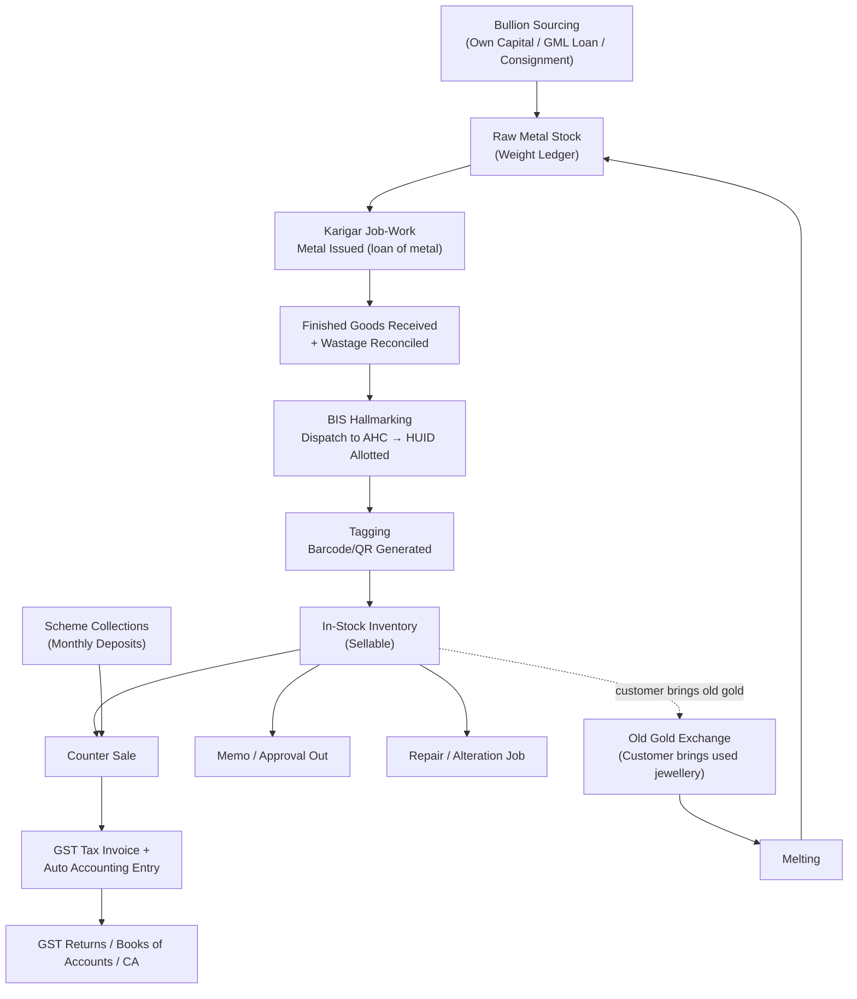

Notice two things that generic retail software never has to model:
1. **A closed loop back to raw material** (melting), which most retail systems have no equivalent of.
2. **Metal that the shop owns but doesn't physically hold** (with the karigar) and **metal the shop physically holds but doesn't fully own** (GML/consignment — see §1.6). This dual-ownership concept is where most home-grown ERPs break.

---

### 1.3 The Stakeholder Ecosystem

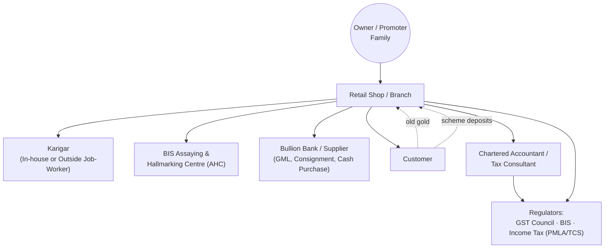

Each arrow above is a data flow your system must record: metal issue vouchers (Karigar), hallmarking dispatch/receipt (AHC), purchase invoices and loan drawdowns (Bank), tax invoices and receipts (Customer), and statutory filings (Gov via CA). A module that can't name which stakeholder it serves is probably not needed yet.

---

### 1.4 The Two Parallel Ledgers — Weight and Money 🚨

This is the single most important architectural mental model in the entire system, and the PRD alludes to it (§1.3.3) but never elevates it to the explicit "two independent, always-reconciling ledgers" principle it deserves.

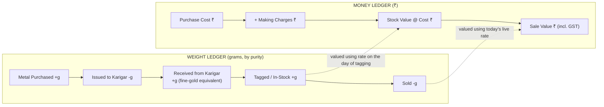

**Why this matters for schema design (preview of Phase 2):** every stock table needs **weight columns that are the source of truth**, with money columns being a *derived, rate-dependent* view. If you store "stock value in ₹" as a persisted field without also keeping the weight and the rate-used, you cannot answer "what is this worth *today*" without replaying history — which is exactly the query owners ask most.

💡 **Best Practice:** Never persist a money value without also persisting (a) the weight it was computed from, and (b) the exact rate ID/version used. This single rule prevents 80% of the reconciliation bugs seen in home-grown jewellery software.

---

### 1.5 Business Model Variants — And Why They Need Different Architecture

The PRD treats "single-store," "multi-branch," and "national brand" as scale variations of the same thing. In reality, they differ **structurally**, not just in size:

| Dimension | Single-Store Sarafa Shop | Family-Owned / Regional Chain | National Brand (Tanishq/Kalyan/Malabar) |
|---|---|---|---|
| **Rate-setting authority** | Owner sets rate once/twice a day, manually, often by phone call with the local Sarafa Association | Head office sets rate; branches usually cannot override | Centralized rate engine, pushed to all branches/franchisees within seconds of a change; branch-level override disabled |
| **Karigar model** | 1–3 known local karigars, informal, cash/trust-based | Mix of in-house karigars + outsourced job-work across branches | Large in-house manufacturing units + regional karigar networks + vendor-supplied finished goods (multi-sourced) |
| **Hallmarking rigor** | Often partial compliance historically; increasingly enforced | Fully compliant, dedicated hallmarking coordinator | 100% compliant, HUID traceability integrated into ERP, often has in-house/contracted AHC relationships |
| **Financing of stock** | Own capital, occasional local gold loan | Own capital + **Gold Metal Loan (GML)** from a bank/bullion supplier (see §1.6) — very common | Heavy use of **GML/Metal Gold Loan** and consignment stock from suppliers; treasury function manages metal-vs-money exposure |
| **Schemes (§12 of PRD)** | Informal, ledger-book based | Formal scheme software, single GSTIN | Structured schemes run with legal safeguards (see §1.6.2) — often via a separate registered entity/trust arrangement |
| **GSTIN / Branches** | Single GSTIN | Possibly multiple GSTINs if branches cross state lines | Always multi-GSTIN (state-wise registration is mandatory), sometimes franchise-operated branches with their own GSTIN under a brand license |
| **IT sophistication** | Excel/manual + calculator historically, now demanding simple, cheap software | Wants an affordable multi-branch ERP with WhatsApp/SMS | Wants enterprise integration: ERP + CRM + BI + Tally/SAP + e-invoicing at scale |
| **Ownership model of a "branch"** | N/A | Owned branches only | **Owned showrooms AND franchise (FOFO/FOCO) showrooms** — a business model the PRD never mentions, but is central to how Kalyan and Malabar actually expanded |

🏗 **Architecture Note:** A true SaaS product must support all three tiers from **one codebase** via configuration, not via three different products:
- **Single-store** → single-tenant-feel UI, rate entry is manual and simple, most modules optional/hidden.
- **Multi-branch** → central rate propagation, inter-branch stock transfer with in-transit tracking, branch-wise GSTIN.
- **Enterprise/National** → all of the above **plus** franchise-partition of data (a franchisee should never see another franchisee's stock/customers, even on the same platform), role hierarchy up to "Regional/Cluster Manager" and "Brand HQ," and GML/consignment stock-ownership tracking.

This tiering decision belongs in your **tenant configuration model**, which we'll design properly in Phase 13, but it must be *anticipated* now — retrofitting franchise data isolation onto a single-store schema later is a rewrite, not a patch.

---

### 1.6 A Domain Reality Missing From the PRD: Gold Metal Loan (GML) & Consignment Stock 🚨

This is the most consequential gap in the source PRD, and it's worth stopping on.

**What it is:** Most mid-to-large Indian jewellers do **not** buy all their gold with cash. They borrow **gold itself** (not rupees) from a bank or bullion supplier — this is called a **Gold Metal Loan (GML)** or **Metal Gold Loan (MGL)**. The jeweller receives, say, 10 kg of gold on loan (denominated in grams, at a small interest rate on the metal), converts it into jewellery and sells it, and later **repays the loan in gold** (or its rupee-equivalent at prevailing rate) — not in the original purchase-day rupees. Similarly, some designer/branded lines are given to a retailer **on consignment** (ownership stays with the supplier/brand until sold).

**Why it matters to your system:**
- Stock sitting in the showroom is **not uniformly "owned"**. A tag might be:
  - **Owned outright** (shop's own capital)
  - **Financed via GML** (shop owns it, but owes the *lender* an equivalent weight of gold, with interest accruing in grams, not just rupees)
  - **Consignment** (shop does *not* own it until sold — it should not appear on the shop's own Balance Sheet as stock, but must still appear as "in showroom, sellable" in inventory)
- This directly affects: Balance Sheet stock valuation (Phase 8), what "available for sale" means at the tag level (Phase 3), and the interest-cost/MIS view owners actually care about (a large chain's finance team watches "GML exposure in grams" daily, just like the sales team watches revenue).

❌ **Common Developer Mistake:** Treating "In Stock" as a single binary status. The moment you build multi-branch or enterprise-tier support, "In Stock" must be **(a) sellable-or-not** and **(b) whose-balance-sheet-is-this-on** as two independent flags on the tag record.

💡 **Best Practice:** Add a `stock_ownership_type` enum (`OWNED`, `GML_FINANCED`, `CONSIGNMENT`) at the Tag/Lot level from day one, even in your MVP schema, even if Phase 1 (MVP) of the rollout only supports `OWNED`. Adding this later means a migration touching every stock and accounting table.

We will design the actual tables for this in **Phase 2/Phase 3**; for now, just carry the concept forward.

#### 1.6.1 A Second Missing Nuance: Are Gold Schemes Legally "Deposits"? ⚖

The PRD's Scheme module (§12) describes the mechanics correctly (monthly deposit → bonus → redemption in jewellery) but never flags the **compliance boundary** that makes this legal in India:

- A scheme is safe from being classified as an illegal "deposit-taking" activity (which would trigger the **Banning of Unregulated Deposit Schemes Act, 2019** and/or issues under the **Prize Chits and Money Circulation Schemes (Banning) Act, 1978**) **only if redemption is strictly in kind (jewellery) and never cash-refundable**, and the terms are transparently disclosed upfront (this is why every scheme brochure you've seen explicitly says "redeemable against jewellery purchase only, no cash refund").
- Large chains typically also register schemes under the **Consumer Protection (Direct Selling) Rules** disclosure norms and sometimes route them through a separate legal entity for ring-fencing.

⚖ **Indian Compliance Requirement:** The system must **hard-block cash refund of scheme balances** by default (configurable only with an explicit legal/compliance override, logged in the audit trail) — this is a legal safety rail, not just a UX choice. We will build this constraint into Phase 10.

---

### 1.7 Critical Review of PRD Sections 0–3 (Line-by-Line)

**What the PRD gets right:**
- The Industry Primer (§1) correctly identifies the core vocabulary (GW/SW/NW, Wastage, HUID) and the "why this differs from generic retail" framing — this is a strong foundation.
- §1.3 already senses the dual-unit (weight+money) problem, though it doesn't develop it into an explicit ledger-pair architecture (we did that in §1.4 above).
- The Persona table (§3) is a reasonable *operational* role list.

**Gaps and ambiguities you must resolve before Phase 2:**

1. **🚨 No stock-ownership/financing concept anywhere** (§1.6 above) — affects Master Data, Inventory, and Accounting phases materially. This is the single biggest omission.
2. **Persona table (§3) is missing enterprise-tier roles:** no "Franchise Owner/Partner," no "Regional/Cluster Manager," no "Brand HQ Compliance Officer." Without these, your RBAC model (Phase 12) will need a breaking change the day a national-brand customer signs up.
3. **Persona table conflates "Inventory/Stock Manager" with "Purchase Manager."** In real chains these are different people with different approval limits (a stock manager tags and transfers; a purchase manager commits capital to buy metal/consignment). Worth splitting in Phase 2's RBAC design.
4. **Scheme module (§12) has no compliance guardrail** for cash-refund (see §1.6.1) — must be added as an explicit business rule, not left to configuration alone.
5. **"Out of Scope" (§2) doesn't address franchise/FOFO-FOCO billing separation** — if this product is meant to also serve growing regional chains that later franchise out, this decision needs to be made explicitly now (even if the answer is "not in v1"), because it changes the tenant model.
6. **Vision (§2) doesn't state a primary target segment for MVP prioritization.** "Single-store jeweller wanting simple billing" and "50-branch chain wanting GML tracking and franchise isolation" pull the MVP scope in very different directions. This is a product decision I'll ask you to make explicitly before Phase 2, since it determines how much of Phase 2's schema needs multi-tenant/multi-ownership fields from day one versus deferred.
7. **No mention of stock insurance / bank hypothecation of inventory** — many jewellers pledge showroom stock as collateral for a Cash Credit (CC) limit; hypothecated stock often has reporting obligations to the bank (a "stock statement" submitted monthly). Not urgent for MVP, but worth a placeholder field in Phase 2's Branch/Metal master.

None of these are reasons to distrust the PRD — it's an unusually strong document for a first draft. They are exactly the kind of gaps that only surface when you model the *actual business* first, which is the entire point of Phase 1.

---

### 1.8 SaaS Suitability Assessment (Preview)

| Deployment Target | Is Current PRD Design Sufficient As-Is? | Verdict |
|---|---|---|
| Single-store jeweller | Yes, largely | PRD's modules map cleanly; just hide GML/franchise complexity behind config |
| Multi-branch regional chain | Mostly, with gaps | Needs GML/consignment ownership flag (§1.6) and finer RBAC (§1.7-3) before Phase 8/12 build |
| National / enterprise / franchise | No — needs explicit design decisions | Needs franchise data-partition, GML tracking, Regional Manager role, and a scheme compliance guardrail before those modules are built (Phases 10, 12, 13) |

We'll revisit this table at the end of every phase and update the checkboxes as gaps get closed.

---

### 1.9 🚩 Decision Needed Before Phase 2 — RESOLVED

**Decision:** Architect for **multi-branch regional chain** first.

**Implication locked in for Phase 2 onward:**
- Every master data table carries `tenant_id` + `branch_id` (nullable `branch_id` = tenant-wide/HQ-level record) from day one.
- Rate Master is designed with **centralized HQ rate-setting + real-time propagation to branches**, with a controlled branch-level override path (permissioned, reason-logged) — not the single-shop "one person types the rate" model.
- Branch-wise GSTIN linkage is mandatory in Branch Master, not deferred.
- `stock_ownership_type` (§1.6) is included as a field now, but enterprise-only concerns (franchise data partitioning, Regional/Cluster Manager role) are *noted but deferred* — regional chain ≠ full franchise network yet. We'll revisit if you later confirm franchise support is needed.

---

### 1.10 Phase 1 Completion Checklist ✅

- [x] Understand why jewellery pricing is fundamentally different from generic retail (weight × live rate, not fixed SKU price)
- [x] Understand the full physical+financial lifecycle loop (bullion → karigar → hallmarking → tag → sale/exchange → accounting → back to melting)
- [x] Understand the stakeholder ecosystem and which module will serve which stakeholder
- [x] Internalize the **Weight Ledger / Money Ledger** dual-ledger model — this governs schema design in every future phase
- [x] Understand how single-store, regional-chain, and national-brand businesses differ *structurally*, not just in scale
- [x] Understand Gold Metal Loan (GML) and consignment stock as a first-class domain concept, missing from the PRD
- [x] Understand the legal guardrail around Gold Scheme cash-refunds
- [x] Have a documented list of PRD gaps to resolve before/during Phase 2

---

### 1.11 What Phase 2 Will Cover

**Phase 2 — Master Data Architecture**, covering (per the full 18-point framework: Business Objective through Phase Checklist) for each of: Metal Master, Rate Master (including the rate-versioning/history design that everything else depends on), Item/Design Master, Party Master (with the PAN/TCS/PMLA rules built in as data-level constraints, not app-level afterthoughts), Making-Charge/Wastage Scheme Master, Stone/Diamond Rate Master, Tax Master, and Branch/Location Master — plus the `stock_ownership_type` groundwork from §1.6 and the ERD showing how they all relate.

---

*End of Phase 1.*

---
---

# PHASE 2 — Master Data Architecture

**Decision locked (§1.9):** Architecting for **multi-branch regional chain** first. Every design decision below assumes multiple branches, one or more GSTINs, and a central HQ that sets policy — with room to grow into full enterprise/franchise later without a rewrite.

### 2.1 The Master Data Domain Model

Master data is the *shared vocabulary* every transaction module (Tagging, Billing, Karigar, Old Gold, Accounting) speaks. Get this wrong and every downstream module inherits the mistake permanently — master data is nearly impossible to safely restructure once transactions reference it.

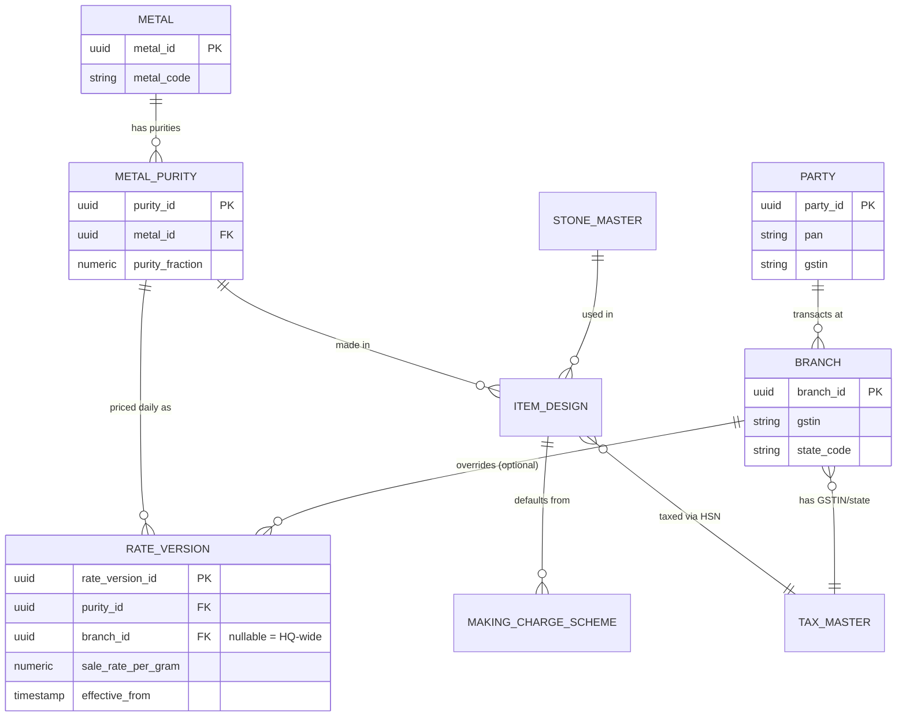

🏗 **Architecture Note:** Every table in this diagram carries `tenant_id`. Every one **except METAL, METAL_PURITY, TAX_MASTER policy definitions** also carries a nullable `branch_id` — nullable meaning "this record applies across all branches unless a branch-specific row overrides it." This single pattern (tenant-wide row with `branch_id = NULL`, overridden by a branch-specific row when present) is what lets one schema serve single-store and multi-branch tenants without a fork.

---

### 2.2 MODULE: Metal Master

#### 1. Business Objective
Provide the single, canonical, tenant-wide list of metals and purities the business deals in, so every other module references a normalized ID — never a free-text string like `"22K"` or `"916"` typed differently by different staff.

#### 2. Jewellery Domain Concepts
- **Purity/Fineness/Karat**: 24KT gold = 999 fine (100% pure); 22KT ≈ 916 (91.6% pure) — the dominant retail gold purity in India; 18KT = 750 (common for diamond-studded jewellery, since higher-karat gold is too soft to securely hold stone settings); 14KT = 585. Silver: 999 (fine silver, used for coins/bars) or 925 (Sterling, used for articles/utensils).
- **Standard unit**: India quotes gold conventionally per **10 grams** in the bullion/newspaper market, but internal system calculation must normalize to **per-gram** to avoid repeated unit-conversion bugs throughout the codebase.
- A **purity** is metal + a fineness fraction; it is the atomic unit that Rate Master prices and that every tag/item ultimately references.

#### 3. End-to-End Business Workflow
This master is set up **once at tenant onboarding** (pre-seeded with standard Indian purities) and changed **rarely** — only when the business adds a new product line (e.g., starts a platinum range, or a regional branch needs a locally-conventional purity like 970). In a multi-branch chain, this master is **HQ-owned and tenant-wide**; branches never create their own metals/purities — this is what keeps "22KT" meaning exactly the same thing across every branch's tags, rates, and reports.

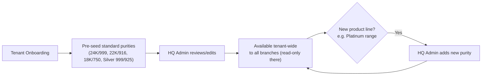

#### 4. Database Design Thinking
```sql
CREATE TABLE metals (
    metal_id        UUID PRIMARY KEY DEFAULT gen_random_uuid(),
    tenant_id       UUID NOT NULL,
    metal_code      VARCHAR(10)  NOT NULL,   -- GOLD, SILVER, PLATINUM
    metal_name      VARCHAR(50)  NOT NULL,
    default_hsn_code VARCHAR(10),
    is_active       BOOLEAN NOT NULL DEFAULT TRUE,
    created_by      UUID NOT NULL,
    created_at      TIMESTAMPTZ NOT NULL DEFAULT now(),
    UNIQUE (tenant_id, metal_code)
);

CREATE TABLE metal_purities (
    purity_id       UUID PRIMARY KEY DEFAULT gen_random_uuid(),
    tenant_id       UUID NOT NULL,
    metal_id        UUID NOT NULL REFERENCES metals(metal_id),
    purity_name     VARCHAR(30) NOT NULL,     -- '22KT/916'
    purity_fraction NUMERIC(6,4) NOT NULL,    -- 0.9160  (CHECK: 0 < x <= 1)
    standard_unit   VARCHAR(10) NOT NULL DEFAULT 'GRAM',
    hsn_code        VARCHAR(10),
    is_active       BOOLEAN NOT NULL DEFAULT TRUE,   -- FALSE = hidden from NEW tagging, not a delete
    deactivated_at  TIMESTAMPTZ,
    created_by      UUID NOT NULL,
    created_at      TIMESTAMPTZ NOT NULL DEFAULT now(),
    UNIQUE (tenant_id, metal_id, purity_name),
    CONSTRAINT chk_fraction CHECK (purity_fraction > 0 AND purity_fraction <= 1)
);
```
🚨 **Critical Business Rule:** No `branch_id` column here. Metal/Purity is **tenant-wide by design** — a branch cannot invent its own purity. This is the one master in the whole system that should *not* follow the nullable-branch-override pattern from §2.1, because purity meaning must be identical everywhere for rate/reporting integrity.

#### 5. Backend Architecture
Expose via a lightweight **Master Data Service**. This is read-heavy (called on nearly every billing line, tagging action, and report) and write-rare (edited maybe a few times a year). Cache the full active purity list per tenant in Redis/in-memory with a TTL + explicit invalidate-on-write; never let the billing hot path hit Postgres for this lookup.

#### 6. Frontend Screens
- **HQ Settings → Metal & Purity Master**: list, add, deactivate. HQ/Owner role only.
- Everywhere else (Item Master, Tagging, Billing): a read-only dropdown sourced from cache, scoped to `is_active = true`.

#### 7. Business Rules
- 🚨 A purity is **never hard-deleted**, only deactivated — historical tags, rates, and invoices reference it permanently.
- Deactivating a purity hides it from *new* tagging/purchase entry, but **existing tagged stock in that purity remains fully sellable** until sold out — deactivation is forward-looking only.
- `purity_fraction` is the single source of truth used to derive purity-specific rates from the 24KT base rate (Rate Master, §2.3) and to compute Fine Gold Equivalent for Karigar reconciliation (Phase 4).

#### 8. Validation Rules
- `purity_fraction` strictly between 0 (exclusive) and 1 (inclusive).
- `purity_name` unique per metal per tenant.
- Cannot deactivate the last remaining active purity of a metal that has open (unsold) stock — soft warning, not a hard block (owner may legitimately be discontinuing a line).

#### 9. Compliance Requirements ⚖
`default_hsn_code` must align with the GST HSN table (gold/silver/platinum jewellery = HSN 7113, per current GST Council notification — see Phase 7). This master only stores the *default* for auto-fill convenience; the authoritative GST rate itself lives in Tax Master and must be independently verifiable/updatable, since GST notifications change.

#### 10. Edge Cases
- Regional purity conventions that don't fit a clean KT number (e.g., some markets historically use 970 or other in-between fineness for specific traditional ornament styles) — the fraction field must accept **any** value in range, never a fixed enum/dropdown of "standard" karats only.
- A branch in a different state insists on a locally-used purity naming convention — resolved by tenant-wide naming plus (in Phase 2.9, Branch Master) a display-label override, not a duplicate purity record.

#### 11. Module Dependencies
Item/Design Master (purity FK), Rate Master (prices each purity), Tagging (tag stores purity_id), Billing Engine (rate lookup by purity), Karigar module (Fine Gold Equivalent calc), GST/HSN (Tax Master).

#### 12. Reports & KPIs
Metal/Purity-wise stock summary (foreshadowed — built fully in Phase 3), Purity Master change audit log.

#### 13. Security Considerations
Write access restricted to Owner/Admin/HQ role only; every create/deactivate is audit-logged (old value, new value, user, timestamp, reason) per PRD §14.9.

#### 14. Performance Considerations
Must be servable from cache in <5ms; must be bundled into the **offline POS cache** (PRD §16.2) so branches can keep billing during an internet outage without this lookup failing.

#### 15. Testing Strategy
Unit tests: fraction range validation; uniqueness constraint; deactivate-does-not-orphan-existing-tags; cache invalidation fires correctly on write; offline bundle includes latest active set.

#### 16. Common Developer Mistakes ❌
- Storing purity as a raw string (`"22K"`, `"916"`, `"22kt"` — three different strings for one concept) scattered across tables instead of a single FK — this alone causes most cross-report reconciliation bugs in first-draft jewellery software.
- Hardcoding purity fractions in application code instead of reading from this master — breaks the moment a shop needs a non-standard purity.
- Forgetting to seed default HSN codes at tenant onboarding, causing silent GST miscalculation later that's hard to trace back to "an empty master field."

#### 17. Production Best Practices 💡
Pre-seed standard Indian purities at onboarding (24KT/999, 22KT/916, 18KT/750, 14KT/585, Silver 999, Silver 925, Platinum 950) but keep the master fully editable; enforce soft-delete-only at the database constraint level, not just in application logic, so a future developer can't "clean up" the table with a DELETE statement.

#### 18. Phase Completion Checklist ✅
- [ ] `metals` and `metal_purities` tables created, tenant-scoped, no `branch_id`
- [ ] Soft-delete (`is_active`) enforced, hard delete blocked at DB level
- [ ] Standard purity seed data script written
- [ ] Redis/in-memory cache layer with invalidate-on-write
- [ ] Offline POS bundle includes this master
- [ ] Audit logging wired for create/deactivate

---

### 2.3 MODULE: Rate Master (Daily Metal Rate)

This is the single most important master in the entire system — nearly every rupee figure the business produces traces back to a row in this table. Get the versioning model wrong here and no amount of correct billing-engine code downstream can save you.

#### 1. Business Objective
Provide a **live, immutable, fully-auditable** record of "what is 1 gram of purity X worth right now," centrally set by HQ and propagated to all branches in near real time, while still allowing a controlled, logged branch-level override for genuine local market variance.

#### 2. Jewellery Domain Concepts
- Rate is set once or **multiple times a day** (intraday revisions are normal, especially around bullion market volatility or festivals).
- **Sale Rate** vs **Purchase/Buy-back Rate** — the shop always buys old gold back slightly below what it sells at (its margin/risk buffer on old gold exchange, Phase 6).
- Rates for 22KT/18KT/14KT are conventionally **derived from the 24KT base rate × purity fraction**, but real shops frequently round or manually adjust the derived figure to match local market/association convention — the system must support **both** auto-derivation and manual override, per purity, on every revision.
- "**Active rate**" is not "today's rate" — it is the *latest revision whose `effective_from` timestamp has passed*, which may be the 3rd revision of the day by 2 PM.

#### 3. End-to-End Business Workflow

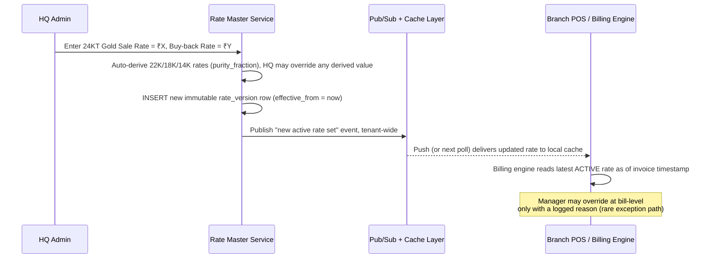

#### 4. Database Design Thinking
```sql
CREATE TABLE rate_versions (
    rate_version_id      UUID PRIMARY KEY DEFAULT gen_random_uuid(),
    tenant_id            UUID NOT NULL,
    branch_id            UUID NULL,   -- NULL = HQ tenant-wide rate; set = branch-specific override
    purity_id            UUID NOT NULL REFERENCES metal_purities(purity_id),
    sale_rate_per_gram      NUMERIC(12,2) NOT NULL CHECK (sale_rate_per_gram > 0),
    purchase_rate_per_gram  NUMERIC(12,2) NOT NULL CHECK (purchase_rate_per_gram > 0),
    effective_from       TIMESTAMPTZ NOT NULL,
    entered_by           UUID NOT NULL,
    approved_by          UUID,
    is_override          BOOLEAN NOT NULL DEFAULT FALSE,
    override_reason      TEXT,             -- mandatory if is_override = true
    derived_from_version_id UUID REFERENCES rate_versions(rate_version_id), -- traceability if auto-derived
    created_at           TIMESTAMPTZ NOT NULL DEFAULT now()
    -- NOTE: no updated_at, no UPDATE ever performed on this table.
);

CREATE INDEX idx_rate_lookup
    ON rate_versions (tenant_id, purity_id, branch_id, effective_from DESC);
```
🚨 **Critical Business Rule:** `rate_versions` is **append-only**. There is no `UPDATE` statement anywhere in the codebase that touches this table. "Correcting" a mistaken rate entry means inserting a *new* row with a later `effective_from` and an `override_reason` explaining the correction — never editing history. This is the exact evidentiary trail a GST/Income-tax audit or an internal dispute (customer claims they were billed at yesterday's rate) relies on.

**Lookup logic** (used everywhere — Billing, Old Gold, Valuation reports):
```sql
SELECT * FROM rate_versions
WHERE tenant_id = :tenant
  AND purity_id = :purity
  AND effective_from <= :as_of_timestamp
  AND (branch_id = :branch OR branch_id IS NULL)
ORDER BY (branch_id IS NOT NULL) DESC, effective_from DESC
LIMIT 1;
```
This prefers a branch-specific override if one exists at that timestamp, else falls back to the HQ tenant-wide rate — this single query pattern is what makes the nullable-`branch_id` design from §2.1 actually work in practice.

#### 5. Backend Architecture 🏗
Rate Master runs as its own service with a **publish/subscribe** channel (Kafka topic or Redis pub/sub) — the moment HQ activates a new rate, an event fans out to every branch's local cache instantly, rather than branches polling the database on every bill line (which would both be slow and hammer the DB during festival-season load spikes, PRD §16.2). Each branch POS keeps a **local in-memory "current rate per purity" cache**, refreshed by the subscription, with a periodic reconciliation poll as a safety net. Offline POS clients persist the last-received rate bundle to local storage and display a "rate last updated at HH:MM — may be stale" banner if disconnected beyond a configurable tolerance (e.g., 30 minutes) rather than silently billing on old data.

#### 6. Frontend Screens
- **HQ Rate Entry** (fast, large numeric-keypad UI — done under time pressure every morning): enter 24KT sale + buy-back rate → auto-derived table for every other active purity appears instantly, editable inline → single "Activate" action.
- **Branch Rate Ticker/Board** (read-only): many shops physically display a rate board; this screen can double as that public-facing display.
- **Rate History & Audit**: full immutable history, filterable by purity/branch/date, exportable for the CA.
- **Branch Override** screen: permissioned separately from normal billing permission; mandatory reason field; flags to HQ if the override deviates from HQ rate beyond a configured tolerance.

#### 7. Business Rules 🚨
- Billing **always** resolves rate by `(tenant, purity, branch, invoice_timestamp)` — never by calendar date alone, since multiple revisions per day are the norm, not the exception.
- An **Advance/Booking** (Phase 5, PRD §7.6) that locks today's rate does so by **storing the specific `rate_version_id`**, not a copied number — at conversion time, the system re-fetches that exact version unless staff explicitly opts to re-price at the current live rate.
- Purchase (buy-back) rate must be ≤ sale rate for the same purity — a soft validation warning, not a hard block, since rare local exceptions can occur but should always be surfaced for review.

#### 8. Validation Rules
- Both rate fields > 0.
- If a purity's rate is manually overridden away from its 24KT-derived value by more than a configurable sanity threshold (e.g., ±5%), the system requires a second-person approval before activation. This single guard rail catches the single most damaging real-world failure mode in this domain: a fat-fingered rate entry (an extra zero, a decimal shift) that silently misprices every bill for the rest of the day until someone notices.

#### 9. Compliance Requirements ⚖
Rate history must be preserved **permanently, never purged** — it is the primary evidence that a specific invoice's metal valuation was correct and untampered-with, and is exactly the kind of register a GST or Income Tax officer can ask to inspect (PRD §5.5 treats the *stock* register as inspectable; the *rate* register underpinning every stock valuation deserves the same permanence guarantee, and the PRD doesn't say this explicitly — worth calling out as a strengthening addition).

#### 10. Edge Cases
- Two HQ users submitting a rate revision within the same second (race condition) — needs a serialized write path (DB-level unique constraint or application-level lock per tenant+purity) so one write cleanly supersedes the other with a deterministic `effective_from` ordering.
- A branch goes offline right when HQ pushes a new rate — must queue and reconcile on reconnect; must never let a branch silently keep billing on a stale cached rate indefinitely (staleness banner + configurable hard cutoff).
- Festival days (Akshaya Tritiya, Dhanteras) with 10+ revisions in one day — UI must show "latest 5, expand for full history," not an unbounded flat list.
- A branch legitimately needs a different rate due to local market convention — handled via the permissioned override path, never a workaround in application code.

#### 11. Module Dependencies
Metal Master (purity FK, §2.2), Billing Engine (every single line item, Phase 5), Old Gold Exchange (buy-back rate, Phase 6), Stock Valuation reports ("at market" vs "at cost" views, Phase 3/8), Advance/Booking rate-lock (Phase 5).

#### 12. Reports & KPIs
Rate History/Audit Trail, Rate Volatility report (revisions-per-day trend — also a useful signal for reviewing staff override patterns), Branch Rate Variance report (branch override vs HQ rate, outliers flagged).

#### 13. Security Considerations
Write access restricted to a specific "Rate Setter" permission (typically Owner/Admin at HQ) distinct from general admin rights; branch override requires its own distinct permission; every write is immutably audit-logged (this table *is* the audit log, by design).

#### 14. Performance Considerations
Rate lookup sits in the hot path of every billing line — PRD §16.2 budgets <200ms per line for the whole calculation engine, so this specific lookup must be served from the local branch cache in low single-digit milliseconds, never a live cross-network DB query per line.

#### 15. Testing Strategy
Concurrency test (simultaneous rate submissions resolve deterministically), derivation-accuracy test (24KT → 22K/18K/14K arithmetic), rate-lock/advance-booking honoring test, offline-cache staleness-banner test, fat-finger sanity-threshold test, branch-override-precedence-in-lookup-query test.

#### 16. Common Developer Mistakes ❌
- Running `UPDATE rate_versions SET sale_rate = ...` to "fix" a wrong entry — destroys the audit trail; the correct fix is always a new row.
- Looking up rate by `DATE(effective_from) = today` instead of a timestamp comparison — silently breaks the moment there's a second revision in the same day.
- Skipping the cache/pub-sub layer and querying Postgres directly per bill line — works fine in a demo, then collapses under real festival-season concurrent load.

#### 17. Production Best Practices 💡
Treat this table as an **event-sourced ledger**, not a "current value with history" table — the mental model matters because it changes how every future developer is tempted to write to it. Build the fat-finger sanity-threshold guard rail from day one; it is cheap to build and prevents the single most damaging class of error in this entire domain. Make the HQ rate-entry screen fast and low-friction, since it is done under genuine time pressure every single morning by someone who wants to get back to the sales floor.

#### 18. Phase Completion Checklist ✅
- [ ] `rate_versions` table created, append-only enforced (no UPDATE path exists in code or DB permissions)
- [ ] Pub/sub propagation from HQ to branch caches implemented
- [ ] Branch-override permission separate from HQ rate-setter permission
- [ ] Fat-finger sanity-threshold check with second-approval flow
- [ ] Offline staleness banner + cutoff implemented
- [ ] Rate-lock mechanism for Advance/Booking stores `rate_version_id`, not a copied number
- [ ] Rate History/Audit and Branch Variance reports available

---

### 2.4 What Comes Next in Phase 2

Next up: **Item/Design Master** and **Party Master** — the latter needs real care, since the PAN/TCS/PMLA rules from PRD §4.4 have to be built as *data-level constraints* on the Party/transaction tables (not just a UI warning), or they will eventually be bypassed. After that: Making-Charge/Wastage Scheme Master, Stone/Diamond Rate Master, Tax Master, and Branch Master (where the GSTIN-per-branch and `stock_ownership_type` groundwork from §1.6 gets finalized).

---

*End of Phase 2, Part A (Metal Master + Rate Master).*

---
---

### 2.5 MODULE: Item / Design Master

**1. Business Objective:** Define the *design template* (not a fixed-price SKU) — category, default making charge/wastage, HSN, images — that every physical Tag (Phase 3) instantiates with its own actual weight.

**2. Domain Concepts:** "SKU" doesn't fit jewellery; **Item = design template**, **Tag = sellable instance** with real weight. Category (Ring, Necklace, Bangle, Chain, Earring, Bracelet, Pendant, Coin, Bar) and sub-category (Ladies/Gents/Kids; Traditional/Modern/Antique/Casting/Handmade) drive default making-charge slabs.

**3. Workflow:** Created at design stage (in-house design or received from karigar/supplier) → default MC/wastage/HSN attached → reused as a template every time a batch of that design is tagged. In a multi-branch chain, the design catalog is tenant-wide, with a per-branch "offered here" flag (flagship stores often carry a heavier bridal range that smaller branches don't stock).

**4. Database Design Thinking:**
```sql
CREATE TABLE item_designs (
    item_id            UUID PRIMARY KEY,
    tenant_id           UUID NOT NULL,
    design_code         VARCHAR(30) NOT NULL,
    design_family_code  VARCHAR(30),   -- groups same design across purities, see Edge Cases
    category            VARCHAR(30),
    sub_category        VARCHAR(50),
    metal_id            UUID REFERENCES metals(metal_id),
    purity_id           UUID REFERENCES metal_purities(purity_id),
    default_mc_type      VARCHAR(10),  -- PER_GRAM | PERCENT | FIXED
    default_mc_value     NUMERIC(12,2),
    default_wastage_pct  NUMERIC(5,2),
    hsn_code            VARCHAR(10),
    gender_tag          VARCHAR(20),
    is_active           BOOLEAN DEFAULT TRUE,
    UNIQUE (tenant_id, design_code)
);
CREATE TABLE item_branch_availability (item_id UUID, branch_id UUID, is_offered BOOLEAN, PRIMARY KEY (item_id, branch_id));
CREATE TABLE item_images (item_id UUID, image_url TEXT, sort_order INT);
```

**5. Backend Architecture:** Extension of the Master Data Service; cached; a search/filter index (category, sub-category, gender, price band) is needed once the catalog grows past a few thousand designs — large chains carry tens of thousands.

**6. Frontend Screens:** HQ design-catalog admin (image upload, branch-availability toggle); counter search/filter screen for staff.

**7. Business Rules 🚨:** Resolving an ambiguity between PRD §4.3 (item-level defaults) and §4.5 (category-level slabs): the correct hierarchy is a **three-tier override chain — Category Slab (§2.6) → Item Design default (this table) → Transaction-time override (Phase 5, with approval)**. The PRD never states this hierarchy explicitly; it matters, because without it, two developers will build two different, conflicting "default" resolution paths.

**8. Validation Rules:** `design_code` unique per tenant; MC value non-negative; wastage % 0–100, flagged for review above ~15%.

**9. Compliance Requirements ⚖:** HSN default inherited from Metal Master but overridable per item — a diamond-studded gold design may need different classification handling once Phase 7's HSN-split question (raised in §2.8 below) is resolved.

**10. Edge Cases:** The same design offered in two purities (e.g., 22K and 18K versions of one ring) → model as two separate `item_designs` rows sharing one `design_family_code` for reporting rollups, never a single row with multiple purities. Bespoke/custom-order pieces (Phase 5) may have no catalog entry at all — billing must support an ad-hoc "Custom Item" line not tied to any `item_id`, optionally promoted to a catalog design later.

**11. Module Dependencies:** Metal/Purity Master, Making-Charge Scheme Master (§2.6), Billing Engine (Phase 5), Stone Master (§2.8) for studded designs.

**12. Reports & KPIs:** Design-wise sales velocity, category-wise contribution, slow-moving design report (feeds the Ageing Report in Phase 3).

**13. Security Considerations:** HQ/merchandising role writes; branch staff read-only, with availability-toggle rights only if explicitly delegated.

**14. Performance Considerations:** Full-text/faceted search index required at catalog scale; cached for counter-side lookups.

**15. Testing Strategy:** design-code uniqueness; design-family rollup correctness across purity variants; ad-hoc custom-item bypass path; branch-availability filter correctness.

**16. Common Developer Mistakes ❌:** Conflating Item with Tag — putting weight/quantity fields on this table is the classic generic-retail-POS instinct to resist; this table holds *only* design metadata and defaults, never actual stock.

**17. Production Best Practices 💡:** Introduce `design_family_code` from day one — retrofitting cross-purity reporting rollups onto an existing catalog is painful and error-prone.

**18. Phase Completion Checklist:**
- [ ] `item_designs` + `item_branch_availability` + `item_images` tables created
- [ ] Three-tier MC/wastage override hierarchy documented and implemented consistently
- [ ] Ad-hoc custom-item billing path supported without a catalog entry
- [ ] Search index in place for catalog-scale lookups

---

### 2.6 MODULE: Party Master (Customer & Supplier — Unified Ledger)

**1. Business Objective:** One unified ledger entity (Tally-style "Party") since the same individual can be both a debtor (buyer) and a creditor (old-gold seller) — avoids duplicated/fragmented records and lets balances net correctly.

**2. Domain Concepts:** PAN mandatory above ₹2,00,000 cash (Rule 114B), Form 60 as the no-PAN fallback, GSTIN for B2B invoicing/ITC, TCS (Sec 206C) on qualifying cash receipts, PMLA Cash Transaction Report (CTR) threshold at ₹10 lakh, Aadhaar as optional high-value KYC.

**3. End-to-End Workflow:** Created at first transaction (search-by-mobile is the primary lookup, PRD §7.1) or pre-registered (scheme enrollment, wholesale account).

🏗 **Architecture Note (locked in by the multi-branch decision, §1.9):** Party Master **must be tenant-wide, not branch-scoped**. A customer's purchase history, credit limit, and — critically — their **aggregate TCS threshold across all branches** must be consistent no matter which branch they walk into. Branch-scoping this table is a common, subtle mistake that silently breaks both chain-wide loyalty (Phase 11) and TCS aggregation (a genuine compliance risk, since the ₹2,00,000/threshold rules apply to the *person*, not to "the person at Branch A").

**4. Database Design Thinking:**
```sql
CREATE TABLE parties (
    party_id        UUID PRIMARY KEY,
    tenant_id       UUID NOT NULL,          -- tenant-wide, NO branch_id here
    party_name      VARCHAR(150) NOT NULL,
    mobile          VARCHAR(15) NOT NULL,
    email           VARCHAR(150),
    pan             VARCHAR(10),            -- encrypted at rest
    form60_on_file  BOOLEAN DEFAULT FALSE,
    gstin           VARCHAR(15),
    aadhaar_enc     TEXT,                   -- encrypted, masked in all UI except KYC screen
    party_type      VARCHAR(15) NOT NULL,   -- RETAIL | WHOLESALE | SCHEME | SUPPLIER
    credit_limit    NUMERIC(14,2) DEFAULT 0,
    opening_balance NUMERIC(14,2) DEFAULT 0,
    is_active       BOOLEAN DEFAULT TRUE,
    UNIQUE (tenant_id, mobile)
);
CREATE TABLE party_ledger_entries (
    entry_id UUID PRIMARY KEY, party_id UUID REFERENCES parties(party_id),
    branch_id UUID,   -- WHERE the txn happened, for reporting -- not a scoping key on the party itself
    txn_type VARCHAR(20), ref_invoice_id UUID, debit NUMERIC(14,2), credit NUMERIC(14,2),
    balance_after NUMERIC(14,2), entry_date TIMESTAMPTZ
);
```

**5. Backend Architecture:** A Party Service exposing search-by-mobile as its primary API, a duplicate-detection/merge utility (a very real operational need — the same customer routinely gets entered twice under a mistyped mobile number, and ledger history must survive a merge intact), and a ledger-posting API consumed by Billing, Old Gold, and Scheme modules alike.

**6. Frontend Screens:** Quick-add-customer modal at the billing counter (mobile + name minimum; more fields required only once a compliance threshold is triggered); full Party profile (ledger, purchase history, scheme enrollments) visible only to Owner/Accountant per PRD §15.2 — counter staff see a limited view.

**7. Business Rules 🚨 (enforced as data-level constraints, not UI-only checks — this directly resolves the open question from the end of Phase 2's first message):**
- A sale cannot be finalized with `cash_amount >= 200000` unless the linked party has a non-null `pan` OR `form60_on_file = true`. This check belongs in the invoice-finalization service/stored procedure — **never only in the frontend form**, since a frontend-only check is trivially bypassed by direct API calls or bulk imports.
- TCS liability is computed from **cumulative cash receipts from a party across the entire tenant** (all branches), not per-branch — a service-level trigger, not a per-invoice isolated check.
- PMLA CTR: cash transactions ≥ ₹10 lakh (single or connected) are auto-flagged into a compliance review queue table, never silently passed through.

**8. Validation Rules:** mobile mandatory and unique per tenant; PAN format regex; GSTIN format + checksum validation when provided.

**9. Compliance Requirements ⚖:** Rule 114B, TCS Sec 206C, PMLA CTR — all three enforced as described above; PAN/Aadhaar encrypted at rest (PRD §15.2).

**10. Edge Cases:** Family members sharing one mobile number (needs a "linked family group" concept for loyalty/scheme purposes without merging distinct legal identities, since PAN differs); NRI/foreign customers with no PAN/Aadhaar (Form 60 or passport-based KYC path); wholesale B2B buyers needing GSTIN-based invoicing distinct from the retail flow.

**11. Module Dependencies:** Billing (every invoice), Old Gold Exchange (seller KYC), Scheme (enrollment), Accounting (Debtors/Creditors ledger, Phase 8).

**12. Reports & KPIs:** Customer-wise sales history, PAN/Form-60 Compliance Report (flags transactions missing mandatory PAN), TCS Report, Cash Transaction/PMLA Report, Credit-limit-exceeded report.

**13. Security Considerations:** PAN/Aadhaar visible only to Owner/Accountant roles; counter staff see name/mobile/loyalty tier only — not full financial/KYC detail.

**14. Performance Considerations:** Mobile-number search must be sub-100ms — it's the very first action of every single billing transaction; index on `(tenant_id, mobile)`.

**15. Testing Strategy:** dedupe/merge correctness (ledger history intact post-merge), PAN-threshold-block trigger test, tenant-wide TCS-aggregation test, encryption-at-rest verification.

**16. Common Developer Mistakes ❌:** Branch-scoping the customer table (breaks chain-wide loyalty and TCS aggregation); implementing the PAN/₹2,00,000 rule only as a frontend form validation (bypassable via API/bulk import); storing PAN/Aadhaar in plaintext.

**17. Production Best Practices 💡:** Build the PAN/TCS/PMLA rules as database triggers or a dedicated compliance-check service every entry point (POS, API, bulk import) must pass through — never rely on any single UI form being the only gate.

**18. Phase Completion Checklist:**
- [ ] `parties` table is tenant-wide, no `branch_id` column
- [ ] PAN/Form-60 threshold enforced at the service/DB layer, not just the UI
- [ ] TCS aggregation computed across all branches for one party
- [ ] PAN/Aadhaar encrypted at rest, masked in non-KYC views
- [ ] Duplicate-party merge tool preserves ledger history

---

### 2.7 MODULE: Making-Charge / Wastage Scheme Master

**1. Business Objective:** Predefine MC/wastage slabs by category so counter staff never has to remember or manually type rates — reduces billing errors and speeds up the counter.

**2. Domain Concepts:** Three MC types (Per-gram, Percentage-of-metal-value, Fixed-per-piece); Wastage as % of net weight; the merged "Value-Addition" display mode (PRD §7.2) as an alternative to showing Wastage and Making Charges as separate lines.

**3. Workflow:** HQ merchandising sets slabs per category/sub-category, optionally per branch (a flagship store may command a different MC than a small outlet). This is **tier 1** of the three-tier override hierarchy established in §2.5 — Item Design (tier 2) and transaction-time override (tier 3) can each override it in sequence.

**4. Database Design Thinking:**
```sql
CREATE TABLE mc_wastage_schemes (
    scheme_id      UUID PRIMARY KEY,
    tenant_id      UUID NOT NULL,
    branch_id      UUID,             -- NULL = tenant-wide slab
    category       VARCHAR(30),
    sub_category   VARCHAR(50),
    mc_type        VARCHAR(10),      -- PER_GRAM | PERCENT | FIXED
    mc_value       NUMERIC(12,2),
    wastage_pct    NUMERIC(5,2),
    effective_from DATE NOT NULL,
    is_active      BOOLEAN DEFAULT TRUE
);
```
Unlike Rate Master, slabs change infrequently enough that simple effective-dating (not full event-sourcing per transaction) is adequate — but a row is still never overwritten; a change means a new dated row.

**5. Backend Architecture:** Cached master, low write-frequency; resolved via the three-tier hierarchy at billing time.

**6. Frontend Screens:** HQ slab-editor grid (category × sub-category × MC/wastage).

**7. Business Rules 🚨:** The three-tier hierarchy (Category Slab → Item Design override → Transaction-time override with approval) is the single resolution order used everywhere — must be implemented as one shared function, not re-derived independently in Billing vs. Estimate screens (echoing the Phase 5 Calculation Engine principle).

**8. Validation Rules:** Wastage % in a sane range, flagged above ~15% for review.

**9. Compliance Requirements ⚖:** GST law requires Making Charges shown separately if charged separately, OR merged as Value-Addition — the display mode must be **consistent within one invoice**, never mixed line-by-line.

**10. Edge Cases:** Festival promotional MC-waiver campaigns — a temporary, time-bound override, modeled as a dated slab row, not a code branch.

**11. Module Dependencies:** Item Master (§2.5), Billing Engine (Phase 5).

**12. Reports & KPIs:** Making-Charges Income by category (feeds Phase 5/11 reports).

**13. Security Considerations:** HQ/merchandising write access only.

**14. Performance Considerations:** Cached, low-write — no special concern.

**15. Testing Strategy:** Override-hierarchy resolution-order test across all three tiers.

**16. Common Developer Mistakes ❌:** Hardcoding slabs in the billing engine code instead of driving them from this data-driven master.

**17. Production Best Practices 💡:** Keep this fully data-driven so a festival MC-waiver campaign is a data change, not a code deploy.

**18. Phase Completion Checklist:**
- [ ] `mc_wastage_schemes` table with tenant/branch-nullable scoping
- [ ] Three-tier override resolution implemented as one shared function
- [ ] Value-Addition vs. separate-line display mode is a per-invoice-consistent setting

---

### 2.8 MODULE: Stone / Diamond Rate Master

**1. Business Objective:** Price stones (diamonds/gemstones) independently of the metal rate, since their value depends on the 4Cs (carat, cut, clarity, colour) or a per-piece figure for small/melee stones — never weight × metal-rate.

**2. Domain Concepts:** Certified stones (GIA/IGI/SGL certificate number) vs. uncertified melee stones; rate-per-carat vs. rate-per-piece; 1 carat = 0.2 grams (relevant to the GW/SW/NW math, PRD §17).

**3. Workflow:** Staff/gemologist maintains slab rates by type + shape + clarity + colour + carat-range for uncertified/small stones. For anything certified or one-off, the PRD's own worked example (§17) shows the *normal* path is entering a **certified valuation directly per piece** — the slab-rate lookup is really the fallback for small uncertified stones, not the primary path, and this handbook makes that priority order explicit where the PRD leaves it implicit.

**4. Database Design Thinking:**
```sql
CREATE TABLE stone_rate_master (
    stone_rate_id   UUID PRIMARY KEY, tenant_id UUID NOT NULL,
    stone_type      VARCHAR(30), shape VARCHAR(20), clarity VARCHAR(10), color_grade VARCHAR(10),
    carat_range_min NUMERIC(6,3), carat_range_max NUMERIC(6,3),
    rate_per_carat  NUMERIC(12,2), rate_per_piece NUMERIC(12,2),
    effective_from  DATE NOT NULL
);
CREATE TABLE stone_certifications (
    cert_id UUID PRIMARY KEY, tag_id UUID REFERENCES tags(tag_id),
    cert_body VARCHAR(20), cert_number VARCHAR(50),
    certified_carat NUMERIC(6,3), certified_value NUMERIC(14,2), cert_file_url TEXT
);
```

**5. Backend Architecture:** Cached slab master plus a certification-attachment service (file upload to the same S3-compatible object store used for hallmarking certificates, PRD §16.1).

**6. Frontend Screens:** Slab-rate editor; per-tag stone-entry screen with certificate upload.

**7. Business Rules 🚨:** Once a certification is attached, its `certified_value` **always overrides** the slab-rate calculation for that stone — the system must never silently recompute from the slab after a certified value has been entered.

**8. Validation Rules:** carat > 0; certificate number is free-text (format varies by lab, no fixed regex).

**9. Compliance Requirements ⚖:** No GST-specific rule beyond correct HSN classification at billing time.

🚨 **Unresolved tension worth flagging before Phase 7 is finalized:** the PRD's own worked example (§17) bills the diamond value as part of *one* composite taxable value at the 3% jewellery-composite GST rate, while its own HSN table (§9.2) lists diamonds separately at roughly 1.5%. These two parts of the source PRD are in tension with each other, and this must be resolved with the client's CA (does the specific jewellery piece require a split HSN line for the diamond portion, or is the whole piece taxed as one composite supply?) before the GST module (Phase 7) is built — this is exactly the kind of ambiguity that's cheap to resolve now and expensive to discover after invoices have already been issued incorrectly.

**10. Edge Cases:** Multiple small stones of mixed types in one piece — store an itemized stone-weight/value breakdown per tag, never one blended figure, so the HSN-split question above stays resolvable later without re-entering data.

**11. Module Dependencies:** Item Master, Billing Engine, Tagging.

**12. Reports & KPIs:** Stone Stock Register (carats in/out, PRD §5.5).

**13. Security Considerations:** Standard write-role restriction.

**14. Performance Considerations:** Low volume, no special concern.

**15. Testing Strategy:** Certification-override-precedence test; carat-to-gram conversion accuracy test.

**16. Common Developer Mistakes ❌:** Blending metal + stone value into one number at the tag level with no stone-level breakdown retained — forecloses the HSN-split question before it's even been decided by the CA.

**17. Production Best Practices 💡:** Always retain the itemized stone breakdown even while billing a composite line — the classification question can then be resolved later without re-entering historical data.

**18. Phase Completion Checklist:**
- [ ] `stone_rate_master` + `stone_certifications` tables created
- [ ] Certified-value-overrides-slab rule enforced
- [ ] Itemized stone breakdown retained even in composite-billing mode
- [ ] HSN-split question flagged for CA sign-off before Phase 7

---

### 2.9 MODULE: Tax Master

**1. Business Objective:** A central, versioned, government-notification-driven table of HSN codes and GST rates — the PRD is explicit (§9.2) these must never be hardcoded, and Tax Master is where that principle becomes an actual table.

**2. Domain Concepts:** HSN 7113 (gold/silver/platinum jewellery), 7102 (diamond), 7103 (other stones), 7108/7106 (bullion), SAC 9988 (job-work services); CGST/SGST split for intra-state, IGST for inter-state, determined by comparing the billing branch's state to the customer's billing state.

**3. Workflow:** HQ/Accountant maintains versioned rate rows whenever the GST Council issues a notification; the system should alert (Phase 11) when a rate's effective period is about to lapse with no successor row, prompting review rather than silently defaulting to a stale rate.

**4. Database Design Thinking:**
```sql
CREATE TABLE tax_rates (
    tax_rate_id     UUID PRIMARY KEY, tenant_id UUID NOT NULL,
    hsn_or_sac_code VARCHAR(10), description VARCHAR(100),
    cgst_rate NUMERIC(5,2), sgst_rate NUMERIC(5,2), igst_rate NUMERIC(5,2),
    effective_from DATE NOT NULL, effective_to DATE,
    notification_ref VARCHAR(100)   -- traceability to the actual government notification
);
CREATE TABLE state_codes (state_code CHAR(2) PRIMARY KEY, state_name VARCHAR(50));
```
🚨 Same append/version discipline as Rate Master (§2.3): never overwrite a historical tax-rate row — old invoices must remain reconstructible exactly as filed.

**5. Backend Architecture:** Cached, versioned lookup by `(hsn_code, as_of_date)`.

**6. Frontend Screens:** HQ/Accountant-only Tax Master screen with a `notification_ref` field — every CA who audits this system will ask "which government notification authorizes this rate," and having it queryable saves real pain later.

**7. Business Rules 🚨:** CGST+SGST vs. IGST is determined automatically from branch-state vs. customer-state comparison — never manually chosen by counter staff.

**8. Validation Rules:** `cgst_rate + sgst_rate` should typically equal `igst_rate` for the same HSN (a sanity check, since the dual-GST and integrated-GST rates are designed to be equivalent) — mismatches are flagged for review, not silently accepted.

**9. Compliance Requirements ⚖:** This table's currency *is* the compliance requirement — a stale rate here is a direct filing-error risk.

**10. Edge Cases:** A rate change effective mid-month (must be date-precise, not month-precise).

**11. Module Dependencies:** Metal/Item Master (default HSN, §2.2/§2.5), Billing/GST Engine (Phase 5/7).

**12. Reports & KPIs:** Effective Tax Rate report; "rates expiring soon" alert list.

**13. Security Considerations:** Accountant/HQ write access only.

**14. Performance Considerations:** Cached, low write frequency.

**15. Testing Strategy:** Intra- vs. inter-state split correctness; effective-date boundary tests.

**16. Common Developer Mistakes ❌:** Hardcoding "3% GST on jewellery" as a constant in billing code — the exact failure mode the source PRD explicitly warns against (§9.2), and the most common shortcut first-time builders take.

**17. Production Best Practices 💡:** Build the `notification_ref` field in from day one; it is the single cheapest thing you can do to make this system audit-friendly.

**18. Phase Completion Checklist:**
- [ ] `tax_rates` table append-only, versioned by `effective_from`/`effective_to`
- [ ] CGST/SGST vs. IGST determined automatically from state comparison
- [ ] `notification_ref` populated for every rate row
- [ ] "Rate expiring soon" alert implemented

---

### 2.10 MODULE: Branch / Location Master

**1. Business Objective:** Register every physical location with its own GSTIN (GST registration is state-wise), enabling correct invoice numbering, correct CGST/SGST-vs-IGST determination, and branch-wise reporting — this is the master that makes the multi-branch decision (§1.9) real.

**2. Domain Concepts:** GST registration is state-wise — a chain with showrooms in Maharashtra and Karnataka needs two GSTINs, one per state, even under one company/PAN. Invoice numbering must be sequential and gap-free **per GSTIN per financial year** (a hard GST-law requirement, PRD §16.2). Stock-in-transit between branches needs its own tracked state.

**3. Workflow:** HQ registers each branch at onboarding/expansion; GSTIN, state code, address, invoice-numbering series prefix, and (per §1.6) the branch's default `stock_ownership_type` are configured once and rarely touched thereafter.

**4. Database Design Thinking:**
```sql
CREATE TABLE branches (
    branch_id          UUID PRIMARY KEY, tenant_id UUID NOT NULL,
    branch_code        VARCHAR(20) NOT NULL,
    branch_name        VARCHAR(100), address TEXT, state_code CHAR(2),
    gstin              VARCHAR(15),   -- see business rule below: NOT always unique per branch
    invoice_series_prefix VARCHAR(10),
    is_active          BOOLEAN DEFAULT TRUE,
    default_stock_ownership_type VARCHAR(15) DEFAULT 'OWNED',
    UNIQUE (tenant_id, branch_code)
);
CREATE TABLE inter_branch_transfers (
    transfer_id UUID PRIMARY KEY, tenant_id UUID NOT NULL,
    from_branch_id UUID REFERENCES branches(branch_id),
    to_branch_id   UUID REFERENCES branches(branch_id),
    dispatched_at TIMESTAMPTZ, received_at TIMESTAMPTZ,
    status VARCHAR(20)   -- IN_TRANSIT | RECEIVED | DISCREPANCY
);
```

**5. Backend Architecture 🏗:** Branch is the tenant-partitioning anchor that nearly every other table's `branch_id` FK ultimately points to.

**6. Frontend Screens:** HQ branch-setup wizard; inter-branch transfer dispatch/receive screens.

**7. Business Rules 🚨:** Invoice numbering sequence is maintained **per GSTIN per financial year**, never a single global counter across branches sharing a GSTIN-blind sequence — a common and serious compliance bug. e-Way Bills (Phase 7) auto-trigger for inter-branch transfers above the state-notified value threshold.

**8. Validation Rules:** GSTIN format + checksum; `state_code` must match the state embedded in the GSTIN's first two digits — a trivial, automatic sanity check the source PRD doesn't mention but is valuable and cheap to implement.

**9. Compliance Requirements ⚖:** Branch-wise GSTIN and sequential invoice numbering are both hard GST-law requirements (Rule 46 / e-invoicing rules).

**10. Edge Cases 🚨:** Two branches in the same state can legally share **one** GSTIN (GST registration can be single-per-state covering multiple physical outlets) — so `gstin` is **not always 1:1 with `branch_id`**; it can be many-branches-to-one-GSTIN. A naive 1:1 assumption here is a real, common architectural mistake worth correcting explicitly.

**11. Module Dependencies:** Effectively every phase, since `branch_id` is the tenant-partitioning anchor.

**12. Reports & KPIs:** Branch Stock Comparison, Branch P&L, Stock-Transfer-in-Transit register (PRD §5.5).

**13. Security Considerations:** Only HQ/Owner can create or edit branch records.

**14. Performance Considerations:** Negligible — low-cardinality, cached master.

**15. Testing Strategy:** GSTIN-state-code cross-check; per-GSTIN invoice-sequence gap-detection test; many-branches-to-one-GSTIN scenario test.

**16. Common Developer Mistakes ❌:** Assuming one branch always equals one GSTIN — breaks the moment a chain consolidates multiple outlets in one state under a single registration.

**17. Production Best Practices 💡:** Model the invoice-numbering sequence against **GSTIN**, not branch, letting multiple branches share a sequence when that reflects the real registration structure.

**18. Phase Completion Checklist:**
- [ ] `branches` + `inter_branch_transfers` tables created
- [ ] Invoice numbering sequence keyed to GSTIN, not branch
- [ ] GSTIN-state-code cross-validation implemented
- [ ] Many-branches-per-GSTIN scenario explicitly supported, not assumed away

---

*End of Phase 2 (all 8 Master Data modules complete).*

---
---

# PHASE 3 — Inventory & Tagging: The Tag as the Atomic Unit

### 1. Business Objective
Track every individual physical piece of jewellery uniquely from creation to sale, since — unlike generic retail — two pieces of the "same design" never have identical weight or value. The **Tag** is the sellable, serialized unit of inventory; the Item Design (Phase 2 §2.5) is only its template.

### 2. Jewellery Domain Concepts
GW/SW/NW recap (Phase 1 §1.1); the Tag lifecycle state machine below; barcode/QR carrying tag identity for scan-to-bill (RFID for bulk stock-take as a Phase-2-of-rollout enhancement); dual valuation — **at-cost** (for the Balance Sheet) vs. **at-market** (for the owner's live "what's my stock worth today" view, Phase 1 §1.1's critical business rule).

### 3. End-to-End Business Workflow — Tag Lifecycle

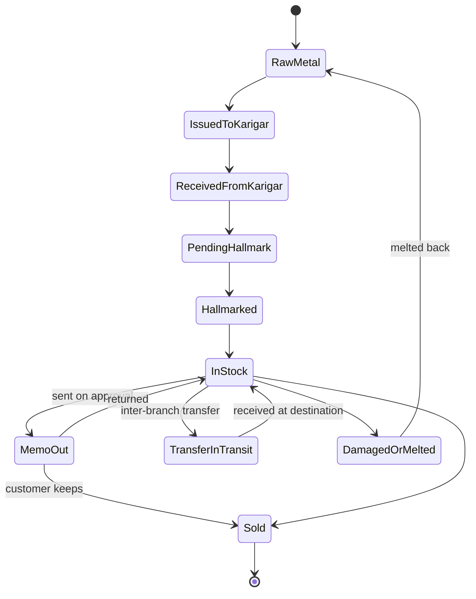

### 4. Database Design Thinking
```sql
CREATE TABLE tags (
    tag_id          UUID PRIMARY KEY, tenant_id UUID NOT NULL, branch_id UUID NOT NULL,
    item_id         UUID REFERENCES item_designs(item_id),
    purity_id       UUID REFERENCES metal_purities(purity_id),
    gross_weight    NUMERIC(10,3) NOT NULL,
    stone_weight    NUMERIC(10,3) NOT NULL DEFAULT 0,
    net_weight      NUMERIC(10,3) GENERATED ALWAYS AS (gross_weight - stone_weight) STORED,
    huid            VARCHAR(6),
    stock_ownership_type VARCHAR(15) NOT NULL DEFAULT 'OWNED',  -- OWNED | GML_FINANCED | CONSIGNMENT
    status          VARCHAR(25) NOT NULL,   -- see state machine above
    cost_rate_version_id UUID REFERENCES rate_versions(rate_version_id), -- rate at tagging time, for at-cost valuation
    barcode_value   VARCHAR(30) UNIQUE,
    created_at      TIMESTAMPTZ DEFAULT now(),
    CONSTRAINT chk_weights CHECK (gross_weight >= stone_weight AND stone_weight >= 0)
);
CREATE TABLE tag_status_history (
    history_id UUID PRIMARY KEY, tag_id UUID REFERENCES tags(tag_id),
    from_status VARCHAR(25), to_status VARCHAR(25),
    changed_by UUID, changed_at TIMESTAMPTZ, reason TEXT
);
```
🚨 **Critical Business Rule:** `tags.status` transitions are enforced by a state machine at the service layer (or DB trigger) — never a free-text field any code path can set arbitrarily. A tag jumping straight from `RAW_METAL` to `SOLD` should be structurally impossible.

🚨 **Critical Business Rule (explicit in PRD §16.2):** a tag can never be "in stock" and sellable at two branches simultaneously. This is enforced via a unique, transactional status update — the *first* successful commit to `SOLD` (or `TRANSFER_IN_TRANSIT`) wins; any competing attempt fails and is surfaced to staff, never silently overwritten.

### 5. Backend Architecture
The Inventory Service owns the state machine; every transition is a transactional operation that also writes to `tag_status_history` (the same event-sourced-history philosophy as Rate Master, Phase 2 §2.3). Barcode (Code-128) or QR generation happens at tag creation. Offline POS caches today's sellable-tag list per branch; on reconnect, conflict resolution means "first successful transactional commit wins" — not last-write-wins, since selling the same physical tag twice is a real, damaging failure mode, not a theoretical one.

### 6. Frontend Screens
Tagging screen (weigh-in, HUID entry, barcode print), stock lookup/search (design, purity, weight range, branch), Stock-Take/reconciliation screen (scan-and-compare against the expected list), Memo-Out screen (customer-approval tracking with due-date reminders), inter-branch transfer dispatch/receive screen.

### 7. Business Rules 🚨
- Valuation is always reportable **both ways**: at-cost (using `cost_rate_version_id`, FIFO/weighted-average per lot) for the Balance Sheet, and at-market (live Rate Master lookup) for the owner's MIS view — never conflate the two into one stored column.
- Memo-Out items are excluded from "available for sale" counts but included in total-asset/insurance reports.
- `stock_ownership_type = CONSIGNMENT` tags are excluded from the shop's own Balance Sheet stock value even while shown as "in showroom, sellable" — the concrete implementation of the Phase 1 §1.6 GML/consignment gap.

### 8. Validation Rules
`gross_weight >= stone_weight >= 0`; HUID exactly 6 alphanumeric characters, globally unique per tenant and never reused, even after a sale reversal; barcode uniqueness.

### 9. Compliance Requirements ⚖
HUID must be captured before a hallmark-required item moves to `IN_STOCK`/billable (configurable hard/soft block, PRD §11.3, exemptions apply per Phase 9). Metal/Item-wise/Stone/Karigar-wise/Branch-wise Stock Registers (PRD §5.5) must be exportable for GST/Income-tax inspection.

### 10. Edge Cases
Re-weighing at the counter shows a different weight than the tag label (scale drift, wear, or tampering) — system supports "confirm/override with reason," logging the discrepancy rather than silently overwriting the recorded weight. A tag scanned for sale while simultaneously mid-transfer between branches — must be structurally prevented by the state machine, not caught after the fact. Melted-and-reissued tags never reuse a HUID or barcode value, even though the metal is now physically "new."

### 11. Module Dependencies
Metal/Item/Stone Masters (Phase 2), Karigar module (issue/receipt, Phase 4), Hallmarking (Phase 9), Billing (Phase 5, consumes `IN_STOCK` tags), Old Gold Exchange (Phase 6, feeds the melting loop back to `RAW_METAL`), Accounting (Phase 8, stock valuation).

### 12. Reports & KPIs
Stock Summary (item/purity-wise, weight + value), Ageing Report (unsold beyond X days — a direct capital-lock signal), Tag-wise Stock Ledger, Branch Stock Comparison, Memo/Approval Outstanding Report, Physical Stock Discrepancy Report, and a **GML/Consignment exposure report** (new, introduced by this handbook per Phase 1 §1.6, absent from the source PRD).

### 13. Security Considerations
Tag status transitions are logged with user + timestamp; stock write-offs (damaged/lost) require elevated approval.

### 14. Performance Considerations
Barcode-scan-to-bill-line lookup must be near-instant (well under the Phase 5 <200ms budget, since it's a sub-step of that budget); offline cache must hold the branch's full sellable-tag list.

### 15. Testing Strategy
State-machine illegal-transition rejection tests; cross-branch double-sell-prevention test (the PRD's own explicit DB-level requirement); HUID/barcode uniqueness tests; offline-reconnect conflict-resolution test; at-cost-vs-at-market valuation reconciliation test.

### 16. Common Developer Mistakes ❌
Modeling stock as a quantity counter per design instead of individually serialized tags — the single most fundamental generic-retail instinct to avoid in this domain. Allowing free-text status updates instead of an enforced state machine. Storing only one valuation figure and losing the at-cost/at-market distinction that owners actually rely on daily.

### 17. Production Best Practices 💡
Treat tag status transitions as an append-only event log (`tag_status_history`) in addition to the current-status field, mirroring the Rate Master's event-sourced philosophy — this pays off enormously the first time an owner asks "why doesn't the stock report match the shelf" during an audit.

### 18. Phase Completion Checklist ✅
- [ ] `tags` + `tag_status_history` tables created with enforced state machine
- [ ] Cross-branch double-sell prevented at the DB/transaction level
- [ ] HUID and barcode uniqueness enforced, never reused
- [ ] At-cost and at-market valuation both queryable independently
- [ ] `stock_ownership_type` correctly excludes consignment stock from the Balance Sheet view
- [ ] Offline sellable-tag cache + reconnect conflict resolution implemented

---

*End of Phase 3.*

---
---

# PHASE 4 — Procurement & Karigar (Job-Work) Management

## 4.A MODULE: Procurement (Raw Metal & Finished Goods)

**1. Business Objective:** Record inbound metal/finished-goods purchases from bullion dealers, wholesalers, or via Gold Metal Loan (GML) drawdown — correctly booking ITC-eligible GST and updating raw-metal or finished-tag stock, with source-of-funding tracked from day one (§1.6).

**2. Domain Concepts:** GML drawdown (§1.6) is itself a distinct procurement type, not a cash purchase. A GRN (Goods Receipt Note) must capture weight + purity, not just quantity — a fundamentally different receipt document than generic retail.

**3. End-to-End Workflow:**
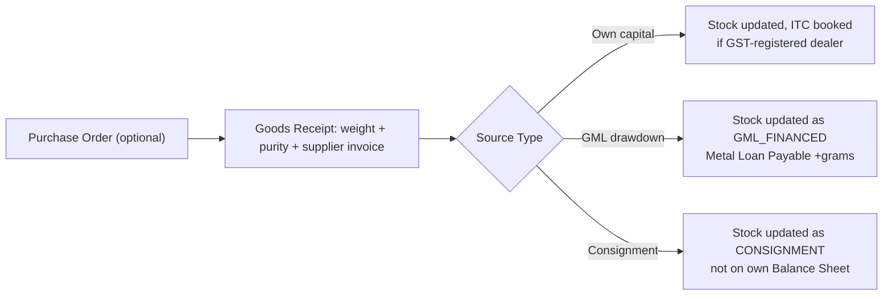

**4. Database Design Thinking:**
```sql
CREATE TABLE goods_receipts (
    grn_id UUID PRIMARY KEY, tenant_id UUID, branch_id UUID,
    supplier_party_id UUID REFERENCES parties(party_id),
    metal_id UUID, purity_id UUID, gross_weight NUMERIC(10,3),
    source_type VARCHAR(15),   -- OWN_CAPITAL | GML_DRAWDOWN | CONSIGNMENT
    supplier_invoice_ref VARCHAR(50), received_at TIMESTAMPTZ
);
CREATE TABLE gml_loan_ledger (
    entry_id UUID PRIMARY KEY, tenant_id UUID, lender_party_id UUID,
    grams_drawn NUMERIC(10,3), grams_repaid NUMERIC(10,3),
    interest_accrued_grams NUMERIC(10,3), entry_date TIMESTAMPTZ
);
```

**5. Backend Architecture:** Procurement Service posts to Inventory (raw-metal stock, tenant's own or GML-financed) and Accounting (Phase 8) in one transaction.

**6. Frontend Screens:** GRN entry screen; GML drawdown/repayment screen with a running gram-balance display.

**7. Business Rules 🚨:** GML repayment is tracked **in grams, not just rupees** — repaying the loan means returning an equivalent fine-gold weight (or its rupee-equivalent at the repayment-day rate, per the loan agreement), mirroring the Weight Ledger principle from Phase 1 §1.4.

**8. Validation Rules:** Purity must reference Metal Master; supplier GSTIN validated for ITC eligibility.

**9. Compliance Requirements ⚖:** ITC eligibility rules (registered supplier, valid tax invoice, matching GSTR-2B); the Purchase Register must reconcile against GSTR-2B (Phase 7).

**10. Edge Cases:** Partial GRN against one PO; rate fluctuation between GML drawdown and repayment — a real P&L exposure large chains actively manage, worth a "GML Mark-to-Market" report.

**11. Module Dependencies:** Metal Master, Tagging (finished-goods receipt creates tags), Accounting, GST module.

**12. Reports & KPIs:** Purchase Register, GML Outstanding & Mark-to-Market report, ITC Register.

**13. Security Considerations:** Purchase-approval role separate from GRN-entry role — maker-checker for high-value POs.

**14. Performance Considerations:** Not a hot path; standard CRUD performance suffices.

**15. Testing Strategy:** 3-way match (PO–GRN–Invoice) discrepancy detection; GML gram-ledger accuracy tests.

**16. Common Developer Mistakes ❌:** Tracking GML only in rupees, losing the gram-native liability the loan is actually denominated in.

**17. Production Best Practices 💡:** Build the GML ledger gram-first, rupee-second — the inverse of how a generic accounting system would default.

**18. Phase Completion Checklist:** `goods_receipts` + `gml_loan_ledger` created; source-type tracked per GRN; ITC eligibility validated at entry; GML Mark-to-Market report available.

---

## 4.B MODULE: Karigar / Job-Work Management (the heart of manufacturing)

**1. Business Objective:** Track the loan-of-metal loop with each karigar — metal issued (still the shop's asset, temporarily with the karigar) through finished-goods receipt, wastage reconciliation, and labour-charge booking — as **two independent liabilities**: grams payable and money payable.

**2. Domain Concepts:** Fine Gold Equivalent = Gross Weight × Purity% (normalizes cross-purity comparison); Karigar Wastage % = (Fine Issued − Fine Returned) / Fine Issued; agreed wastage slabs (e.g., up to 6% free, beyond that billed back or investigated); job-work GST (SAC 9988, Reverse Charge if the karigar is unregistered).

**3. End-to-End Workflow:**
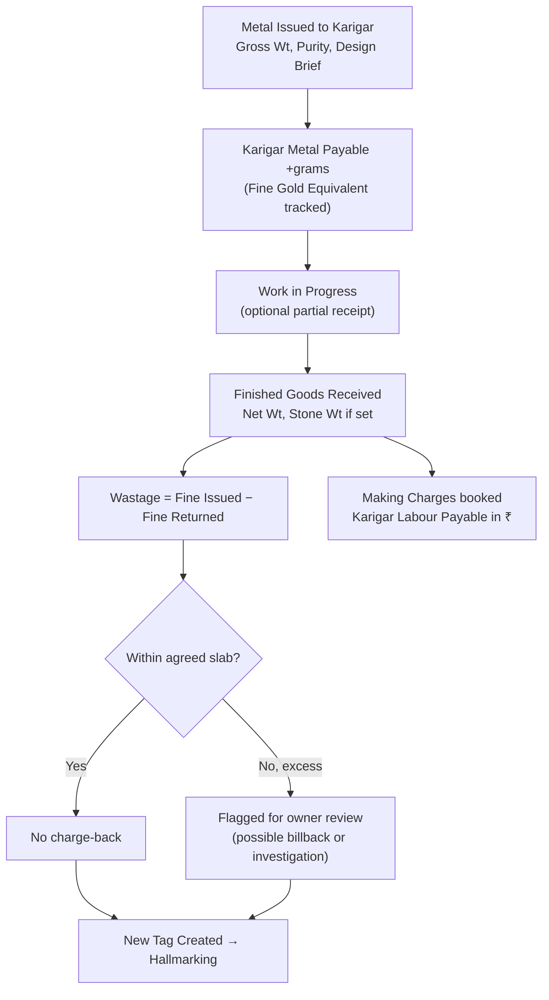

**4. Database Design Thinking:**
```sql
CREATE TABLE karigars (
    karigar_id UUID PRIMARY KEY, tenant_id UUID, name VARCHAR(100),
    karigar_type VARCHAR(15),   -- IN_HOUSE | OUTSIDE
    gstin VARCHAR(15), agreed_wastage_pct NUMERIC(5,2)
);
CREATE TABLE karigar_metal_issues (
    issue_id UUID PRIMARY KEY, karigar_id UUID REFERENCES karigars(karigar_id), branch_id UUID,
    metal_id UUID, purity_id UUID, gross_weight_issued NUMERIC(10,3),
    fine_equiv_issued NUMERIC(10,3), design_brief TEXT,
    issued_at TIMESTAMPTZ, status VARCHAR(20)   -- OPEN | PARTIALLY_RECEIVED | CLOSED
);
CREATE TABLE karigar_receipts (
    receipt_id UUID PRIMARY KEY, issue_id UUID REFERENCES karigar_metal_issues(issue_id),
    gross_weight_received NUMERIC(10,3), stone_weight NUMERIC(10,3), net_weight NUMERIC(10,3),
    fine_equiv_returned NUMERIC(10,3), wastage_pct_actual NUMERIC(5,2),
    making_charge_amount NUMERIC(12,2), received_at TIMESTAMPTZ
);
```
🚨 **Critical Business Rule:** Two independent running balances per karigar — `grams_payable` (metal owed back) and `money_payable` (labour charges owed) — **never netted together**. They are different liabilities with different accounting treatment (Phase 8).

**5. Backend Architecture:** Karigar Service maintains both balances transactionally on every issue/receipt event.

**6. Frontend Screens:** Karigar ledger screen (grams + money side by side), Issue/Receipt entry screens, Excess-Wastage review queue.

**7. Business Rules 🚨:** Excess wastage beyond the agreed slab is **flagged for owner review, not auto-billed** — the PRD itself frames this as an investigative signal (could be genuine design complexity, or a loss/theft indicator), not an automatic penalty.

**8. Validation Rules:** Fine-equivalent calculations must use the exact `purity_fraction` from Metal Master (Phase 2) — never a rounded approximation.

**9. Compliance Requirements ⚖:** Job-work GST — Reverse Charge if the karigar is unregistered, forward charge with ITC if registered; the karigar's GST registration status must be recorded per karigar.

**10. Edge Cases:** Karigar sets stones supplied by the shop (stone weight/value reconciled separately from metal); a job issued but never returned (overdue karigar-job report, PRD §14.4); a karigar closing shop with metal still owed (a genuine, uncomfortable edge case needing a loss-provisioning/write-off workflow with elevated approval).

**11. Module Dependencies:** Metal Master, Tagging (creates the new tag on receipt), Accounting (Phase 8 karigar reconciliation), GST module.

**12. Reports & KPIs:** Karigar-wise Outstanding (grams) Register, Karigar Wastage Analysis (trend — flags inefficient or dishonest karigars, per the PRD's own framing), Pending Karigar Jobs (overdue).

**13. Security Considerations:** Karigar-module role kept separate from general inventory role (per the PRD's own persona table).

**14. Performance Considerations:** Standard; not a hot path.

**15. Testing Strategy:** Fine-equivalent-calculation accuracy; excess-wastage-flagging-threshold test; dual-balance (grams vs. money) independence test.

**16. Common Developer Mistakes ❌:** Netting grams-payable and money-payable into a single "karigar balance" figure — conceptually wrong, and breaks the Balance Sheet treatment (Phase 8) where these sit in different ledger heads.

**17. Production Best Practices 💡:** Per-karigar wastage-trend reporting over time is one of the highest-value MIS features for owners in this entire system — build it early, since it directly protects against a real, common source of shrinkage.

**18. Phase Completion Checklist:** `karigars`/`karigar_metal_issues`/`karigar_receipts` created; dual gram/money balances maintained independently; excess-wastage review queue implemented; overdue-job report available.

---

## 4.C MODULE: Melting (brief)
Old jewellery or discontinued designs are melted back to raw metal. Workflow: select tag(s)/old-gold lot(s) → record the actual refined output weight and purity → raw-metal stock increases; source tags are **permanently retired**, never reused.

🚨 **Critical Business Rule:** A melted tag's HUID/barcode is retired forever — the resulting raw metal, even if immediately re-tagged, receives a brand-new tag identity and never inherits the old one, preserving traceability integrity.

---

*End of Phase 4.*

---
---

# PHASE 5 — Billing / POS Calculation Engine

### 1. Business Objective
Build a single, shared, independently-testable Pricing/Calculation Engine (PRD §16.1) that computes correct line-item and bill-level totals for Sale, Estimate, and Repair, and is reused (not re-implemented) by Old Gold Exchange (Phase 6) — one source of truth for every module that ever needs to price something.

### 2. Jewellery Domain Concepts
Recap: NW = GW − SW; Metal Value; Wastage; three Making-Charge types; Stone Value; GST split; Round-off; pre-GST discounts; Advance/Booking rate-lock; Estimate mode (non-fiscal); split payments; PAN/TCS triggers.

### 3. End-to-End Business Workflow
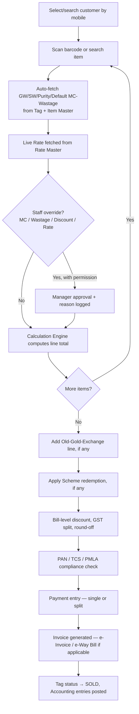

### 4. Database Design Thinking
```sql
CREATE TABLE invoices (
    invoice_id UUID PRIMARY KEY, tenant_id UUID, branch_id UUID,
    invoice_number VARCHAR(30),   -- sequential per GSTIN per FY, see Phase 2 §2.10
    party_id UUID REFERENCES parties(party_id), invoice_date TIMESTAMPTZ,
    invoice_type VARCHAR(15),   -- ESTIMATE | TAX_INVOICE | REPAIR
    taxable_value NUMERIC(14,2), cgst NUMERIC(14,2), sgst NUMERIC(14,2), igst NUMERIC(14,2),
    round_off NUMERIC(6,2), net_payable NUMERIC(14,2),
    status VARCHAR(15)   -- DRAFT | FINALIZED | CANCELLED
);
CREATE TABLE invoice_lines (
    line_id UUID PRIMARY KEY, invoice_id UUID REFERENCES invoices(invoice_id),
    tag_id UUID,   -- NULL for ad-hoc custom items
    gross_weight NUMERIC(10,3), stone_weight NUMERIC(10,3), net_weight NUMERIC(10,3),
    rate_version_id UUID REFERENCES rate_versions(rate_version_id),
    metal_value NUMERIC(14,2), wastage_value NUMERIC(14,2),
    making_charge_value NUMERIC(14,2), stone_value NUMERIC(14,2),
    line_discount NUMERIC(14,2), line_taxable_value NUMERIC(14,2), hsn_code VARCHAR(10)
);
CREATE TABLE invoice_payments (
    payment_id UUID PRIMARY KEY, invoice_id UUID REFERENCES invoices(invoice_id),
    mode VARCHAR(20),  -- CASH | CARD | UPI | CHEQUE | OLD_GOLD_ADJ | SCHEME_ADJ | ADVANCE_ADJ
    amount NUMERIC(14,2)
);
```
🚨 **Critical Business Rule:** Every `invoice_lines` row stores `rate_version_id`, not just a computed rupee value — so any invoice can be exactly reconstructed and audited later, even after rates have since changed many times over, directly reusing the Rate Master traceability principle from Phase 2.

### 5. Backend Architecture 🏗
The Calculation Engine is a **pure, stateless function** — `calculateLine(tag/adhoc-item, rate_version, mc_config, discount, gst_config) → LineResult` — with zero side effects, unit-testable in complete isolation from the database, and invoked *identically* by Billing, Estimate, and Old-Gold modules. Never three divergent copies of the same formula: this is the single highest-leverage engineering decision in the entire system, called out explicitly in PRD §16.1. Must complete in under 200ms per line (PRD §16.2). Offline POS runs this exact same engine locally against cached master data, syncing the finalized invoice once connectivity returns.

### 6. Frontend Screens
Billing counter screen (barcode-scan-first UX, large touch targets, live running total); override/approval modal (mandatory reason field); Estimate screen (near-identical UI, clearly labeled non-fiscal); payment/split-payment screen; Repair job screen (a separate, labour-only flow).

### 7. Business Rules 🚨 (the core formula, restated as the Engine's contract)
```
NW              = GW − SW
Metal Value     = NW × Rate(purity, branch, invoice_timestamp)
Wastage Value   = (NW × Wastage%) × Rate     [or merged into Value-Addition mode]
Making Charges  = per-gram | %-of-metal-value | fixed, per item config
Stone Value     = Σ (carat × rate/carat) or (piece × rate/piece); certified value overrides slab
Line Taxable    = Metal + Wastage + Making + Stone − Line Discount
GST             = Line Taxable × rate (CGST+SGST if branch-state = customer-state, else IGST)
```
Discounts are applied **before** GST (CGST Act §15 compliance, PRD §7.4). Old Gold Exchange is a **payment-stage netting**, never a sales-side discount (PRD §8.3) — one of the most legally consequential rules in the whole system, and the Engine must structurally prevent it from ever being modeled as a discount line.

### 8. Validation Rules
Sum of all payment-mode amounts must equal Net Payable exactly (else the invoice cannot finalize, or an explicit "Balance Due" receivable is created — never a silent mismatch). Discount cannot exceed a configured max % without elevated approval. The rate used must be a valid, non-superseded `rate_version_id` as of the invoice timestamp.

### 9. Compliance Requirements ⚖
PAN/Form-60 gate at ≥₹2,00,000 cash (checked again here at invoice-finalization as defense-in-depth, in addition to the Party Master level check, Phase 2 §2.6); TCS auto-computed on qualifying cash receipts; invoice numbering sequential and gap-free per GSTIN per FY (Phase 2 §2.10); HUID must print for every hallmark-required line item (Phase 9 dependency — invoice cannot finalize with a hallmark-required tag lacking a HUID, configurable hard/soft block).

### 10. Edge Cases
Split payment across four or more modes including partial old-gold adjustment and partial scheme redemption in the same bill (the Engine must net all adjustment-type payment modes correctly against Net Payable). Estimate-to-Sale conversion where the rate has moved since the estimate was created (staff choice: honor the estimate rate within a policy window, or re-price live — must be an explicit, logged choice, never a silent default). A bill with zero stone weight (must not divide-by-zero or error in the stone calc). An inter-state sale to a walk-in customer with no captured state (defaults to the shop's own state per PRD §7.3 — but this default needs to be an explicit, logged business rule, not an implicit code fallback).

### 11. Module Dependencies
Rate Master, Metal/Item/Stone Masters, Tax Master (all Phase 2), Tagging (Phase 3), Party Master (Phase 2), Old Gold Exchange (Phase 6), Scheme (Phase 10), Accounting (Phase 8, auto-posts on finalize), GST e-Invoice/e-Way Bill (Phase 7).

### 12. Reports & KPIs
Day Book/Sales Register, Item/Category-wise Sales, Salesperson-wise Sales & Incentive, Making-Charges Income Report, Discount Given Report, Estimate-to-Sale Conversion Ratio.

### 13. Security Considerations
Rate/discount overrides require a permission tier distinct from normal billing; invoice cancellation or edit-after-finalization requires maker-checker above a configurable value threshold (PRD §15.1, e.g. ₹5,00,000).

### 14. Performance Considerations
Under 200ms per line is a hard non-functional requirement (PRD §16.2) — achievable only because the Engine is a pure function operating on already-cached master data, never issuing fresh DB round-trips mid-calculation.

### 15. Testing Strategy
The PRD's own §17 worked example (a 24g necklace, 916 purity, with diamonds and an old-gold exchange, intra-state) is the canonical reference test case — replicate it as an automated regression test, then extend with: zero-stone-weight, wastage-merged-into-MC, inter-state IGST variant, split-payment across 4+ modes, old-gold-only transaction with no new sale, PAN-threshold-blocking, TCS-triggering, Estimate-to-Sale rate-honoring, and offline-then-sync scenarios.

### 16. Common Developer Mistakes ❌
Implementing the calculation formula separately (and therefore divergently) in the Billing screen, the Estimate screen, and the Old-Gold screen instead of one shared engine — the single most common structural bug that produces "the estimate said X but the bill said Y" support tickets. Modeling Old Gold Exchange as a sales-side discount (a real GST compliance error, PRD §8.3). Rounding at the wrong stage — rounding each intermediate value instead of only the final invoice total (PRD §7.7).

### 17. Production Best Practices 💡
Build the Calculation Engine first, as a standalone, framework-agnostic module with full unit-test coverage on the formula, *before* building any UI around it — every Billing/Estimate/Old-Gold screen then becomes a thin UI wrapper calling the same tested function. Use fixed-point/decimal arithmetic libraries throughout (PRD §16.2) — floating-point rounding drift on high-value transactions is not a theoretical risk in this domain; it is a guaranteed eventual audit finding.

### 18. Phase Completion Checklist ✅
- [ ] Calculation Engine built as a pure, stateless, independently unit-tested function
- [ ] Billing, Estimate, and Old-Gold all call the *same* engine instance/library
- [ ] `rate_version_id` stored on every invoice line, never just a computed rupee figure
- [ ] Old Gold Exchange structurally modeled as payment-stage netting, not a discount
- [ ] Decimal/fixed-point arithmetic used throughout, no floating-point
- [ ] PRD §17 worked example passes as an automated regression test

---

*End of Phase 5.*

---
---

# PHASE 6 — Old Gold / Silver Exchange (Buyback)

### 1. Business Objective
Correctly record the purchase of used jewellery from customers — with proper KYC, purity testing, and GST treatment — as a distinct transaction type, never blended into the sale invoice as a discount.

### 2. Jewellery Domain Concepts
Tunch/touch testing; melting/refining deduction %; buy-back rate (Rate Master, always ≤ the sale rate — the shop's margin/risk buffer); the Margin Scheme (CGST Rule 32(5)) as a rare, CA-gated alternate GST mode for antique/as-is resale.

### 3. End-to-End Business Workflow
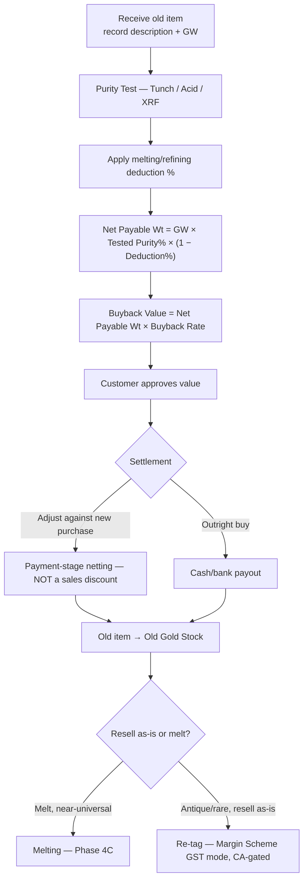

### 4. Database Design Thinking
```sql
CREATE TABLE old_gold_transactions (
    ogt_id UUID PRIMARY KEY, tenant_id UUID, branch_id UUID,
    party_id UUID REFERENCES parties(party_id),   -- KYC via Party Master, treat as a purchase
    item_description TEXT, photo_url TEXT,
    gross_weight NUMERIC(10,3), tested_purity_pct NUMERIC(5,2), deduction_pct NUMERIC(5,2),
    net_payable_weight NUMERIC(10,3),
    buyback_rate_version_id UUID REFERENCES rate_versions(rate_version_id),
    buyback_value NUMERIC(14,2),
    settlement_mode VARCHAR(20),   -- ADJUSTED_AGAINST_SALE | CASH_PAYOUT
    linked_invoice_id UUID,
    gst_mode VARCHAR(20) DEFAULT 'NORMAL_NON_SUPPLY',   -- NORMAL_NON_SUPPLY | MARGIN_SCHEME
    created_at TIMESTAMPTZ
);
```
🚨 **Critical Business Rule:** `gst_mode` defaults to `NORMAL_NON_SUPPLY` and requires an explicit, separately-permissioned flag flip plus a CA sign-off workflow to ever move to `MARGIN_SCHEME` — per the source PRD's own explicit caution (§8.3) that this must never be blended casually into a normal invoice.

### 5. Backend Architecture
The Old Gold Service reuses the Phase 5 Calculation Engine for the buyback-value formula, and reuses Party Master KYC gating (Phase 2 §2.6) since this is legally a purchase from an individual.

### 6. Frontend Screens
Old-gold intake screen (photo capture, weight/purity entry, an explicit customer-approval step shown before finalizing); a linked-to-invoice picker when adjusting against a new sale.

### 7. Business Rules 🚨
Settlement is always a **payment-stage netting** against the sale invoice's Net Payable — never a line-item discount on the sale (restated from Phase 5 §7 as the load-bearing rule it is).

### 8. Validation Rules
`tested_purity_pct` between 0–100; `deduction_pct` within a sane configured range, flagged if unusually high (a possible under-payment-to-customer error).

### 9. Compliance Requirements ⚖
KYC (Party Master PAN/Form-60/PMLA thresholds) applies to old-gold sellers exactly as it does to buyers, since this is a purchase transaction. Margin Scheme mode has a distinct GST computation (margin = sale price − purchase price) and must never share a ledger head with normal old-gold purchases.

### 10. Edge Cases
Customer disputes the tested purity after seeing the value (needs a documented re-test/second-opinion workflow). A pure old-gold-only transaction with no linked new sale — must be fully supported, not assumed-always-adjusted, with a straight cash payout. An item later found to be lower purity than tested after refining (loss must be absorbed/investigated, flagged in a report).

### 11. Module Dependencies
Party Master, Rate Master (buyback rate), Calculation Engine (Phase 5), Melting (Phase 4C), Accounting (Phase 8).

### 12. Reports & KPIs
Old-Gold Purchase Register; Margin-Scheme-flagged transactions report (for CA review).

### 13. Security Considerations
Same KYC-gating triggers as Party Master apply here.

### 14. Performance Considerations
Standard; not a hot-path concern.

### 15. Testing Strategy
Payment-netting-not-discount invariant test; KYC-threshold-blocking test; Margin-Scheme-mode-requires-explicit-flag test.

### 16. Common Developer Mistakes ❌
Implementing old-gold adjustment as a bill-level "discount" line because it's the path of least resistance in the UI — a real GST compliance error (incorrectly reduces the taxable value on the new sale) that must be structurally prevented, not just discouraged in a training manual.

### 17. Production Best Practices 💡
Keep Margin Scheme mode off by default for every tenant and require a documented CA sign-off artifact attached to the tenant's compliance settings before it can ever be enabled.

### 18. Phase Completion Checklist ✅
- [ ] `old_gold_transactions` table created, KYC-gated via Party Master
- [ ] Settlement modeled structurally as payment-stage netting, never a discount line
- [ ] Margin Scheme mode off by default, gated behind explicit compliance sign-off
- [ ] Old-gold-only (no linked sale) flow fully supported

---

*End of Phase 6.*

---
---

# PHASE 7 — GST Compliance Module

### 1. Business Objective
Ensure every invoice is GST-law-compliant (Rule 46 format, correct HSN/rate, e-Invoice/e-Way Bill where applicable) and that periodic returns (GSTR-1/3B) can be generated without manual reconciliation.

### 2. Jewellery Domain Concepts
HSN table recap (7113 jewellery, 7102 diamond, SAC 9988 job-work); CGST/SGST vs. IGST; e-Invoice IRN/QR via a GSP/NIC; e-Way Bill thresholds (state-variable); Reverse Charge for unregistered job-workers; Making Charges taxed at the jewellery composite rate, not a separate service rate (PRD §9.8) — and the diamond-HSN-split tension flagged in Phase 2 §2.8 that must be resolved with the client's CA before this phase is finalized.

### 3. End-to-End Business Workflow
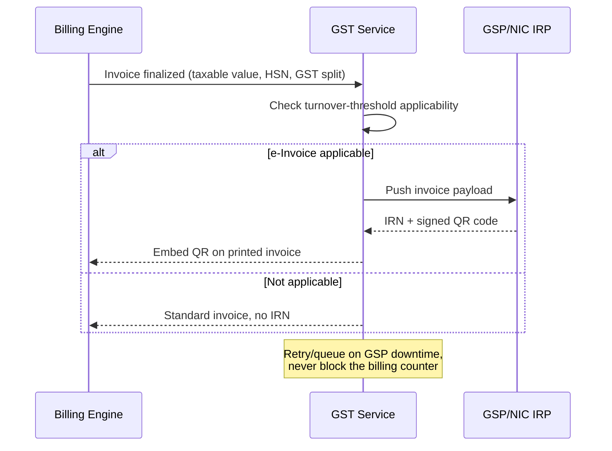

### 4. Database Design Thinking
```sql
CREATE TABLE einvoice_log (
    einvoice_id UUID PRIMARY KEY, invoice_id UUID REFERENCES invoices(invoice_id),
    irn VARCHAR(100), qr_code_data TEXT,
    status VARCHAR(15),   -- PENDING | GENERATED | FAILED | CANCELLED
    retry_count INT DEFAULT 0, cancelled_within_24h BOOLEAN
);
CREATE TABLE eway_bill_log (
    ewb_id UUID PRIMARY KEY, invoice_id UUID, transfer_id UUID,   -- inter-branch transfers too
    ewb_number VARCHAR(30), threshold_state_code CHAR(2), generated_at TIMESTAMPTZ
);
```

### 5. Backend Architecture 🏗
GST tax computation is called synchronously at invoice-finalization (it must be fast, inside the Phase 5 hot path), but e-Invoice/e-Way Bill submission to government portals is handled **asynchronously with a retry queue**, so a GSP outage never blocks a customer at the billing counter — a critical non-functional requirement, since billing must never wait on a government API.

### 6. Frontend Screens
Invoice print template with HSN/GST-split/HUID lines and an embedded e-Invoice QR; an e-Invoice/e-Way Bill status dashboard with a manual-retry action.

### 7. Business Rules 🚨
Making Charges are always taxed at the same composite rate as the jewellery item itself, never split to a separate service-tax line, when billed as part of one jewellery sale (PRD §9.8). e-Invoice cancellation is only possible within 24 hours on the government portal — after that, a **credit-note workflow** is required instead. (The source PRD doesn't describe this 24-hour fallback explicitly — a genuine gap this handbook closes.)

### 8. Validation Rules
HSN/GST rate lookup always resolves via Tax Master (Phase 2 §2.9) at the invoice's effective date, never hardcoded. e-Way Bill threshold is state-configurable (PRD §9.5).

### 9. Compliance Requirements ⚖
Rule 46 invoice format; e-Invoice turnover-threshold rules; e-Way Bill state-notified thresholds; Reverse Charge booking for unregistered job-work — all as data-driven configuration, re-verified periodically against current notifications.

### 10. Edge Cases
GSP API down for hours during peak billing — the queue must not silently drop invoices; the dashboard must clearly surface "pending submission" items. An invoice cancelled after the 24-hour window (credit-note flow). An inter-branch transfer crossing the e-Way Bill value threshold.

### 11. Module Dependencies
Billing Engine (Phase 5), Tax Master (Phase 2 §2.9), Branch Master (Phase 2 §2.10, GSTIN/invoice series), Accounting (Phase 8, GSTR data feeds from ledgers).

### 12. Reports & KPIs
GSTR-1 data export, GSTR-3B summary, Purchase Register/ITC reconciliation against GSTR-2B, HSN Summary, e-Invoice/IRN Log, e-Way Bill Log, TCS Report.

### 13. Security Considerations
e-Invoice/e-Way Bill credentials (GSP API keys) stored encrypted, accessible only to system service accounts, never exposed to end users.

### 14. Performance Considerations
Async queue with monitoring/alerting on backlog growth.

### 15. Testing Strategy
GSP-downtime queue-and-retry test; 24-hour cancellation-window boundary test; threshold-crossing e-Way Bill auto-trigger test; Reverse Charge booking test for unregistered karigar job-work.

### 16. Common Developer Mistakes ❌
Calling the e-Invoice API synchronously in the billing critical path — the counter freezes the moment the GSP has latency or an outage, a real and damaging failure mode during festival rush. Hardcoding today's GST rates as constants (explicitly warned against in the source PRD, §9.2, and worth repeating as the most common shortcut).

### 17. Production Best Practices 💡
Async-first integration with any government API, with a visible ops dashboard for pending/failed submissions and a manual-push retry action — treat "did this invoice's e-Invoice actually reach the portal" as a first-class operational metric, not an afterthought.

### 18. Phase Completion Checklist ✅
- [ ] e-Invoice/e-Way Bill submission is fully asynchronous, never blocks billing
- [ ] Retry queue with visible ops dashboard implemented
- [ ] 24-hour cancellation boundary + credit-note fallback implemented
- [ ] All HSN/GST rates resolved from Tax Master, zero hardcoded rates

---

*End of Phase 7.*

---
---

# PHASE 8 — Accounting Engine

### 1. Business Objective
Auto-post correct double-entry journal entries behind every transaction so books stay accurate without manual journal entries, and export cleanly to Tally (the trade's de-facto standard).

### 2. Jewellery Domain Concepts
Chart of Accounts specific to this domain: Sales-by-metal-type, Purchases, Output/Input GST, TCS Payable, Stock-in-Hand, Karigar Metal Payable (grams-native memo), Karigar Labour Payable (₹), Customer Advance, Scheme Collection Liability, Debtors/Creditors, Round-off, Discount.

### 3. End-to-End Business Workflow
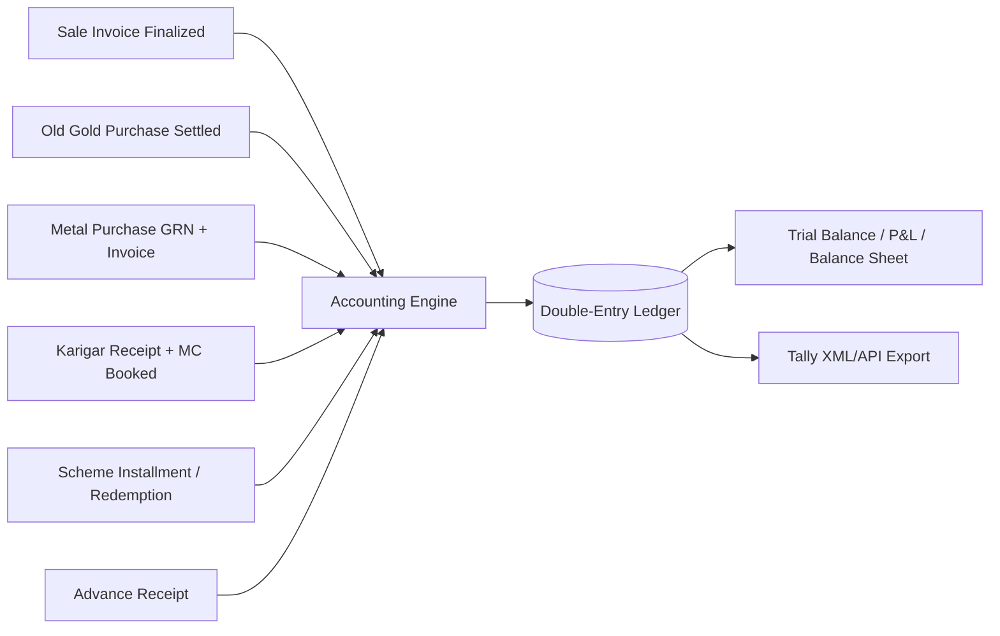
Every transactional module emits a domain event; the Accounting Engine subscribes and posts the corresponding journal entry — never the reverse. Accounting should never need bespoke per-module logic scattered elsewhere; it is a pure consumer of well-defined events.

### 4. Database Design Thinking
```sql
CREATE TABLE chart_of_accounts (
    account_id UUID PRIMARY KEY, tenant_id UUID, account_name VARCHAR(100),
    account_type VARCHAR(10)   -- ASSET | LIABILITY | INCOME | EXPENSE
);
CREATE TABLE journal_entries (
    je_id UUID PRIMARY KEY, tenant_id UUID, branch_id UUID,
    source_event_type VARCHAR(30), source_event_id UUID,
    entry_date TIMESTAMPTZ, narration TEXT
);
CREATE TABLE journal_lines (
    jl_id UUID PRIMARY KEY, je_id UUID REFERENCES journal_entries(je_id),
    account_id UUID REFERENCES chart_of_accounts(account_id),
    debit NUMERIC(14,2) DEFAULT 0, credit NUMERIC(14,2) DEFAULT 0
);
```
🚨 **Critical Business Rule:** Every `journal_entries` row traces back to exactly one `source_event_id` (an invoice, an old-gold transaction, a karigar receipt) — never a manually-typed, source-less entry for routine transactions. Debit must equal credit per entry, enforced at insert time.

### 5. Backend Architecture 🏗
Event-driven posting reuses the same event-sourcing philosophy already established for Rate Master (Phase 2) and Tag Status History (Phase 3) — a consistent pattern across the whole system by this point.

### 6. Frontend Screens
Ledger statement viewer; Trial Balance/P&L/Balance Sheet screens; Bank/Cash reconciliation screen.

### 7. Business Rules 🚨
Karigar metal-issue is a **memo entry only** (grams, no P&L impact) since the shop still owns the metal — only the Karigar Labour Payable (money) hits the P&L as an expense (the Phase 4 gram/money distinction, restated here as an accounting rule). Stock valuation for the Balance Sheet uses lower-of-cost-or-net-realizable-value, with FIFO/weighted-average for metal and specific identification for making charges and stones (Phase 3's at-cost tracking feeds this directly).

### 8. Validation Rules
Every journal entry must balance (Σdebit = Σcredit) before commit.

### 9. Compliance Requirements ⚖
Round-off posted to its own ledger head (standard practice); TCS booked to a distinct payable ledger, never blended into Sales.

### 10. Edge Cases
Invoice cancellation after accounting entries are already posted — requires a **reversing entry**, never a silent delete of the original. Multi-GSTIN branches need segregated GST ledgers per GSTIN, not one pooled Output-GST account tenant-wide.

### 11. Module Dependencies
Every prior phase — this is the consumer of all transactional events across the whole system.

### 12. Reports & KPIs
Trial Balance, P&L, Balance Sheet, Ledger Statements, Debtors/Creditors Ageing, Bank Reconciliation, Karigar Reconciliation (opening + issued − received − allowed-wastage = closing, PRD §10.5).

### 13. Security Considerations
Accountant role has ledger access but not billing-edit rights (correctly already specified in the PRD's persona table).

### 14. Performance Considerations
Journal posting can be near-real-time or slightly asynchronous (not in the <200ms billing hot path) but must never be lost — a durable queue with guaranteed delivery.

### 15. Testing Strategy
Debit-equals-credit invariant test for every entry type; reversal-on-cancellation test; karigar gram/money dual-ledger reconciliation test; Tally export round-trip test.

### 16. Common Developer Mistakes ❌
Allowing manual, source-less journal entries for routine sales/purchases — defeats the entire "auto-posted, error-free books" objective that's the PRD's own stated goal (§10.1). Netting the GML loan liability into the general Purchase liability instead of its own distinct ledger head, losing the gram-native tracking established in Phase 4.

### 17. Production Best Practices 💡
Make the Accounting Engine a pure downstream subscriber to domain events from every other module — resist ever building "special case" accounting logic inside the Billing or Karigar modules themselves; that discipline is what keeps the books trustworthy as the system grows.

### 18. Phase Completion Checklist ✅
- [ ] Every journal entry traces to exactly one source event; no source-less manual entries permitted for routine transactions
- [ ] Karigar grams-payable stays a memo entry (no P&L impact); only labour charges hit P&L
- [ ] Multi-GSTIN branches have segregated GST ledger heads
- [ ] Tally export verified round-trip
- [ ] Reversing-entry flow implemented for post-posting cancellations

---

*End of Phase 8.*

---
---

# PHASE 9 — BIS Hallmarking & HUID Compliance

### 1. Business Objective
Track every hallmarked piece's HUID from AHC dispatch through sale, ensuring no non-exempt un-hallmarked item is ever billed, and that HUID prints correctly on the invoice.

### 2. Jewellery Domain Concepts
AHC (Assaying & Hallmarking Centre); HUID — a 6-character alphanumeric code, unique per physical piece, never reused; exemption categories (sub-2g items, specific antique/export cases, small-turnover exemptions).

### 3. End-to-End Business Workflow
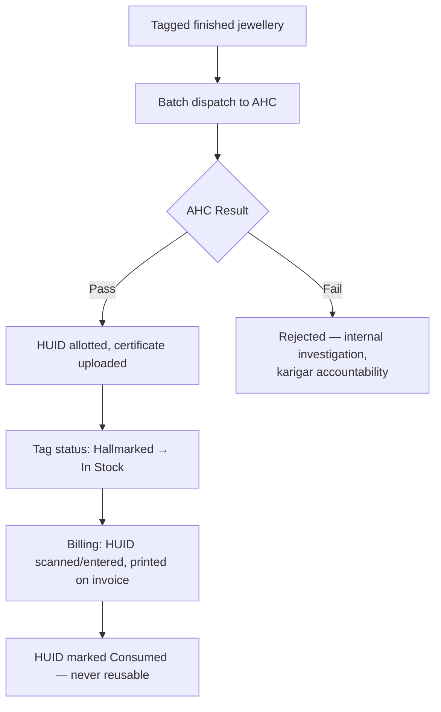

### 4. Database Design Thinking
```sql
CREATE TABLE ahc_dispatch_batches (
    batch_id UUID PRIMARY KEY, tenant_id UUID, branch_id UUID, dispatched_at TIMESTAMPTZ, ahc_name VARCHAR(100)
);
CREATE TABLE ahc_dispatch_items (
    dispatch_item_id UUID PRIMARY KEY, batch_id UUID REFERENCES ahc_dispatch_batches(batch_id),
    tag_id UUID REFERENCES tags(tag_id), status VARCHAR(15)   -- PENDING | RECEIVED | REJECTED
);
CREATE TABLE huid_records (
    huid VARCHAR(6) PRIMARY KEY, tenant_id UUID,
    tag_id UUID REFERENCES tags(tag_id),
    certified_purity NUMERIC(6,4), cert_file_url TEXT, allotted_at TIMESTAMPTZ,
    consumed_at TIMESTAMPTZ   -- set the moment it's billed
);
```
🚨 **Critical Business Rule:** `huid_records.huid` is a global unique key that, once `consumed_at` is set, can never be reassigned — even a sale reversal doesn't free it up for reuse, since the physical piece with that laser-engraved number either still exists (returned to stock, same HUID) or has been melted (HUID retired forever, per Phase 4C).

### 5. Backend Architecture
The Hallmarking Service gates the Tagging state machine (Phase 3) — a tag cannot move to billable `IN_STOCK` if it's in a hallmark-required category without a linked HUID (a configurable hard/soft block, per exemption rules).

### 6. Frontend Screens
AHC dispatch/receive batch screen; HUID-mismatch review queue (certified purity differs from declared, per PRD §11.2); exemption-category configuration screen.

### 7. Business Rules 🚨
HUID must print on the invoice for every hallmarked line item (PRD §9.3/§11.3) — checked by the Billing Engine (Phase 5) at finalization.

### 8. Validation Rules
HUID format exactly 6 alphanumeric characters; uniqueness enforced at the database level.

### 9. Compliance Requirements ⚖
This module *is* a compliance requirement in its entirety — exemption categories must be configurable since BIS rules evolve (sub-2g threshold, turnover-based exemptions, antique/export carve-outs).

### 10. Edge Cases
Certified purity from the AHC differs meaningfully from the shop's declared purity — must be flagged, never silently accepted, since this could indicate a karigar-side or master-data error worth investigating. An item rejected by the AHC goes back into the Karigar/Melting loop (Phase 4) with an accountability trail.

### 11. Module Dependencies
Tagging (Phase 3, state-machine gate), Billing (Phase 5, invoice-line requirement), Karigar (Phase 4, rejection accountability).

### 12. Reports & KPIs
HUID Register; Pending Hallmarking Dispatch; AHC-wise Rejection Report (useful for evaluating AHC/karigar quality).

### 13. Security Considerations
Dispatch/receive actions are logged with user and timestamp.

### 14. Performance Considerations
Not a hot-path concern beyond the tagging-state gate.

### 15. Testing Strategy
Hard-block-vs-soft-block configuration test; HUID-uniqueness-never-reused test; exemption-category correct-exclusion test.

### 16. Common Developer Mistakes ❌
Treating HUID as just another text field on the tag instead of its own uniquely-constrained, lifecycle-tracked entity — this loses the "never reused" guarantee that is the entire point of the BIS system.

### 17. Production Best Practices 💡
Model exemptions as data (a rules table), not code branches, since BIS notifications on exemption thresholds change periodically — exactly like GST rates (Phase 2 §2.9). This is the same "don't hardcode a government-notified number" principle recurring for a third time in this handbook, which should tell you how central it is to this entire domain.

### 18. Phase Completion Checklist ✅
- [ ] `huid_records` enforces global uniqueness, never reassigned once consumed
- [ ] Tagging state machine hard/soft-blocks non-exempt un-hallmarked items from `IN_STOCK`
- [ ] Exemption categories are data-driven, not hardcoded
- [ ] AHC rejection flows back into Karigar accountability tracking

---

*End of Phase 9.*

---
---

# PHASE 10 — Gold Savings Scheme Module

### 1. Business Objective
Manage monthly-deposit scheme enrollments, collections, bonus computation, and jewellery-only redemption — with the legal cash-refund guardrail identified in Phase 1 §1.6.1 enforced structurally, not just as a policy statement.

### 2. Jewellery Domain Concepts
Tenure/bonus types; the redemption-in-kind-only legal boundary (exposure under the Banning of Unregulated Deposit Schemes Act, 2019, and the Prize Chits and Money Circulation Schemes (Banning) Act, 1978, if mishandled).

### 3. End-to-End Business Workflow
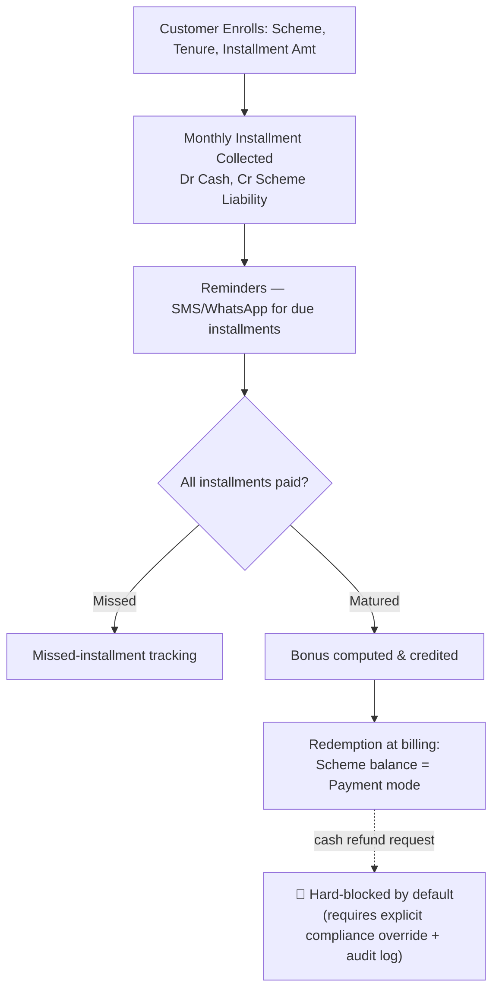

### 4. Database Design Thinking
```sql
CREATE TABLE scheme_master (
    scheme_id UUID PRIMARY KEY, tenant_id UUID, name VARCHAR(100),
    tenure_months INT, bonus_type VARCHAR(15),   -- EXTRA_MONTH | PERCENT | SLAB
    bonus_value NUMERIC(8,2),
    allow_cash_refund BOOLEAN NOT NULL DEFAULT FALSE
);
CREATE TABLE scheme_enrollments (
    enrollment_id UUID PRIMARY KEY, tenant_id UUID,
    party_id UUID REFERENCES parties(party_id), scheme_id UUID REFERENCES scheme_master(scheme_id),
    start_date DATE, installment_amount NUMERIC(12,2),
    status VARCHAR(15)   -- ACTIVE | MATURED | LAPSED | REDEEMED
);
CREATE TABLE scheme_installments (
    installment_id UUID PRIMARY KEY, enrollment_id UUID REFERENCES scheme_enrollments(enrollment_id),
    due_date DATE, paid_date DATE, amount NUMERIC(12,2)
);
```
🚨 **Critical Business Rule:** `scheme_master.allow_cash_refund` defaults `FALSE`, and — per Phase 1 §1.6.1 — flipping it requires a distinct, separately-permissioned compliance workflow with a logged legal justification. This is a hard-coded legal safety rail, not a configuration nicety.

### 5. Backend Architecture
Scheme Service posts installment receipts to Accounting (Phase 8) as a Liability, never Income; redemption at billing consumes the Calculation Engine (Phase 5) as just another payment mode.

### 6. Frontend Screens
Enrollment screen; installment collection screen with reminder scheduling; redemption screen at the billing counter.

### 7. Business Rules 🚨
GST does not apply at installment-receipt stage for goods — only at final invoice time (PRD §7.6/§12.3), reusing the same principle as Advance/Booking.

### 8. Validation Rules
Installment amount matches the scheme's configured minimum; an enrollment cannot redeem for more than its accumulated balance plus bonus.

### 9. Compliance Requirements ⚖
The cash-refund guardrail above is the central compliance requirement of this entire module.

### 10. Edge Cases
Customer wants to transfer a scheme balance to a family member (a policy decision needing an explicit transfer workflow with KYC on both parties, never an ad-hoc ledger edit). Premature closure (the PRD mentions penalty rules — must be configurable per scheme). A lapsed scheme with missed installments beyond a grace period (policy-driven, not silently forfeited without documented terms).

### 11. Module Dependencies
Party Master, Billing/Calculation Engine, Accounting.

### 12. Reports & KPIs
Scheme-wise active/matured/lapsed list; Outstanding Scheme Liability (a real Balance Sheet figure, PRD §12.4); Collection Due/Overdue report; Bonus Accrual report.

### 13. Security Considerations
Redemption and cash-refund-override actions require elevated, distinctly-logged permissions.

### 14. Performance Considerations
Standard; reminder-scheduling is a background job, not a hot path.

### 15. Testing Strategy
Cash-refund-hard-block test; GST-non-applicability-at-installment test; bonus-computation-accuracy test; premature-closure-penalty test.

### 16. Common Developer Mistakes ❌
Allowing scheme cash-refund as a simple config toggle with no audit trail — a genuine legal exposure for the business, not just a UX nicety (Phase 1 §1.6.1 explains why). Booking scheme installments as Income instead of Liability — a real accounting error many first-draft systems make.

### 17. Production Best Practices 💡
Treat the cash-refund block as a legal safety rail enforced in code, and require any override to produce a durable, exportable compliance artifact — if this business is ever scrutinized under the deposit-taking regulations, "we could not simply toggle this off" is the answer you want to be able to give.

### 18. Phase Completion Checklist ✅
- [ ] `scheme_master.allow_cash_refund` defaults false, gated behind compliance override
- [ ] Installments booked as Liability, not Income
- [ ] Outstanding Scheme Liability report available for the Balance Sheet
- [ ] Premature-closure and lapsed-scheme policies configurable per scheme

---

*End of Phase 10.*

---
---

# PHASE 11 — CRM, Loyalty, Reports & Dashboards

### 1. Business Objective
Turn the tenant-wide Party Master (Phase 2 §2.6) and every transactional module's data into actionable engagement (loyalty, reminders) and management visibility (dashboards, KPI reports) — the "so what" layer on top of everything built so far.

### 2. Jewellery Domain Concepts
Loyalty points; purchase-history profiling; rate-alert subscriptions; festival broadcast campaigns (WhatsApp Business API); the full report catalog from PRD §14.

### 3. End-to-End Business Workflow (brief)
Every transactional event (sale, scheme installment, old-gold purchase) also emits to a CRM event stream; loyalty points accrue/redeem against configurable rules; a nightly batch job (or real-time materialized views for smaller tenants) computes dashboard aggregates feeding the Owner Dashboard.

### 4. Database Design Thinking (illustrative)
```sql
CREATE TABLE loyalty_ledger (party_id UUID, points_earned NUMERIC, points_redeemed NUMERIC, balance NUMERIC);
CREATE TABLE customer_preferences (party_id UUID, category_affinity VARCHAR, avg_ticket_size NUMERIC);  -- derived, not manually entered
CREATE TABLE campaign_log (campaign_id UUID, audience_segment VARCHAR, sent_at TIMESTAMPTZ, channel VARCHAR);
```

### 5. Backend Architecture 🏗
CRM is an event-consumer service (the same pattern as Accounting, Phase 8), plus a Reporting Service that materializes dashboard/report queries. For multi-branch chains, reports must be filterable by branch and rollable-up tenant-wide, given Party Master is tenant-wide (Phase 2 §2.6) while transactions are branch-tagged.

### 6. Frontend Screens
Owner/Management real-time dashboard — Today's Sales (₹ and grams, metal-wise), Live Stock Value (at-cost vs. at-market), Karigar Outstanding, Scheme Liability, Cash-in-Hand, GST Payable MTD, and **GML Exposure** (a KPI this handbook adds beyond the source PRD's own list, given Phase 1 §1.6) — plus the full Sales/Inventory/Purchase-Karigar/GST/Accounting/Hallmarking/Scheme report catalog (PRD §14.2–14.8).

### 7. Business Rules
Loyalty points and rate-alerts are marketing features, lower-rigor than the transactional modules, but must still respect the Phase 2 PII-visibility rules (counter staff shouldn't see full financial history, PRD §15.2) when building any customer-facing profile view.

### 8. Validation Rules
Standard.

### 9. Compliance Requirements ⚖
WhatsApp Business API broadcast messaging must respect opt-in/consent norms.

### 10. Edge Cases
A customer active across multiple branches — the tenant-wide Party Master (§2.6) makes this correct by construction, which is exactly why that design call mattered.

### 11. Module Dependencies
Every prior phase, as a data source.

### 12. Reports & KPIs
The full PRD §14 catalog, plus the Audit Trail (§14.9 — every master-data change/override/cancellation with user/timestamp/old-new-value/reason). The Audit Trail should be built as a cross-cutting concern from Phase 2 onward, not bolted on here; the reporting/export UI for it belongs in this phase.

### 13. Security Considerations
Report access itself must respect RBAC (an Accountant sees financial reports, a Sales Executive does not, PRD §3).

### 14. Performance Considerations
Heavy aggregate queries (stock valuation, dashboards) should run against read-replicas or materialized views, never competing with the live billing OLTP path.

### 15. Testing Strategy
Branch-rollup-to-tenant-wide correctness; RBAC-gated report-access tests.

### 16. Common Developer Mistakes ❌
Running dashboard aggregate queries directly against the same OLTP database serving the billing counter — a real risk of lock contention during festival-rush peak load.

### 17. Production Best Practices 💡
Separate OLTP (billing-critical) and OLAP (reporting/dashboard) workloads early — even a simple read-replica is enough at first — since the PRD's own NFRs (§16.2) explicitly call out 5–10x festival-season load spikes that reporting queries must never be allowed to degrade.

### 18. Phase Completion Checklist ✅
- [ ] Dashboard/report queries run against a read-replica or materialized view, not the live OLTP path
- [ ] GML Exposure KPI included on the Owner Dashboard
- [ ] Audit Trail export/report available and RBAC-gated
- [ ] Loyalty/CRM features respect PII-visibility tiers

---

*End of Phase 11.*

---
---

# PHASE 12 — Security, RBAC & Statutory Hooks

### 1. Business Objective
Consolidate the RBAC model (extending the source PRD's §3 personas with the gaps identified in Phase 1 §1.7 — a Regional/Cluster Manager role, and a Purchase Manager split from Inventory Manager) and centralize every statutory threshold (PAN, TCS, PMLA, e-Invoice, e-Way Bill, Hallmarking exemptions) into one configurable Statutory Parameters table, since nearly every prior phase has referenced a government-notified number that changes over time.

### 2. Jewellery Domain Concepts
Maker-checker/dual-control for high-value transactions; PII visibility tiers; the audit-log-everything principle.

### 3. End-to-End Business Workflow
Role assignment happens at tenant or branch level; every sensitive action is checked against a permission matrix; every statutory threshold is read from the central parameters table rather than hardcoded anywhere — the culmination of a pattern this handbook has repeated at Rate/Tax Master (Phase 2), Hallmarking exemptions (Phase 9), and Scheme rules (Phase 10).

### 4. Database Design Thinking
```sql
CREATE TABLE roles (role_id UUID PRIMARY KEY, tenant_id UUID, role_name VARCHAR(50), permission_set JSONB);
CREATE TABLE user_role_assignments (
    user_id UUID, role_id UUID REFERENCES roles(role_id),
    branch_id UUID   -- NULL = tenant-wide (HQ/Regional roles)
);
CREATE TABLE statutory_parameters (
    param_key VARCHAR(50) PRIMARY KEY,  -- PAN_CASH_THRESHOLD, TCS_RATE, PMLA_CTR_THRESHOLD, EWAY_BILL_STATE_THRESHOLD, ...
    param_value NUMERIC(14,2), effective_from DATE, notification_ref VARCHAR(100)
);
CREATE TABLE audit_log (
    audit_id UUID PRIMARY KEY, tenant_id UUID, user_id UUID,
    entity_type VARCHAR(50), entity_id UUID, action VARCHAR(30),
    old_value JSONB, new_value JSONB, reason TEXT, occurred_at TIMESTAMPTZ
);
```

### 5. Backend Architecture 🏗
A central Authorization Service that every other service calls before a sensitive action, and a central Statutory-Parameter lookup that every compliance check across Phases 2/6/7/9/10 reads from — deliberately the *last* phase built in narrative detail here because it's the consolidation point for a principle this handbook has repeated at nearly every phase: don't hardcode a government-notified number, don't skip the audit log.

### 6. Frontend Screens
Role/permission management screen (HQ only); Statutory Parameters admin screen; Audit Trail viewer/export.

### 7. Business Rules 🚨
Maker-checker (dual control) required above a configurable value threshold for high-value transactions (PRD §15.1, e.g. ₹5,00,000). Extended persona set per Phase 1 §1.7: add a **Regional/Cluster Manager** (multi-branch oversight, approval authority across a group of branches — directly relevant since you chose the multi-branch path) and split **Purchase Manager** from **Inventory/Stock Manager** (different capital-commitment authority).

### 8. Validation Rules
`permission_set` schema validated against a fixed capability list.

### 9. Compliance Requirements ⚖
This module *is* where the PRD's §15.3 consolidated statutory table lives, made real as data, not documentation.

### 10. Edge Cases
A user needs cross-branch visibility (Regional Manager) without full HQ/Owner rights — the nullable `branch_id` on role assignment (tenant-wide vs. specific-branch) handles this cleanly, echoing the Phase 2 §2.1 pattern one more time.

### 11. Module Dependencies
Every phase — this is a cross-cutting concern that, in a real build, should be designed alongside Phase 2, not strictly "after" it; it's sequenced last here only for pedagogical completeness.

### 12. Reports & KPIs
Access/Permission audit report; full Audit Trail export.

### 13. Security Considerations
This module secures itself — role-assignment changes are themselves audit-logged.

### 14. Performance Considerations
Authorization checks must be cached/fast, not a per-request DB round-trip bottleneck.

### 15. Testing Strategy
Maker-checker threshold-enforcement test; Regional-Manager cross-branch-visibility-without-HQ-rights test; statutory-parameter effective-dating test.

### 16. Common Developer Mistakes ❌
Hardcoding any of the ₹2,00,000 / ₹10,00,000 / TCS% thresholds anywhere in application code instead of the central parameters table — the exact mistake this handbook has now warned against across four separate phases, which is the point.

### 17. Production Best Practices 💡
Design RBAC and the Statutory Parameters table in Phase 2, not Phase 12 — this handbook sequenced it last only for pedagogical completeness. In a real build, stand up the Authorization Service and Statutory Parameters table before writing a single billing line, since nearly everything from Phase 5 onward depends on both.

### 18. Phase Completion Checklist ✅
- [ ] Central Statutory Parameters table populated, zero hardcoded government-notified numbers anywhere in code
- [ ] Regional/Cluster Manager and split Purchase/Inventory Manager roles implemented
- [ ] Maker-checker enforced above the configured value threshold
- [ ] Audit Trail covers every master-data change, override, and cancellation

---

*End of Phase 12.*

---
---

# PHASE 13 — System Architecture & Multi-Tenant SaaS Design

### Consolidated Architecture Diagram

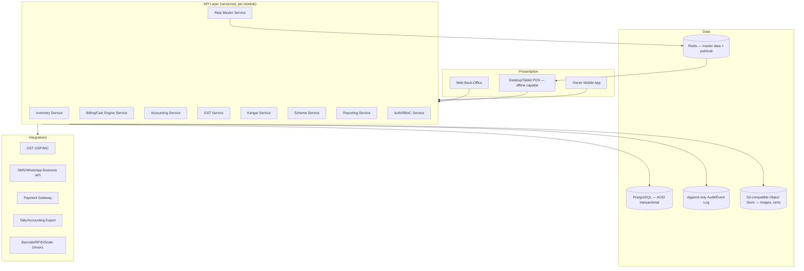

### Key Architecture Decisions Consolidated From Every Phase 🏗
- **Tenant + nullable `branch_id` pattern** (Phase 2 §2.1): the single schema pattern serving single-store through multi-branch without a fork.
- **Event-sourced/append-only ledgers** wherever money or weight is at stake (Rate Master §2.3, Tag Status History §3, Journal Entries §8) — a consistent philosophy, not a one-off convenience.
- **Pure, stateless Calculation Engine** (Phase 5) as the single source of pricing truth across Billing, Estimate, and Old Gold.
- **Async-first government-API integration** (Phase 7) — billing must never block on GSP/NIC latency.
- **OLTP/OLAP separation** (Phase 11) — dashboards and reports never compete with the billing counter for database resources, especially given the PRD's explicit 5–10x festival-load NFR.
- **Offline-capable POS** (Phases 3/5) with local caching of Rate/Item/Metal masters and today's sellable-tag list, conflict-resolved on reconnect.

### Multi-Tenancy Model
Given the locked-in multi-branch decision (§1.9), a **shared-schema multi-tenancy** model (`tenant_id` on every row, enforced via row-level security or a consistent application-layer scoping layer) is the right fit for this SaaS's scale. A sufficiently large enterprise customer wanting full data/infrastructure isolation could later be offered a dedicated-schema or dedicated-instance deployment as a premium tier — a deployment-topology change, not an application rewrite, precisely because the tenant/branch scoping pattern was built in from Phase 2 onward.

### Non-Functional Requirements, Consolidated (extending PRD §16.2)
Performance (<200ms per billing line); Offline support; Precision (decimal/fixed-point arithmetic, never floating-point — repeated because it matters); Scalability (multi-branch, multi-GSTIN, festival spikes); Auditability (immutable logs, gap-free invoice numbering per GSTIN); Data Integrity (a tag is never sellable at two branches at once — DB-enforced, not just application-checked); Availability (a 99.9% target with graceful offline degradation); Security (RBAC, encryption at rest/in transit, no raw card-data storage — use a tokenized gateway); Localization (Hindi/regional-language UI, given real counter-staff literacy variance); Peripherals (barcode/label printers, digital scale integration).

### Suggested Stack (validated against the source PRD's own §16.3, still sound)
A backend language/runtime with strong decimal-arithmetic libraries (Node.js/Java/Python all viable); PostgreSQL as the primary store; React/Angular for the web back-office; an offline-capable POS client (Electron or native); React Native/Flutter for the owner mobile app; an embedded BI layer or custom reporting service for Phase 11's dashboard workloads.

---

*End of Phase 13.*

---
---

# PHASE 14 — QA / Test Strategy & Canonical Worked Example

### 1. Testing Philosophy
Given the domain's error cost — real money, real regulatory exposure — test effort is weighted heavily toward the Calculation Engine (Phase 5) and every append-only ledger (Rate Master, Tag History, Journal Entries): these are the modules where a silent bug compounds daily rather than failing loudly once.

### 2. Test Pyramid for This System
- **Unit tests:** Calculation Engine formula (exhaustive edge cases), purity-fraction derivation, GST split logic, Fine Gold Equivalent math.
- **Integration tests:** cross-module flows (Billing → Accounting auto-post → GST log; Karigar issue → receipt → Tagging → Hallmarking → Billing).
- **Concurrency tests:** simultaneous rate revisions, cross-branch double-sell prevention, offline-reconnect conflict resolution.
- **Compliance tests:** PAN/TCS/PMLA threshold triggers, e-Invoice 24-hour cancellation boundary, scheme cash-refund hard-block.
- **Load tests:** festival-season 5–10x spike simulation against the billing hot path specifically.

### 3. The Canonical Worked Example
Use the source PRD's own §17 worked example (a ~24g necklace, 916 purity, with diamonds, an old-gold exchange, and an intra-state sale) as the **literal regression-test fixture** for the Calculation Engine — every number in that example should be an automated assertion, not just a training illustration.

**Additional edge-case variants QA must build beyond that single example:**
- Zero stone weight
- Wastage merged into Making Charges (Value-Addition display mode)
- Inter-state sale (IGST variant)
- Split payment across four or more modes
- Old-gold-only transaction with no linked new sale
- GML-financed stock sold (ownership-type correctly reflected in reporting)
- Consignment stock sold (correctly excluded from the shop's own Balance Sheet)
- **Scheme redemption combined with an old-gold exchange in the same bill** — a genuinely complex real combination the PRD's single worked example doesn't model, and exactly where multiple adjustment-type payment modes interacting is most likely to hide a Calculation Engine bug
- Karigar excess-wastage flagged scenario
- e-Invoice GSP-downtime-then-retry scenario

### 4. Common Developer Mistakes — Consolidated "Top 10" Across the Whole Build ❌
1. Storing purity as free text instead of a foreign key (Phase 2 §2.2)
2. `UPDATE`-ing the Rate Master instead of an append-only insert (Phase 2 §2.3)
3. Divergent calculation logic in Billing vs. Estimate vs. Old-Gold instead of one shared engine (Phase 5)
4. Modeling Old Gold Exchange as a sales-side discount instead of payment-stage netting (Phase 6)
5. Hardcoding GST/HSN rates in code instead of Tax Master (Phase 2 §2.9 / Phase 7)
6. Branch-scoping the Party Master, breaking tenant-wide CRM/TCS aggregation (Phase 2 §2.6)
7. Omitting `stock_ownership_type`, making GML/consignment stock invisible to the Balance Sheet (Phase 1 §1.6 / Phase 3)
8. Calling the e-Invoice API synchronously, blocking the billing counter (Phase 7)
9. Using floating-point instead of fixed-point/decimal arithmetic (Phase 5)
10. Allowing manual, source-less journal entries that defeat the auto-accounting objective (Phase 8)

### 5. Production Best Practices — Recap 💡
The recurring architectural principles across all 14 phases: **(a)** append-only/event-sourced ledgers wherever money or weight is at stake; **(b)** one shared, pure Calculation Engine; **(c)** never hardcode a government-notified number; **(d)** tenant + nullable-`branch_id` as the multi-tenancy pattern; **(e)** async-first integration with any external/government API.

### 6. Final Handbook Completion Checklist ✅
- [ ] All 14 phases reviewed and their per-phase checklists closed out
- [ ] The consolidated Top-10 mistakes list reviewed against the actual codebase before first production launch
- [ ] PRD §17 worked example passing as an automated regression suite, plus all listed edge-case variants
- [ ] Diamond-HSN-split question (Phase 2 §2.8) formally resolved with the client's CA
- [ ] RBAC/Statutory Parameters (Phase 12) actually built alongside Phase 2 in implementation order, not literally last

---

*End of Phase 14 — Handbook complete.*
